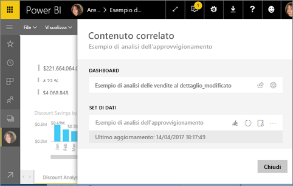

# Visualizzare il contenuto correlato nel servizio Power BI
Il riquadro **Contenuto correlato** mostra come è interconnesso il contenuto del servizio Power BI: dashboard, report e set di dati. Il riquadro Contenuto correlato è anche un punto di partenza per eseguire azioni. Da qui è possibile aggiornare, rinominare, generare informazioni dettagliate e molto altro ancora. Selezionare un rapporto o un dashboard correlato per aprirlo nell'area di lavoro di Power BI.   

In Power BI, i report sono basati sui set di dati, gli oggetti visivi del report vengono aggiunti ai dashboard e gli oggetti visivi del dashboard si collegano ai report. Ma come si fa a sapere quali dashboard ospitano gli oggetti visivi provenienti dal report Marketing? E come si individuano quei dashboard? Il dashboard Procurement usa oggetti visivi da più di un set di dati? In questo caso, come sono denominati e come è possibile aprirli e modificarli? Il set di dati HR è effettivamente usato in report o dashboard? Oppure può essere spostato senza causare collegamenti interrotti? Domande come queste trovano tutte una risposta nel riquadro **Contenuto correlato**.  Non solo il riquadro mostra il contenuto correlato, ma consente anche di intervenire sul contenuto e spostarsi facilmente tra il contenuto correlato.

> [!NOTE]
> La funzionalità Contenuto correlato non funziona per i set di dati di streaming.
> 
> 

## Visualizzare il contenuto correlato di un dashboard
Questo video illustra come visualizzare il contenuto correlato di un dashboard. Seguire quindi tutte le istruzioni riportate sotto il video per provare a farlo da soli usando il set di dati di esempio Analisi dell'approvvigionamento.

<iframe width="560" height="315" src="https://www.youtube.com/embed/B2vd4MQrz4M#t=3m05s" frameborder="0" allowfullscreen></iframe>

Per aprire il riquadro *Contenuto correlato* sono necessarie almeno le autorizzazioni di **visualizzazione** per un dashboard. In questo esempio verrà usato l'esempio [Procurement Analysis Sample](../sample-procurement.md).

**Metodo 1**

In un'area di lavoro selezionare la scheda **Dashboard** e quindi selezionare l'icona **Visualizza elementi correlati** .

 

**Metodo 2**

Con un dashboard aperto, selezionare    dalla barra dei menu superiore.

Viene visualizzato il riquadro **Contenuto correlato**, che mostra tutti i report con visualizzazioni aggiunte al dashboard e i set di dati a esse associati. Per questo dashboard, sono state aggiunte visualizzazioni da tre report diversi, basati a loro volta su tre diversi set di dati.

A questo punto, è possibile intervenire direttamente sul contenuto correlato.  Ad esempio, selezionare un nome di report per aprirlo.  Per un report elencato, selezionare l'icona [Analizza in Excel](../service-analyze-in-excel.md), [Rinomina](../service-rename.md) oppure [Ottieni informazioni dettagliate](end-user-insights.md). Per un set di dati, selezionare l'icona [Crea un nuovo report](../service-report-create-new.md), [Aggiorna](../refresh-data.md), Rinomina, [Analizza in Excel](../service-analyze-in-excel.md), [Ottieni informazioni dettagliate](end-user-insights.md) o per aprire la finestra **Impostazioni** per il set di dati.  

## Visualizzare il contenuto correlato per un report
Per aprire il riquadro *Contenuto correlato* sono necessarie almeno le autorizzazioni di **visualizzazione** per un report. In questo esempio verrà usato l'esempio [Procurement Analysis Sample](../sample-procurement.md).

**Metodo 1**

In un'area di lavoro selezionare la scheda **Report** e quindi selezionare l'icona **Visualizza elementi correlati** .

 

**Metodo 2**

Aprire il report in [Visualizzazione di lettura](end-user-reading-view.md) e selezionare  dalla barra dei menu superiore.

Viene visualizzato il riquadro **Contenuto correlato**, che mostra il set di dati associato e tutti i dashboard che hanno almeno un riquadro aggiunto dal report. Per questo report sono state aggiunte visualizzazioni da due diversi dashboard.

A questo punto, è possibile intervenire direttamente sul contenuto correlato.  Ad esempio, selezionare un nome di dashboard per aprirlo.  Per i dashboard nell'elenco, selezionare un'icona per [Condividere il dashboard con altri utenti](../service-share-dashboards.md) o per aprire la finestra **Impostazioni** per il dashboard. Per il set di dati, selezionare l'icona [Crea un nuovo report](../service-report-create-new.md), [Aggiorna](../refresh-data.md), Rinomina, [Analizza in Excel](../service-analyze-in-excel.md), [Ottieni informazioni dettagliate](end-user-insights.md) o per aprire la finestra **Impostazioni** per il set di dati.  

## Visualizzare il contenuto correlato di un set di dati
Per aprire il riquadro *Contenuto correlato* sono necessarie almeno le autorizzazioni di **visualizzazione** per un set di dati. In questo esempio verrà usato l'esempio [Procurement Analysis Sample](../sample-procurement.md).

In un'area di lavoro selezionare la scheda **Set di dati** e quindi trovare l'icona **Visualizza elementi correlati** .

Selezionare l'icona per aprire il riquadro **Contenuto correlato**.

A questo punto, è possibile intervenire direttamente sul contenuto correlato. Ad esempio, selezionare un nome di report o dashboard per aprirlo.  Per i dashboard nell'elenco, selezionare un'icona per [Condividere il dashboard con altri utenti](../service-share-dashboards.md) o per aprire la finestra **Impostazioni** per il dashboard. Per un report, selezionare l'icona [Analizza in Excel](../service-analyze-in-excel.md), [Rinomina](../service-rename.md) oppure [Ottieni informazioni dettagliate](end-user-insights.md).  

## Limitazioni e risoluzione dei problemi
* Se l'opzione "Visualizza elementi correlati" non è disponibile, cercare invece l'icona . Selezionare l'icona per aprire il riquadro **Contenuto correlato**.
* Per aprire il contenuto correlato per un report, è necessario essere in [Visualizzazione di lettura](end-user-reading-view.md).
* La funzionalità Contenuto correlato non funziona per i set di dati di streaming.

## Passaggi successivi
* [Introduzione al servizio Power BI](../service-get-started.md)
* Altre domande? [Provare la community di Power BI](http://community.powerbi.com/)

