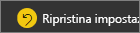

# Presentazione del riquadro Filtri del report
Questo articolo esamina il riquadro filtri del report nel servizio Power BI. Usare i filtri per individuare nuove informazioni dettagliate nei dati.

Esistono diversi modi per filtrare i dati in Power BI, per questo è prima di tutto consigliabile leggere l'articolo [Informazioni su filtri ed evidenziazione](../power-bi-reports-filters-and-highlighting.md).

## Uso del riquadro Filtri del report
Quando un collega condivide un report, cercare il riquadro **Filtri**. In alcuni casi è compresso lungo il bordo destro del report. Selezionarlo per espanderlo.   

Il riquadro Filtri contiene filtri che sono stati aggiunti al report dal *responsabile della progettazione* del report. *I consumer* , ad esempio, è possibile interagire con i filtri esistenti e salvare le modifiche, ma non è possibile aggiungere nuovi filtri al report. Ad esempio, nello screenshot precedente il designer ha aggiunto due filtri di livello pagina: Segmentare e l'anno. È possibile interagire e modificare questi filtri, ma non è possibile aggiungere un terzo filtro a livello di pagina.

Nel servizio Power BI, i report conservano le modifiche apportate nel riquadro filtri e tali modifiche vengono trasferite alla versione del report per dispositivi mobili. Per ripristinare le impostazioni predefinite del responsabile della progettazione nel riquadro Filtri, selezionare **Ripristina impostazioni predefinite** nella barra dei menu superiore.  

   

## Visualizzare tutti i filtri per una pagina del report
Il riquadro filtri Mostra tutti i filtri aggiunti al report per il *progettazione*. Il riquadro filtri è anche l'area in cui è possibile visualizzare informazioni sui filtri e interagire con essi. È possibile salvare le modifiche effettuano o utilizzano **Ripristina impostazioni predefinite** per ripristinare le impostazioni del filtro originale.

Se sono presenti modifiche da salvare, è anche possibile creare un segnalibro persona.  Per altre informazioni, vedere [aggiungere un segnalibro a un report](end-user-bookmarks.md).

Esistono diversi tipi di filtri dei report visualizzati e gestiti nel riquadro filtri, quelli applicati a un oggetto visivo, a una pagina del report e all'intero report.

In questo esempio è stato selezionato un oggetto visivo con i filtri di 2. La pagina del report dispone anche di filtri, elencati sotto la **filtri in questa pagina** intestazione. E l'intero report ha un filtro per Data.

Se accanto ad alcuni filtri è presente la parola **All**, tutti i valori vengono inclusi nel filtro.  Ad esempio, **Segment(All)** nello screenshot precedente indica che questa pagina del report include dati relativi a tutti i segmenti di prodotto.  D'altra parte, di filtrare il livello di pagina del **regione occidentale è** indica che la pagina del report include solo i dati per l'area Stati Uniti occidentali.

Tutti gli utenti che visualizzeranno il report possono interagire con i filtri.

### Consente di visualizzare solo tali filtri applicati a un oggetto visivo
Per un esame più da vicino i filtri applicati a un oggetto visivo specifico, passare il mouse sull'oggetto visivo per visualizzare l'icona del filtro . Selezionare l'icona di filtro per visualizzare una finestra popup con tutti i filtri, filtri dei dati e così via, che interessano tale oggetto visivo. I filtri nella finestra popup sono gli stessi filtri visualizzati nella **filtri** riquadro. 

 
Ecco i tipi di filtri in questa vista può visualizzare:
- Filtri di base
- Filtri dei dati
- Evidenziazione incrociata
- Filtro incrociato
- Filtri avanzati
- Primi N filtri
- Filtri per data relativa
- Filtri dei dati sincronizzati
- Filtri di inclusione/esclusione
- Filtri passati tramite un URL

Nell'esempio riportato di seguito:
1. Possiamo vedere che l'istogramma è stata filtro incrociato.
2. **Inclusa** per indicare che il filtro incrociato riguarda **segmento**, e tre sono incluse. 
3. È stato applicato un filtro dei dati per **trimestre**.
4. **Area** è un filtro applicato a questa pagina del report, e
5. **isVanArsdel** e **anno** sono filtri applicati a questo oggetto visivo.

### Cercare in un filtro
In alcuni casi un filtro può avere un lungo elenco di valori. Usare la casella di ricerca per trovare e selezionare il valore desiderato. 

### Visualizzare i dettagli di filtro
Per informazioni su un filtro, esaminiamo i valori disponibili e i conteggi.  Visualizzare i dettagli del filtro di passando il mouse e selezionando la freccia accanto al nome del filtro. 
  

### Modificare le selezioni del filtro
Per cercare informazioni dettagliate sui dati è possibile interagire con i filtri. È possibile modificare le selezioni del filtro con la freccia a discesa accanto al nome del campo.  A seconda del tipo di dati filtrati e filtro, le opzioni verranno variare da semplice selezioni da un elenco di intervalli di date o numeri di identificazione. In seguito il filtro avanzato, è stato modificato il filtro **totale unità YTD** nella mappa ad albero deve essere compresa tra 2.000 e 3.000. Si noti che questa operazione rimuove Prirum dal grafico ad albero. 
  

> [!TIP]
> Per selezionare più di un valore di filtro contemporaneamente, tenere premuto il tasto CTRL. La maggior parte dei filtri può supportare una selezione multipla. 

### Ripristina filtro predefinito
Se si desidera eseguire il backup all'esterno di tutte le modifiche apportate ai filtri, selezionare **Ripristina impostazioni predefinite** dalla barra dei menu superiore.  I filtri per lo stato originale, viene ripristinato come impostato da report *progettazione*. 

    
### Eliminare un filtro
Se è presente un solo filtro che si desidera impostare su **(tutti)** , deselezionare l'opzione in selezionando l'icona della gomma  accanto al nome del filtro.
  
<!--  too much detail for consumers

## Types of filters: text field filters
### List mode
Ticking a checkbox either selects or deselects the value. The **All** checkbox can be used to toggle the state of all checkboxes on or off. The checkboxes represent all the available values for that field.  As you adjust the filter, the restatement updates to reflect your choices. 

Note how the restatement now says "is Mar, Apr or May".

### Advanced mode
Select **Advanced Filtering** to switch to advanced mode. Use the dropdown controls and text boxes to identify which fields to include. By choosing between **And** and **Or**, you can build complex filter expressions. Select the **Apply Filter** button when you've set the values you want.  

## Types of filters: numeric field filters
### List mode
If the values are finite, selecting the field name displays a list.  See **Text field filters** &gt; **List mode** above for help using checkboxes.   

### Advanced mode
If the values are infinite or represent a range, selecting the field name opens the advanced filter mode. Use the dropdown and text boxes to specify a range of values that you want to see. 

By choosing between **And** and **Or**, you can build complex filter expressions. Select the **Apply Filter** button when you've set the values you want.

## Types of filters: date and time
### List mode
If the values are finite, selecting the field name displays a list.  See **Text field filters** &gt; **List mode** above for help using checkboxes.   

### Advanced mode
If the field values represent date or time, you can specify a start/end time when using Date/Time filters.  

-->

## Passaggi successivi
[Informazioni su come e perché si applicano il filtro incrociato e l'evidenziazione incrociata agli oggetti visivi in una pagina di report](end-user-interactions.md)