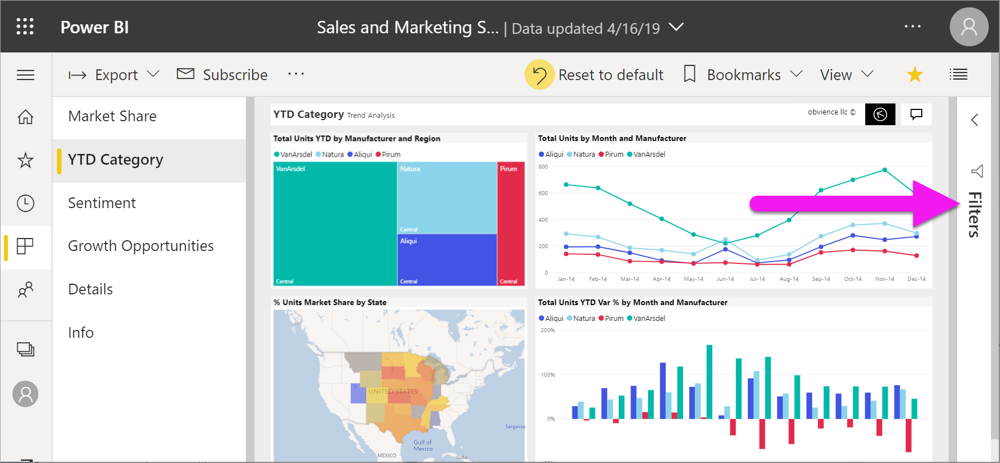
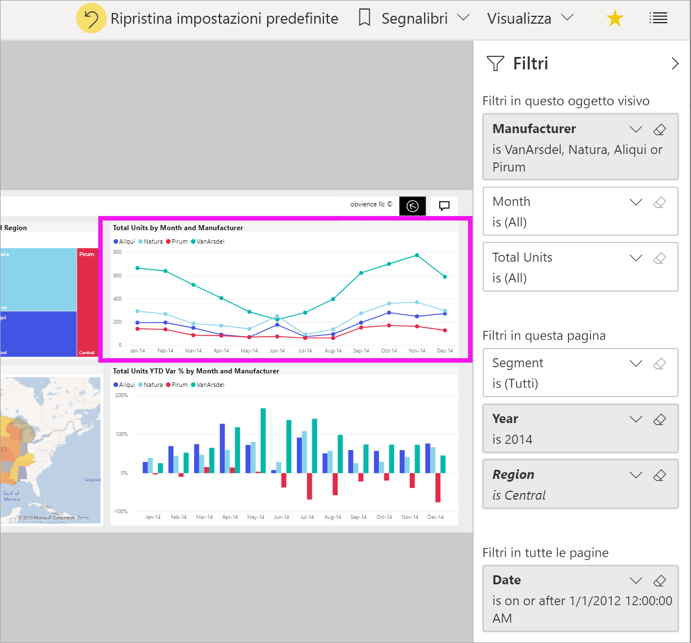
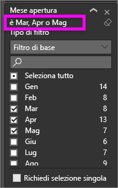
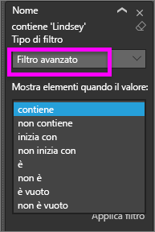
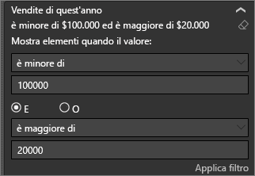
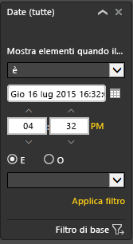

# Presentazione del riquadro Filtri del report

[!INCLUDE[consumer-appliesto-yyny](../includes/consumer-appliesto-yyny.md)]

[!INCLUDE [power-bi-service-new-look-include](../includes/power-bi-service-new-look-include.md)]

Questo articolo illustra il riquadro **Filtri** del report nel servizio Power BI. Usare i filtri per individuare nuove informazioni dettagliate nei dati.

In Power BI è possibile filtrare i dati in molti modi diversi. Per altre informazioni sui filtri, vedere [Filtri ed evidenziazione nei report di Power BI](../power-bi-reports-filters-and-highlighting.md).

## Uso del riquadro Filtri del report

Quando un collega condivide un report, cercare il riquadro **Filtri**. In alcuni casi è compresso lungo il bordo destro del report. Selezionarlo per espanderlo.

Il riquadro **Filtri** contiene i filtri aggiunti al report dal *designer* del report. I *consumer* possono interagire con i filtri esistenti e salvare le modifiche, ma non possono aggiungere nuovi filtri al report. Ad esempio, nello screenshot precedente il designer ha aggiunto tre filtri a livello di pagina: **Segment is All**, **Year is 2014** e **Region is Central**. È possibile interagire con questi filtri e modificarli, ma non è possibile aggiungere un quarto filtro a livello di pagina.

Nel servizio Power BI i report mantengono le modifiche apportate nel riquadro **Filtri**. Il servizio riporta le modifiche nella versione per dispositivi mobili del report. 

Per ripristinare le impostazioni predefinite dal designer nel riquadro **Filtri**, selezionare **Ripristina impostazioni predefinite** nella barra dei menu superiore.

 

> [!NOTE]
> Se non viene visualizzata l'opzione **Ripristina impostazioni predefinite**, è possibile che sia stata disabilitata dal *progettista* del report. Il *progettista* può anche bloccare filtri specifici, in modo da non consentirne la modifica.

## Visualizzare tutti i filtri per una pagina del report

Il riquadro **Filtri** visualizza tutti i filtri aggiunti al report dal designer. Il riquadro **Filtri** è anche l'area in cui è possibile visualizzare le informazioni relative ai filtri e interagire con essi. Salvare le modifiche apportate o usare **Ripristina impostazioni predefinite** per ripristinare le impostazioni filtro originali.

Per salvare le proprie modifiche è anche possibile creare un segnalibro personale. Per altre informazioni, vedere [Cosa sono i segnalibri?](end-user-bookmarks.md)

Il riquadro **Filtri** visualizza e gestisce diversi tipi di filtri del report: report, pagina del report e oggetto visivo.

In questo esempio è stato selezionato un oggetto visivo con tre filtri. Anche la pagina del report include filtri, elencati sotto l'intestazione **Filtri in questa pagina**. L'intero report ha inoltre un filtro per **Date** (Data).

Accanto ad alcuni filtri è presente la voce **(All)** (Tutti). **(All)** (Tutti) indica che il filtro include tutti i valori. Nello screenshot precedente **Segment (All)** (Segmento, Tutti) indica che la pagina del report include i dati relativi a tutti i segmenti di prodotto. 

Tutti gli utenti che visualizzeranno il report possono interagire con i filtri.

### Visualizzare solo i filtri applicati a un oggetto visivo

Per esaminare in modo più dettagliato i filtri applicati a uno specifico oggetto visivo, passare il mouse su di esso per visualizzare l'icona del filtro . Selezionare l'icona del filtro per visualizzare un popup con tutti i filtri, i filtri dei dati e altri elementi che interessano l'oggetto visivo. I filtri nel popup includono gli stessi filtri visualizzati nel riquadro **Filtri**, oltre a filtri aggiuntivi che interessano l'oggetto visivo selezionato.

Ecco i tipi di filtri disponibili in questa visualizzazione:

- Filtri di base
- Filtro dei dati
- Evidenziazione incrociata
- Filtro incrociato
- Filtri avanzati
- Primi N filtri
- Filtri per data relativa
- Filtri dei dati sincronizzati
- Filtri di inclusione/esclusione
- Filtri passati tramite un URL

In questo esempio:
1. **Included** indica che all'oggetto visivo è stato applicato un filtro incrociato. Significa che gli stati di Utah, Colorado e Texas sono stati selezionati in uno degli altri oggetti visivi nella pagina del report. In questo caso è la mappa. Selezionando questi tre stati, i dati di tutti gli altri stati non saranno visualizzati nel grafico a barre selezionato.  

1. **Date** è un filtro applicato a tutte le pagine del report

1. **Region è Central** e **Year è 2014** sono filtri applicati a questa pagina del report

4. **Manufacturer is VanArsdel, Natura, Aliqui, or Pirum** è un filtro applicato all'oggetto visivo.

### Cercare in un filtro

Talvolta un filtro può avere un lungo elenco di valori. Usare la casella di ricerca per trovare e selezionare un valore.

### Visualizzare i dettagli del filtro

Per comprendere un filtro, esaminarne i valori e i conteggi disponibili.  Per visualizzare i dettagli del filtro, passare il puntatore del mouse e selezionare la freccia accanto al nome del filtro.
  

### Modificare le selezioni del filtro

L'interazione con i filtri è un modo per cercare informazioni dettagliate sui dati. È possibile modificare le selezioni del filtro usando la freccia a discesa accanto al nome del campo.  A seconda del filtro e del tipo di dati filtrati da Power BI, le opzioni variano dalle semplici selezioni in un elenco all'identificazione di intervalli di date o numeri. Nel filtro avanzato riportato di seguito l'intervallo del filtro **Total Units YTD** nel grafico ad albero è stato modificato in modo da essere compreso tra 2.000 e 3.000. Si noti che questa modifica rimuove Pirum dal grafico ad albero.
  

> [!TIP]
> Per selezionare contemporaneamente più valori di filtro, tenere premuto CTRL. La maggior parte dei filtri supporta la selezione multipla.

### Ripristinare le impostazioni predefinite del filtro

Per annullare tutte le modifiche apportate ai filtri, selezionare **Ripristina impostazioni predefinite** nella barra dei menu superiore.  Questa selezione ripristina lo stato originale dei filtri, come impostati dal designer del report.

### Eliminare un filtro

Per reimpostare un filtro su (All), deselezionare il filtro usando l'icona della gomma accanto al nome del filtro.

  
<!--  too much detail for consumers

## Types of filters: text field filters
### List mode
Ticking a checkbox either selects or deselects the value. The **All** checkbox can be used to toggle the state of all checkboxes on or off. The checkboxes represent all the available values for that field.  As you adjust the filter, the restatement updates to reflect your choices. 

Note how the restatement now says "is Mar, Apr or May".

### Advanced mode
Select **Advanced Filtering** to switch to advanced mode. Use the dropdown controls and text boxes to identify which fields to include. By choosing between **And** and **Or**, you can build complex filter expressions. Select the **Apply Filter** button when you've set the values you want.  

## Types of filters: numeric field filters
### List mode
If the values are finite, selecting the field name displays a list.  See **Text field filters** &gt; **List mode** above for help using checkboxes.   

### Advanced mode
If the values are infinite or represent a range, selecting the field name opens the advanced filter mode. Use the dropdown and text boxes to specify a range of values that you want to see. 

By choosing between **And** and **Or**, you can build complex filter expressions. Select the **Apply Filter** button when you've set the values you want.

## Types of filters: date and time
### List mode
If the values are finite, selecting the field name displays a list.  See **Text field filters** &gt; **List mode** above for help using checkboxes.   

### Advanced mode
If the field values represent date or time, you can specify a start/end time when using Date/Time filters.  

-->

## Passaggi successivi

Informazioni su come e perché [si applicano il filtro incrociato e l'evidenziazione incrociata agli oggetti visivi in una pagina di report](end-user-interactions.md)