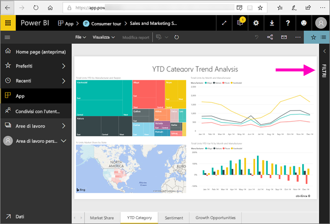
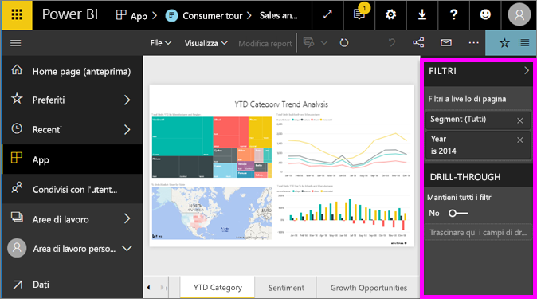
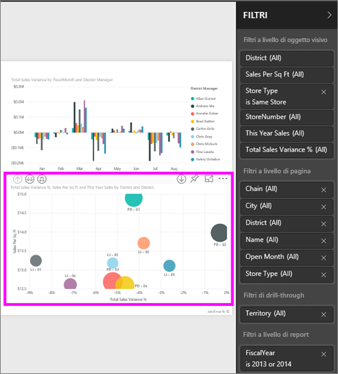
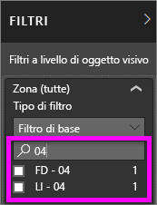
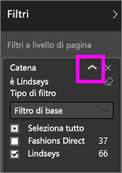
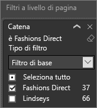
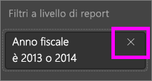

# Presentazione del riquadro Filtri del report
Questo articolo analizza il riquadro Filtri del report nel servizio Power BI.

Esistono diversi modi per filtrare i dati in Power BI, per questo è prima di tutto consigliabile leggere l'articolo [Informazioni su filtri ed evidenziazione](../power-bi-reports-filters-and-highlighting.md).

## Uso del riquadro Filtri del report
Quando un collega condivide un report, cercare il riquadro **Filtri**. In alcuni casi è compresso lungo il bordo destro del report. Selezionarlo per espanderlo.   

Il riquadro Filtri contiene filtri che sono stati aggiunti al report dal *responsabile della progettazione* del report. I *consumer* possono interagire con i filtri e salvare le modifiche, ma non aggiungere nuovi filtri al report. Ad esempio, nello screenshot precedente il designer ha aggiunto due filtri di livello pagina: Segment (Segmento) e Year (Anno). È possibile interagire e modificare questi filtri, ma non è possibile aggiungere un terzo filtro a livello di pagina.

Nel servizio Power BI i report conservano le modifiche apportate nel riquadro Filtri e tali modifiche vengono conservate anche nella versione del report per dispositivi mobili. Per ripristinare le impostazioni predefinite del responsabile della progettazione nel riquadro Filtri, selezionare **Ripristina impostazioni predefinite** nella barra dei menu superiore.     

## Aprire il riquadro Filtri
Quando è aperto un report, il riquadro Filtri viene visualizzato lungo il lato destro dell'area di disegno report. Se il riquadro non è visibile, selezionare la freccia nell'angolo superiore destro per espanderlo.  

In questo esempio è stato scelto un oggetto visivo con 6 filtri. Anche la pagina del report dispone di filtri, elencati al titolo **Filtri a livello di pagina**. È disponibile un [Filtro di drill-through](../power-bi-report-add-filter.md) e anche l'intero report ha un filtro:  **FiscalYear** è 2013 o 2014.

Se accanto ad alcuni filtri è presente la parola **All**, tutti i valori vengono inclusi nel filtro.  Ad esempio, **Chain(All)** nella schermata precedente indica che questa pagina del report include dati relativi a tutte le catene di negozi.  D'altra parte, il filtro a livello di report **FiscalYear è 2013 o 2014** indica che il report include solo i dati per gli anni fiscali 2013 e 2014.

Tutti gli utenti che visualizzeranno il report possono interagire con i filtri.

- Cercare nei filtri di pagina, visivi, di report e drill-through per trovare e selezionare il valore desiderato. 

    

- Visualizzare i dettagli del filtro di passando il mouse e selezionando la freccia accanto al filtro.
  
   
* Modificare il filtro, ad esempio cambiare **Lindseys** in **Fashions Direct**.
  
     

* Reimpostare lo stato originale dei filtri selezionando **Ripristina impostazioni predefinite** nella barra dei menu superiore.    
    
    
* Eliminare il filtro selezionando **x** accanto al nome del filtro.
  
    

  L'eliminazione di un filtro ne comporta la rimozione dall'elenco, ma non elimina i dati dal report.  Se ad esempio si elimina il filtro **FiscalYear è 2013 o 2014**, i dati dell'anno fiscale rimarranno nel report ma non verranno più filtrati per visualizzare solo 2013 e 2014; verranno invece visualizzati tutti gli anni fiscali presenti nei dati.  Tuttavia, dopo aver eliminato il filtro, non sarà possibile modificarlo nuovamente perché viene rimosso dall'elenco. Un'opzione migliore consiste nel cancellare il filtro selezionando l'icona della gomma .
  
  

## Eliminare un filtro
 Nella modalità di filtro avanzato o di base selezionare l'icona della gomma   per cancellare il filtro. 

## Tipi di filtro: filtri dei campi di testo
### Modalità elenco
Se si seleziona una casella di controllo, il valore corrispondente viene selezionato o deselezionato. Si può usare la casella di controllo **Tutto** per selezionare o deselezionare tutte le caselle di controllo. Le caselle di controllo rappresentano tutti i valori disponibili per il campo.  Man mano che si regola il filtro, la riformulazione si aggiorna in base alle scelte effettuate. 

Si noti che a questo punto la riformulazione indica "is Mar, Apr or May" (è Mar, Apr o Mag).

### Modalità avanzata
Selezionare **Filtro avanzato** per passare alla modalità avanzata. Usare i controlli a discesa e le caselle di testo per identificare i campi da includere. Specificando **And** o **Or**, è possibile creare complesse espressioni di filtro. Dopo avere impostato tutti i valori desiderati, selezionare il pulsante **Applica filtro** .  

## Tipi di filtro: filtri dei campi numerici
### Modalità elenco
Se i valori sono finiti, quando si seleziona il nome del campo viene visualizzato un elenco.  Per informazioni sull'uso delle caselle di controllo, vedere la sezione **Filtri dei campi di testo**&gt;**Modalità elenco riportata sopra.**   

### Modalità avanzata
Se i valori sono finiti o rappresentano un intervallo, quando si seleziona il nome del campo viene attivata la modalità di filtro avanzato. Usare gli elenchi a discesa e le caselle di testo per specificare un intervallo di valori da visualizzare. 

Specificando **And** o **Or**, è possibile creare complesse espressioni di filtro. Dopo avere impostato tutti i valori desiderati, selezionare il pulsante **Applica filtro** .

## Tipi di filtro: data e ora
### Modalità elenco
Se i valori sono finiti, quando si seleziona il nome del campo viene visualizzato un elenco.  Per informazioni sull'uso delle caselle di controllo, vedere la sezione **Filtri dei campi di testo**&gt;**Modalità elenco riportata sopra.**   

### Modalità avanzata
Se i valori dei campi rappresentano una data o un'ora, si può specificare un'ora di inizio/fine quando si usano i filtri Data/Ora.  

## Passaggi successivi
[Informazioni su come e perché si applicano il filtro incrociato e l'evidenziazione incrociata agli oggetti visivi in una pagina di report](end-user-interactions.md)