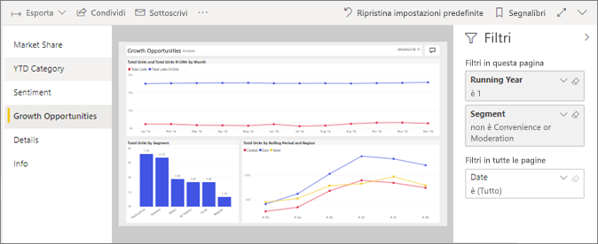
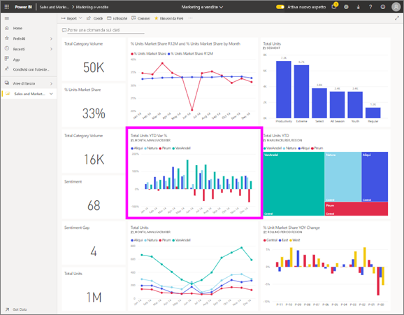

# Visualizzare un report nel servizio Power BI per i *consumer*
Un report è costituito da una o più pagine di oggetti visivi. I report vengono creati da Power BI *progettisti* e [condiviso con *consumer* direttamente](end-user-shared-with-me.md) o come parte di un [app](end-user-apps.md). 

Esistono diversi modi per aprire un report e vi mostreremo due di esse: aprire da casa e da un dashboard. 

<!-- add art-->

## Aprire un report da Power BI Home
Di seguito viene descritta la procedura per aprire un report che è stato condiviso con l'utente direttamente e quindi per aprire un report che è stato condiviso come parte di un'app.

   

### Aprire un report condiviso con l'utente
Power BI *finestre di progettazione* possono condividere un report direttamente con l'utente. Contenuto condiviso in questo modo viene visualizzato nei **condiviso con me** contenitore sulla barra di spostamento a barre e nel **condiviso con me** sezione dell'area di disegno Home.

1. Aprire il servizio Power BI (app.powerbi.com).

2. Dalla barra di spostamento, selezionare **Home** per visualizzare l'area di disegno Home.  

   
   
3. Scorrere verso il basso fino a visualizzare **Condivisi con l'utente corrente**. Cercare l'icona del report . In questa schermata è disponibile un unico dashboard e un report denominato *esempio di vendite e marketing*. 
   
   

4. È sufficiente selezionare il rapporto *carta* per aprire il report.

   

5. Si noti che le schede lungo il lato sinistro.  Ogni scheda rappresenta una *pagina* del report. Attualmente, è il *opportunità di crescita* pagina aperta. Selezionare il *YTD Category* pressione di tab per aprire la pagina report invece. 

   

6. A questo punto vediamo l'intera pagina del report. Per modificare la visualizzazione (zoom) della pagina, selezionare l'elenco a discesa di visualizzazione dall'angolo superiore destro ( **>** ) e scegliere **dimensioni effettive**.

   

   

### Aprire un report che fa parte di un'app
Se sono state ricevute app da colleghi o da AppSource, queste App sono disponibili da casa e dal **app** contenitore nella barra di spostamento. Un'[app](end-user-apps.md) è un'aggregazione di dashboard e report.

1. Tornare alla home page selezionando **Home** dalla barra di spostamento.

7. Scorrere verso il basso fino a visualizzare **App personali**.

   

8. Selezionare una delle app per aprirla. A seconda delle opzioni impostate dal *progettista* dell'app, l'app aprirà un dashboard, un report o un elenco del contenuto dell'app. Se quando si seleziona l'app:
    - Viene aperto il report, è tutto pronto.
    - Viene aperto un dashboard, vedere ***Aprire un report da un dashboard*** di seguito.
    - Viene aperto l'elenco del contenuto dell'app in **Report**, selezionare il report per aprirlo.

## Aprire un report da un dashboard
I report possono essere aperti da un dashboard. La maggior parte dei riquadri del dashboard viene *aggiunta* dai report. Se si seleziona un riquadro, viene aperto il report usato per creare il riquadro stesso. 

1. In un dashboard selezionare un riquadro. In questo esempio è stato selezionato il riquadro dell'istogramma "Total Units YTD".

    

2.  Viene aperto il report associato. Si noti che viene ora visualizzata la pagina "YTD Category". Si tratta della pagina del report che contiene l'istogramma selezionato dal dashboard.

    

> [!NOTE]
> Non tutti i riquadri portano a un report. Se si seleziona un riquadro [creato con Domande e risposte](end-user-q-and-a.md), verrà visualizzata la schermata Domande e risposte. Se si seleziona un riquadro [creato usando il widget **Aggiungi riquadro** del dashboard](../service-dashboard-add-widget.md), possono verificarsi varie situazioni.  

##  Altri modi per aprire un report
Poiché si otterrebbe più a proprio agio passando al servizio Power BI, sarà possibile individuare i flussi di lavoro che funzionano meglio per l'utente. Altri modi per accedere ai report:
- Nel riquadro di spostamento indicatore **Preferiti** e **recenti**    
- Tramite [Visualizza elementi correlati](end-user-related.md).    
- In un messaggio di posta elettronica in caso di [condivisione con l'utente](../service-share-reports.md) o quando si [configura un avviso](end-user-alerts.md)    
- Dal [centro notifiche](end-user-notification-center.md).    
- E altro ancora.

## Passaggi successivi
Esistono [moltissimi modi per interagire con un report](end-user-reading-view.md).  Iniziare a esplorarlo selezionando ogni scheda sul lato dell'area di disegno report.

