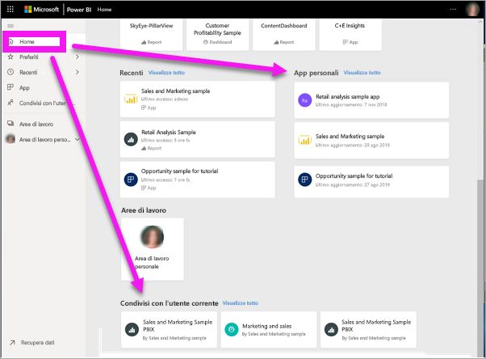
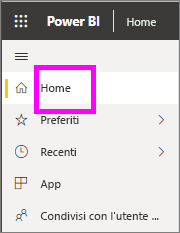
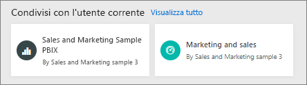
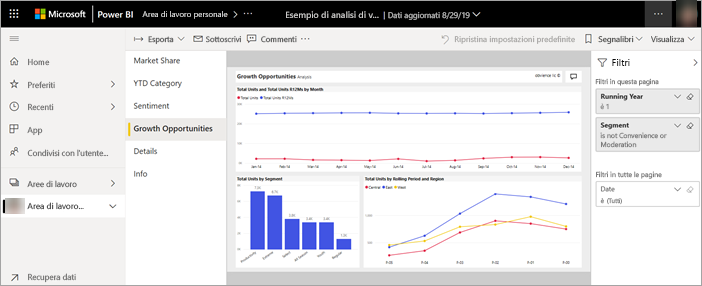
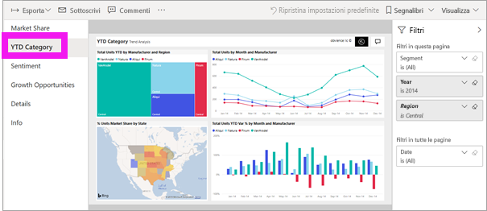
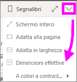
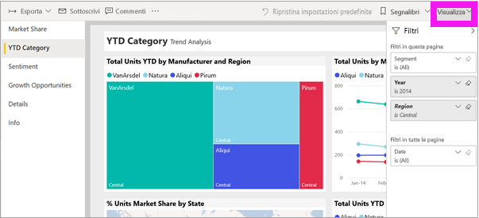
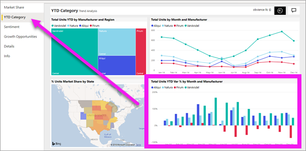

# Visualizzare un report nel servizio Power BI per i *consumer*
Un report è costituito da una o più pagine di oggetti visivi. I report vengono creati dai *progettisti* di Power BI e [condivisi con i *consumer* direttamente](end-user-shared-with-me.md) o nel contesto di un'[app](end-user-apps.md). 

Esistono diversi modi per aprire un report e ne verranno illustrati due: apertura da Home e apertura da un dashboard. 

<!-- add art-->

## Aprire un report da Home di Power BI
Di seguito viene descritta la procedura per aprire un report che è stato condiviso con l'utente direttamente e quindi per aprire un report che è stato condiviso come parte di un'app.

   

### Aprire un report condiviso con l'utente
I *progettisti* di Power BI possono condividere un singolo report direttamente con l'utente tramite un collegamento in un messaggio di posta elettronica o aggiungendolo a Home di Power BI. Il contenuto condiviso in questo modo viene visualizzato nel contenitore **Condivisi con l'utente corrente** nella barra di spostamento e nella sezione **Condivisi con l'utente corrente** dell'area Home dell'utente destinatario.

1. Aprire il servizio Power BI (app.powerbi.com).

2. Dalla barra di navigazione selezionare **Home** per visualizzare l'area Home.  

   
   
3. Scorrere verso il basso fino a visualizzare **Condivisi con l'utente corrente**. Cercare l'icona del report . In questo screenshot sono disponibili un dashboard e un report denominato *Sales and marketing sample*. 
   
   

4. È sufficiente selezionare la *scheda* del report per aprirlo.

   

5. Si notino le schede lungo il lato sinistro.  Ogni scheda rappresenta una *pagina* del report. È attualmente aperta la pagina *Growth Opportunity*. Selezionare la *YTD Category* per aprire tale pagina del report. 

   

6. Al momento è visualizzata l'intera pagina del report. Per modificare la visualizzazione (zoom) della pagina, selezionare l'elenco a discesa Visualizza nell'angolo superiore destro e scegliere **Dimensioni effettive**.

   

   

### Aprire un report che fa parte di un'app
Se si ricevono app da colleghi o da AppSource, tali app sono disponibili da Home e dal contenitore **App** nella barra di spostamento. Un'[app](end-user-apps.md) è un'aggregazione di dashboard e report.

1. Tornare a Home selezionando **Home** sulla barra di spostamento.

7. Scorrere verso il basso fino a visualizzare **App personali**.

   

8. Selezionare una delle app per aprirla. A seconda delle opzioni impostate dal *progettista* dell'app, l'app aprirà un dashboard o un report. Se quando si seleziona l'app:
    - Viene aperto il report, è tutto pronto.
    - Viene aperto un dashboard, vedere ***Aprire un report da un dashboard*** di seguito.

## Aprire un report da un dashboard
I report possono essere aperti da un dashboard. La maggior parte dei [riquadri](end-user-tiles.md) del dashboard viene *aggiunta* dai report. Se si seleziona un riquadro, viene aperto il report usato per creare il riquadro stesso. 

1. In un dashboard selezionare un riquadro. In questo esempio è stato selezionato il riquadro dell'istogramma "Total Units YTD".

    

2.  Viene aperto il report associato. Si noti che viene ora visualizzata la pagina "YTD Category". Si tratta della pagina del report che contiene l'istogramma selezionato dal dashboard.

    

> [!NOTE]
> Non tutti i riquadri portano a un report. Se si seleziona un riquadro [creato con Domande e risposte](end-user-q-and-a.md), verrà visualizzata la schermata Domande e risposte. Se si seleziona un riquadro [creato usando il widget **Aggiungi riquadro** del dashboard](../service-dashboard-add-widget.md), possono verificarsi varie situazioni, ad esempio la riproduzione di un video, l'apertura di in sito Web e altro.  

##  Altri modi per aprire un report
Quando si acquisisce maggiore familiarità con gli spostamenti all'interno del servizio Power BI, sarà possibile individuare i flussi di lavoro ottimali per le proprie esigenze. Altri modi per accedere ai report:
- Dalla barra di spostamento usando **Preferiti** e **Recenti**    
- Tramite [Visualizza elementi correlati](end-user-related.md).    
- In un messaggio di posta elettronica in caso di [condivisione con l'utente](../service-share-reports.md) o quando si [configura un avviso](end-user-alerts.md)    
- Dal [centro notifiche](end-user-notification-center.md).    
- E altro ancora.

## Passaggi successivi
[Aprire e visualizzare un dashboard](end-user-dashboard-open.md)

