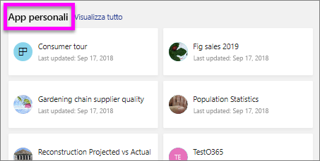

# Visualizzare un report nel servizio Power BI per i *consumer*
Un report è costituito da una o più pagine di oggetti visivi. I report vengono creati dai *designer* di Power BI e [condivisi con i *consumer* direttamente](end-user-shared-with-me.md) o nel contesto di un'[app](end-user-apps.md). 

Esistono diversi modi per aprire un report e ne verranno illustrati due: apertura dalla home page e apertura da un dashboard. 

<!-- add art-->

## Aprire un report dalla home page
Di seguito viene descritta la procedura per aprire un report che è stato condiviso con l'utente direttamente e quindi per aprire un report che è stato condiviso come parte di un'app.

   

### Aprire un report condiviso con l'utente
I *progettisti* di Power BI possono condividere un report direttamente con un utente facendo clic su un pulsante **Condividi** nella barra dei menu principale. Il contenuto condiviso in questo modo viene visualizzato nel contenitore **Condivisi con l'utente corrente** nella barra di spostamento a sinistra e nella sezione **Condivisi con l'utente corrente** della home page dell'utente destinatario.

1. Aprire il servizio Power BI (app.powerbi.com).

2. Dalla barra di spostamento a sinistra selezionare **Home page (anteprima)** per aprire la home page.  

   
   
3. Scorrere verso il basso fino a visualizzare **Condivisi con l'utente corrente**. Cercare l'icona del report . In questo screenshot sono disponibili due tipi di report: *Financial* e *Northwind*. 
   
   

4. È sufficiente selezionare una delle *schede* di report per aprire il report.

   

5. Si notino le schede nella parte inferiore. Ogni scheda rappresenta una *pagina* del report. Attualmente, è aperta la pagina *IT Spend Trend*. Selezionare una scheda diversa per aprire la pagina del report. 

   

6. Al momento è possibile vedere solo una parte della pagina del report. Per modificare la visualizzazione (zoom) della pagina, selezionare **Visualizza** > **Adatta alla pagina**.

   

   

### Aprire un report che fa parte di un'app
Se si ricevono app da colleghi o da AppSource, tali app sono disponibili dalla home page e dal contenitore **App** nella barra di spostamento a sinistra. Un'[app](end-user-apps.md) è un'aggregazione di dashboard e report.

1. Tornare alla home page selezionando **Home page (anteprima)** dalla barra di spostamento a sinistra.

7. Scorrere verso il basso fino a visualizzare **App personali**.

   

8. Selezionare una delle app per aprirla. A seconda delle opzioni impostate dal *progettista* dell'app, l'app aprirà un dashboard, un report o un elenco del contenuto dell'app. Se quando si seleziona l'app:
    - Viene aperto il report, è tutto pronto.
    - Viene aperto un dashboard, vedere [Aprire un report da un dashboard](#Open-a-report-from-a-dashboard) di seguito.
    - Viene aperto l'elenco del contenuto dell'app in **Report**, selezionare il report per aprirlo.

## Aprire un report da un dashboard
I report possono essere aperti da un dashboard. La maggior parte dei riquadri del dashboard viene *aggiunta* dai report. Se si seleziona un riquadro, viene aperto il report usato per creare il riquadro stesso. 

1. In un dashboard selezionare un riquadro. In questo esempio è stato selezionato il riquadro dell'istogramma "Total Units YTD".

    

2.  Viene aperto il report associato. Si noti che viene ora visualizzata la pagina "YTD Category". Si tratta della pagina del report che contiene l'istogramma selezionato dal dashboard.

    

> [!NOTE]
> Non tutti i riquadri portano a un report. Se si seleziona un riquadro [creato con Domande e risposte](end-user-q-and-a.md), verrà visualizzata la schermata Domande e risposte. Se si seleziona un riquadro [creato usando il widget **Aggiungi riquadro** del dashboard](../service-dashboard-add-widget.md), possono verificarsi varie situazioni.  

##  Altri modi per aprire un report
Quando si acquisisce maggiore esperienza nello spostamento in un servizio Power BI, sarà possibile individuare i flussi di lavoro ottimali per le proprie esigenze. Altri modi per accedere ai report:
- Dal riquadro di spostamento a sinistra usando **Preferiti** e **Recenti**    
- Tramite [Visualizza elementi correlati](end-user-related.md).    
- In un messaggio di posta elettronica in caso di [condivisione con l'utente](../service-share-reports.md) o quando si [configura un avviso](end-user-alerts.md)    
- Dal [centro notifiche](end-user-notification-center.md).    
- E altro ancora.

## Passaggi successivi
Esistono [moltissimi modi per interagire con un report](end-user-reading-view.md).  Iniziare l'esplorazione selezionando ogni scheda nella parte inferiore dell'area di disegno report.

