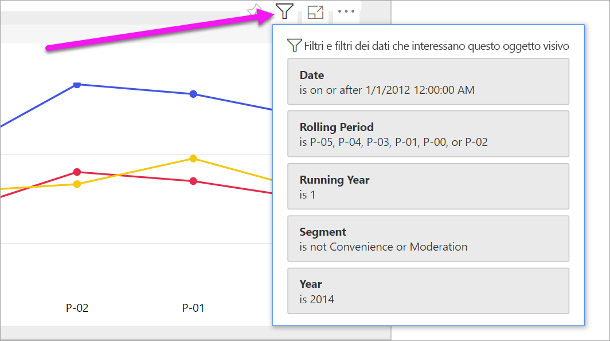
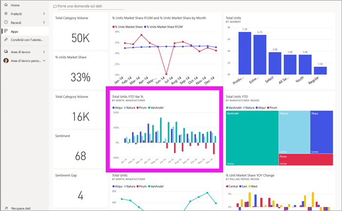

# Visualizzare un report nel servizio Power BI per i *consumer*

[!INCLUDE[consumer-appliesto-yyny](../includes/consumer-appliesto-yyny.md)]

[!INCLUDE [power-bi-service-new-look-include](../includes/power-bi-service-new-look-include.md)]

Un report è costituito da una o più pagine di oggetti visivi. I report vengono creati dai *progettisti* di Power BI e [condivisi con i *consumer* direttamente](end-user-shared-with-me.md) o nel contesto di un'[app](end-user-apps.md). 

Esistono diversi modi per aprire un report e ne verranno illustrati due: apertura da Home e apertura da un dashboard. 

<!-- add art-->

## Aprire un report da Home di Power BI
Di seguito viene descritta la procedura per aprire un report che è stato condiviso con l'utente direttamente e quindi per aprire un report che è stato condiviso come parte di un'app.

   

### Aprire un report condiviso con l'utente
I *progettisti* di Power BI possono condividere un singolo report direttamente con l'utente tramite un collegamento in un messaggio di posta elettronica o aggiungendolo automaticamente al contenuto di Power BI. I report condivisi in questo modo vengono visualizzati nel contenitore **Condivisi con l'utente corrente** nel riquadro di spostamento e nella sezione **Condivisi con l'utente corrente** dell'area Home dell'utente destinatario.

1. Aprire il servizio Power BI (app.powerbi.com).

2. Nel riquadro di spostamento selezionare **Home** per visualizzare l'area Home.  

   
   
3. Scorrere verso il basso fino a visualizzare **Condivisi con l'utente corrente**. Cercare l'icona del report . In questo screenshot sono disponibili un dashboard e un report. Il nome del report è *Sales and marketing sample*. 
   
   

4. È sufficiente selezionare la *scheda* del report per aprirlo.

   

5. Si notino le schede lungo il lato sinistro.  Ogni scheda rappresenta una *pagina* del report. È attualmente aperta la pagina *Growth Opportunity*. Selezionare la *YTD Category* per aprire tale pagina del report. 

   

6. Si noti il riquadro **Filtri** sulla destra. I filtri applicati a questa pagina del report o all'intero report vengono visualizzati qui.

7. Passando il mouse su un oggetto visivo del report vengono visualizzati varie icone e il pulsante **Altre opzioni** (...). Per visualizzare i filtri applicati a un oggetto visivo specifico, selezionare l'icona del filtro. Qui è stata selezionata l'icona del filtro per il grafico a linee *Total units by rolling period and region*.

   

6. Al momento è visualizzata l'intera pagina del report. Per modificare la visualizzazione (zoom) della pagina, selezionare l'elenco a discesa Visualizza nell'angolo superiore destro e scegliere **Dimensioni effettive**.

   

   

È possibile interagire con un report in diversi modi per individuare informazioni dettagliate e prendere decisioni aziendali.  Usare il sommario a sinistra per leggere altri articoli sui report di Power BI. 

### Aprire un report che fa parte di un'app
Se si ricevono app da colleghi o da AppSource, tali app sono disponibili nell'area Home e nel contenitore **App** del riquadro di spostamento. Un'[app](end-user-apps.md) è una raccolta di dashboard e report che sono stati raggruppati insieme da un *progettista* di Power BI.

### Prerequisiti
Per procedere, scaricare l'app Sales and Marketing.
1. Nel browser passare ad appsource.microsoft.com.
1. Cercare "Sales and Marketing" e selezionare **Microsoft sample - Sales & Marketing**.
1. Selezionare **Scarica adesso** > **Continua** > **Installa** per installare l'app nel contenitore App. 

È possibile aprire l'app dal contenitore App o da Home.
1. Tornare a Home selezionando **Home** nel riquadro di spostamento.

7. Scorrere verso il basso fino a visualizzare **App personali**.

   

8. Per aprire la nuova app *Sales and marketing*, selezionarla. A seconda delle opzioni impostate dal *progettista* dell'app, l'app aprirà un dashboard o un report. Quest'app si apre automaticamente con un dashboard.  

## Aprire un report da un dashboard
I report possono essere aperti da un dashboard. La maggior parte dei [riquadri](end-user-tiles.md) del dashboard viene *aggiunta* dai report. Se si seleziona un riquadro, viene aperto il report usato per creare il riquadro stesso. 

1. Nel dashboard selezionare un riquadro. In questo esempio è stato selezionato il riquadro dell'istogramma *Total Units YTD*.

    

2.  Viene aperto il report associato. Ora la pagina attiva è la pagina *YTD Category*. Si tratta della pagina del report che contiene l'istogramma selezionato dal dashboard.

    

> [!NOTE]
> Non tutti i riquadri portano a un report. Se si seleziona un riquadro [creato con Domande e risposte](end-user-q-and-a.md), verrà visualizzata la schermata Domande e risposte. Se si seleziona un riquadro [creato usando il widget **Aggiungi riquadro** del dashboard](../service-dashboard-add-widget.md), possono verificarsi varie situazioni, ad esempio la riproduzione di un video, l'apertura di in sito Web e altro.  

##  Altri modi per aprire un report
Quando si acquisisce maggiore familiarità con gli spostamenti all'interno del servizio Power BI, sarà possibile individuare i flussi di lavoro ottimali per le proprie esigenze. Altri modi per accedere ai report:
- Nel riquadro di spostamento usando [Preferiti](end-user-favorite.md) e [Recenti](end-user-recent.md)    
- Tramite [Visualizza elementi correlati](end-user-related.md).    
- In un messaggio di posta elettronica in caso di [condivisione con l'utente](../service-share-reports.md) o quando si [configura un avviso](end-user-alerts.md)    
- Dal [centro notifiche](end-user-notification-center.md).    
- Da un'area di lavoro
- E altro ancora.

## Passaggi successivi
[Aprire e visualizzare un dashboard](end-user-dashboard-open.md)    
[Filtri dei report](end-user-report-filter.md)

