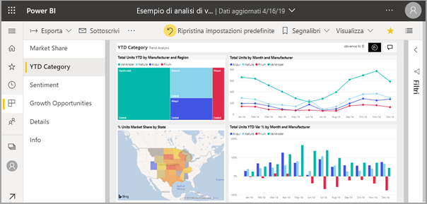
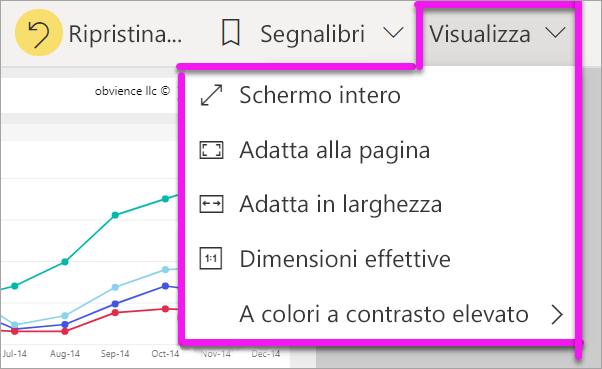
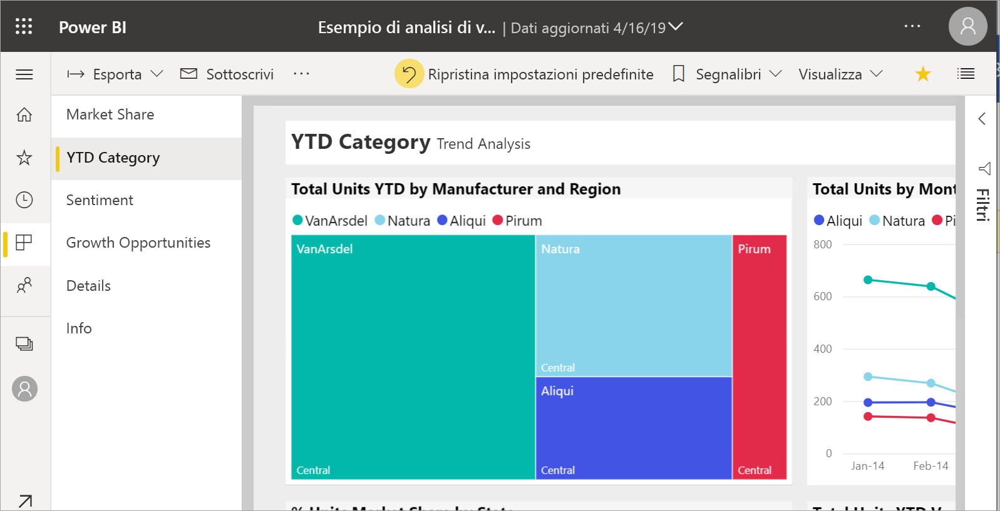
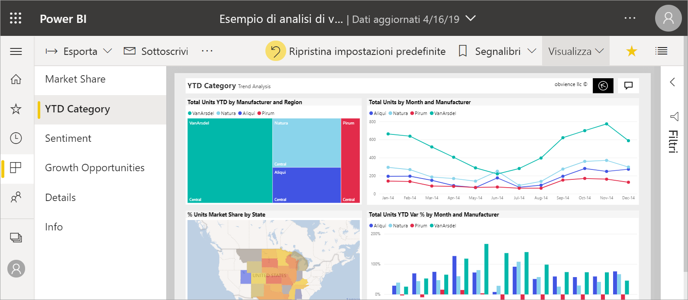
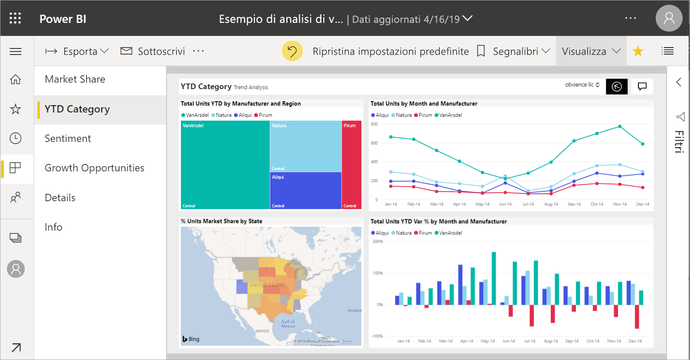
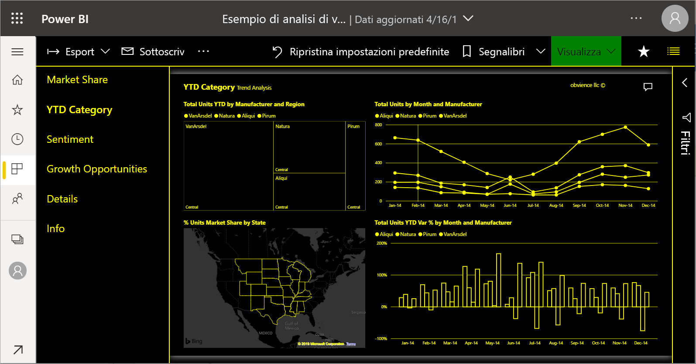

# Modificare la visualizzazione di una pagina del report

[!INCLUDE[consumer-appliesto-yyny](../includes/consumer-appliesto-yyny.md)]

[!INCLUDE [power-bi-service-new-look-include](../includes/power-bi-service-new-look-include.md)]

Le persone visualizzano i report su molti dispositivi diversi con dimensioni dello schermo e proporzioni diverse. Modificare il modo in cui viene visualizzata una pagina del report in base alle proprie esigenze.

## Esplorare il menu Visualizza

Le opzioni del menu **Visualizza** offrono la flessibilità necessaria per visualizzare le pagine del report in base alle dimensioni e alla larghezza scelte:

- Si supponga di visualizzare un report in un dispositivo di piccole dimensioni e che la lettura di titoli e legende risulti difficile.  Selezionare **Visualizza** > **Dimensioni effettive** per aumentare le dimensioni della pagina del report. Usare le barre di scorrimento per spostarsi all'interno del report.

    

- Un'altra opzione consiste nell'adattare il report alla larghezza dello schermo selezionando **Adatta in larghezza**. Poiché viene adattata solo la larghezza e non l'altezza, può essere comunque necessario usare la barra di scorrimento verticale.

  

- Se si preferisce non visualizzare le barre di scorrimento, ma si vuole usare al meglio le dimensioni del proprio schermo, selezionare **Adatta alla pagina**.

   

- **A colori a contrasto elevato** consente inoltre la scelta tra quattro opzioni: Contrasto elevato n. 1, Contrasto elevato n. 2, Nero a contrasto elevato e Bianco a contrasto elevato. Si tratta di una funzionalità di accessibilità che è possibile usare per consentire alle persone con problemi di vista di vedere meglio i report. L'esempio seguente usa il contrasto elevato 1. 

    

- L'ultima opzione, **Schermo intero**, consente di visualizzare la pagina del report senza barre dei menu e intestazioni. Lo schermo intero può essere una buona scelta per schermi di piccole dimensioni in cui i dettagli sono difficili da vedere.  Lo schermo intero può essere una buona scelta anche per la proiezione delle pagine del report su schermi di grandi dimensioni quando le persone devono semplicemente vedere le pagine, ma non interagire con esse.  

    

Quando si esce dal report, le impostazioni del menu **Visualizza** non vengono salvate, ma vengono ripristinate quelle predefinite. Se è importante salvare queste impostazioni, usare i [segnalibri](end-user-bookmarks.md).

## Usare il browser per cambiare la visualizzazione della pagina

I controlli zoom del browser aumentano e riducono l'area di disegno disponibile. Diminuendo lo zoom l'area di disegno disponibile si espande e viceversa. 

Il ridimensionamento dell'intero browser è un altro modo per cambiare le dimensioni di visualizzazione del report. 

## Fare zoom avanti su un oggetto visivo
A volte è difficile vedere i dettagli di un oggetto visivo. È però possibile aumentare la visualizzazione dell'oggetto visivo. Per altre informazioni, vedere [Modalità messa a fuoco e modalità schermo intero](end-user-focus.md)

### Oggetto visivo nella modalità *messa a fuoco*

### Oggetto visivo in modalità *schermo intero*

## Passaggi successivi

* [Presentazione del riquadro Filtri del report](end-user-report-filter.md)