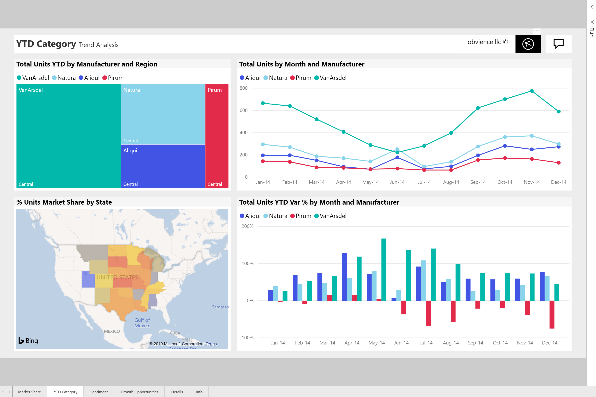

# Modificare la visualizzazione di una pagina del report
I report vengono visualizzati su dispositivi diversi con diverse dimensioni dello schermo e le proporzioni.  Modificare il modo in cui viene visualizzata una pagina di report per soddisfare le esigenze.    

## Esplorare il menu Visualizza
Le opzioni nel menu Visualizza offrono flessibilità per visualizzare le pagine del report nel server di dimensioni e si sceglie di larghezza.

- Si supponga che si sta visualizzando un report in un dispositivo di piccole dimensioni ed è difficile visualizzare i titoli e legende.  Selezionare **View** > **dimensioni effettive** per aumentare le dimensioni della pagina del report. Usare le barre di scorrimento per spostarsi all'interno del report. 

    

- In alternativa è possibile regolare il report per la larghezza dello schermo selezionando **adatta in larghezza**. Ciò potrebbe richiedere ancora l'utilizzo di una barra di scorrimento verticale.

  

- Se si preferisce non tutte le barre di scorrimento, ma si desidera usare al meglio le dimensioni dello schermo.  Selezionare **adatta alla pagina**.

   

   
- L'opzione finale **a schermo intero**, consente di visualizzare la pagina del report senza le intestazioni e nelle barre dei menu. Schermo intero potrebbe essere una buona scelta per schermi di piccole dimensioni in cui i dettagli sono difficili da vedere.  Schermo intero può essere anche una scelta ottimale quando la proiezione di pagine del report su schermi di grandi dimensioni agli utenti di visualizzare ma non interagisce.  

    

Quando si esce da report, non vengono salvate le impostazioni di visualizzazione, ma ripristino i valori predefiniti. Se è importante per l'utente per salvare queste impostazioni, usare [segnalibri](end-user-bookmarks.md). 

## Passaggi successivi
[Creare report per Cortana](../service-cortana-answer-cards.md)
