# Cambiare le dimensioni di una pagina del report
Nell'[articolo e nel video precedenti](../power-bi-report-display-settings.md) sono stati illustrati due modi diversi per controllare la visualizzazione delle pagine nei report di Power BI: **Visualizza** e **Dimensioni pagina**. Le opzioni Visualizzazione pagina e Dimensioni pagina sono disponibili sia nel servizio Power BI sia in Power BI Desktop. L'aspetto e la funzionalità sono praticamente uguali, ma in questa esercitazione verrà usato il servizio Power BI.

### Prerequisiti
- Servizio Power BI   
- [Report dell'esempio di analisi delle vendite al dettaglio](../sample-retail-analysis.md)

## Modificare l'impostazione di visualizzazione della pagina

1. Aprire il report nella Visualizzazione di lettura o nella Visualizzazione di modifica e selezionare la scheda del report **New Stores**. Per impostazione predefinita, questa pagina viene visualizzata usando l'impostazione **Adatta alla pagina**.  In questo caso, usando l'impostazione Adatta alla pagina, la pagina del report viene visualizzata senza barre di scorrimento, ma alcuni dettagli e riquadri sono troppo piccoli per essere letti.

   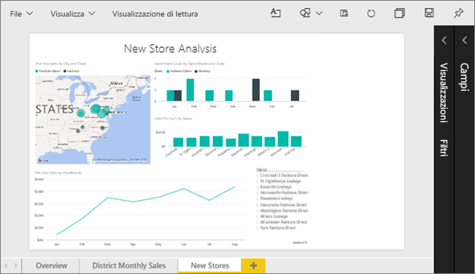
2. Assicurarsi che nell'area di disegno non sia selezionata alcuna visualizzazione. Selezionare **Visualizza** ed esaminare le opzioni di visualizzazione.

   * Questo sarà l'aspetto in Visualizzazione di lettura.

     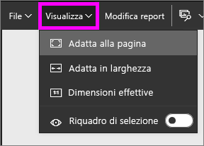
   * Questo sarà l'aspetto in Visualizzazione di modifica.

     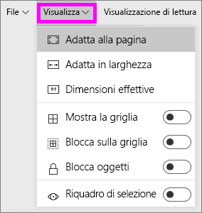

3. Si osservi l'aspetto della pagina quando si usa l'impostazione **Dimensioni effettive**.

   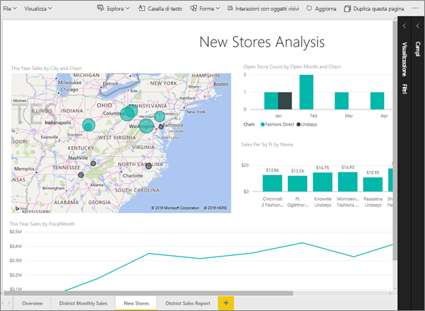

   Non è grande, il dashboard presenta ora due barre di scorrimento.
4. Passare a **Adatta in larghezza**.

   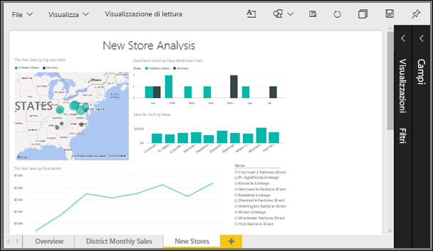

   Il risultato è migliore, è ancora presente una barra di scorrimento, ma è più facile leggere i dettagli.

## Modificare la visualizzazione predefinita di una pagina del report
Gli *autori* dei report possono modificare la visualizzazione predefinita delle pagine dei report. Quando si condivide il report con altri utenti, le pagine del report verranno aperte con la visualizzazione impostata. I *consumer* del report avranno la possibilità di modificare la visualizzazione, ma non potranno salvare le modifiche all'uscita dal report.

1. Nella pagina **Nuovi archivi** del report, tornare alla visualizzazione **Dimensioni effettive**.

   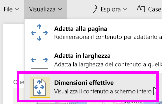

2. Nella pagina del report **District Monthly Sales** selezionare Visualizza e quindi **Adatta in larghezza**.

3. Nella pagina del report **Panoramica** lasciare l'impostazione di visualizzazione predefinita.

4. Selezionare **File > Salva** per salvare il report. All'apertura successiva del report, le pagine useranno le nuove impostazioni di visualizzazione. Confermare la visualizzazione.

   
3. Per tornare all'area di lavoro corrente, selezionarne il nome nella barra di spostamento superiore.  

   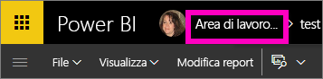
4. Selezionare la scheda **Report** e scegliere lo stesso report (esempio di analisi delle vendite al dettaglio).

    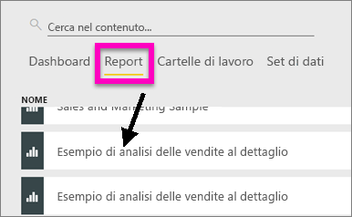
5. Aprire ogni pagina del report per visualizzare le nuove impostazioni.

   

## Informazioni sull'impostazione *Dimensioni pagina*
Le impostazioni per le dimensioni della pagina sono disponibili solo nella [Visualizzazione di modifica](../service-interact-with-a-report-in-editing-view.md), quindi per modificare queste impostazioni è necessario disporre di autorizzazioni di modifica (*autore*) per il report. Tali autorizzazioni per gli *autori* sono già disponibili se si è effettuata la connessione a uno degli [esempi](../sample-datasets.md).

1. Aprire la pagina "District monthly sales" di [Esempio di analisi delle vendite al dettaglio](../sample-retail-analysis.md) in Visualizzazione di modifica.
2. Assicurarsi che nell'area di disegno non sia selezionata alcuna visualizzazione.  Nel riquadro **Visualizzazioni** selezionare l'icona del rullo .
3. Selezionare **Dimensioni pagina** &gt; **Tipo** per visualizzare le opzioni relative alle dimensioni della pagina.

   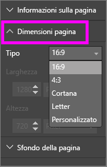
4. Selezionare **Letter**.  Solo il contenuto che rientra in 816x1056 pixel (formato Letter) rimane nella parte bianca dell'area di disegno.

   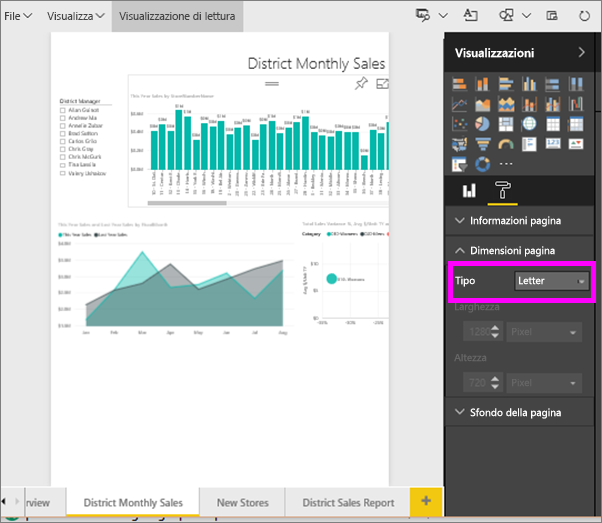
5. Selezionare **Dimensioni pagina** **16:9** .

   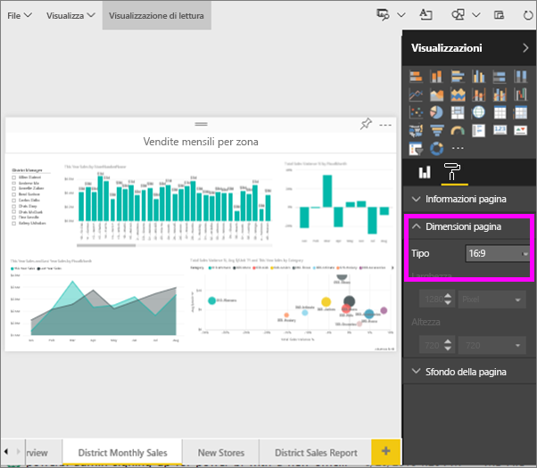

   La pagina del report viene visualizzata usando una proporzione di 16 in larghezza e 9 in altezza. Per visualizzare le dimensioni effettive in pixel, osservare i campi Larghezza e Altezza in grigio (1280x720). Attorno all'area di disegno report è presente molto spazio vuoto perché in precedenza l'opzione **Visualizza** era stata impostata su "Adatta in larghezza".
7. Continuare a esplorare le opzioni di **Dimensioni pagina**.

## Usare le opzioni Visualizza e Dimensioni pagina insieme
Usare Visualizza e Dimensioni pagina insieme per creare un report con un aspetto ottimale quando condiviso con i colleghi o quando viene incorporato in altre applicazioni.

In questo esercizio si creerà una pagina del report che verrà visualizzata in un'applicazione con spazio per 500 pixel di larghezza e 750 pixel di altezza.

Tenere a mente che la pagina del report è attualmente visualizzata con una larghezza di 1280 pixel e un'altezza di 720. Sarà necessario apportare diverse modifiche per ridimensionare e riorganizzare la pagina se si desidera adattare ad essa tutti gli oggetti visivi.

1. Ridimensionare e spostare gli oggetti visivi in modo che rientrino in meno della metà dell'area di disegno attuale.

    
2. Selezionare **Dimensioni pagina** &gt; **Personalizzato**.
3. Impostare la Larghezza su 500 e l'Altezza su 750.

    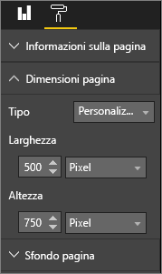
4. Modificare la pagina del report in modo che risulti ben organizzata. Usare le opzioni **Visualizza > Dimensioni effettive** e **Visualizza > Adatta alla pagina** per apportare le modifiche.

    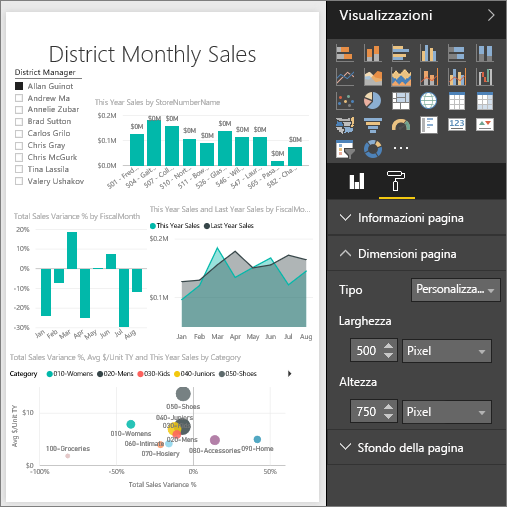

## Passaggi successivi
[Creare report per Cortana](../service-cortana-answer-cards.md)

Tornare a [Impostazioni di visualizzazione della pagina in un report di Power BI](../power-bi-report-display-settings.md)

Altre domande? [Provare la community di Power BI](http://community.powerbi.com/)
