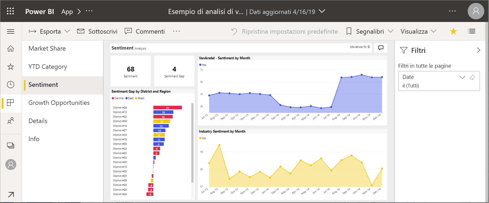

# Report in Power BI

Un report di Power BI consente di visualizzare un set di dati da più punti di vista, grazie a oggetti visivi che rappresentano conclusioni e approfondimenti diversi ottenuti dal set di dati.  Un report può includere un solo oggetto visivo oppure contenere pagine con più oggetti visivi. A seconda del ruolo, si può essere una persona che *progetta* i report. Oppure si può essere una persona che *consuma* o usa i report.

Questo report è composto da sei pagine (o schede) e si sta attualmente visualizzando la pagina **Sentiment**. Questa pagina contiene cinque diversi oggetti visivi e il titolo della pagina. Il riquadro *Filtri* mostra un filtro applicato a tutte le pagine del report. Per comprimere il riquadro Filtri, selezionare la freccia ( **>** ).

Se non si ha familiarità con Power BI, è possibile apprendere le nozioni di base utili leggendo [Concetti di base del servizio Power BI per i consumer](end-user-basic-concepts.md). I report sono disponibili per la visualizzazione, la condivisione e l'annotazione nei dispositivi mobili. Per altre informazioni, vedere [Esplorare i report nelle app Power BI per dispositivi mobili](mobile/mobile-reports-in-the-mobile-apps.md).

## Vantaggi dei report

In Power BI un report si basa su un singolo set di dati. I *designer* di report creano gli oggetti visivi che rappresentano parti di informazioni in un report. Gli oggetti visivi non sono statici.  Vengono aggiornati in base alle modifiche dei dati sottostanti. È possibile interagire con gli oggetti visivi e i filtri durante l'analisi dei dati per individuare informazioni dettagliate e cercare risposte. Come un dashboard, un report è altamente interattivo e altamente personalizzabile.

### Interagire in modo sicuro con i contenuti

Durante l'esplorazione e l'interazione con il contenuto, ovvero l'applicazione di filtri, il sezionamento, la sottoscrizione e l'esportazione, non è possibile danneggiare i report in alcun modo. Le attività svolte non influiscono sul set di dati sottostante o sul contenuto originale condiviso. Ciò si applica a dashboard, report e app.

> [!NOTE]
> Ricordare che non esiste il pericolo di danneggiare i dati. Power BI è un ambiente ideale in cui esplorare e sperimentare senza il timore di danneggiare qualcosa.

### Salvare le modifiche oppure ripristinare le impostazioni predefinite

Ciò non significa che non sia possibile salvare le modifiche apportate. È possibile, ma queste modifiche interesseranno solo la propria visualizzazione del contenuto. Per ripristinare la visualizzazione predefinita originale del report, selezionare **Ripristina impostazioni predefinite**.

## Dashboard e report a confronto

I [dashboard](end-user-dashboards.md) sono spesso confusi con i report perché sono anch'essi canvas contenenti oggetti visivi. Tuttavia, ci sono alcune importanti differenze.  

| **Capacità** | **Dashboard** | **Report** |
| --- | --- | --- |
| Pagine |Una pagina |Una o più pagine |
| Origini dati |Uno o più report e uno o più set di dati per dashboard |Un singolo set di dati per report |
| Applicazione di filtri |Non è possibile filtrare o sezionare |Molti modi diversi di filtrare, evidenziare e sezionare |
| Impostazione di avvisi |È possibile creare avvisi da ricevere per posta elettronica quando il dashboard soddisfa determinate condizioni |No |
| Feature |È possibile impostare un dashboard come "in primo piano" |Non permette di creare un report in primo piano |
| Permette di visualizzare i campi e le tabelle del set di dati sottostante |No. È possibile esportare i dati, ma non è possibile vedere i campi e le tabelle del set di dati nel dashboard stesso |Sì. È possibile vedere i campi e le tabelle del set di dati e i valori che si è autorizzati a vedere |
| Customization |No  |È possibile filtrare, esportare, visualizzare contenuto correlato, aggiungere segnalibri, generare codici a matrice, eseguire analisi in Excel e altro ancora |

<!--| Available in Power BI Desktop |No |Yes, can create and view reports in Desktop |
| Pinning |Can pin existing visuals (tiles) only from current dashboard to your other dashboards |Can pin visuals (as tiles) to any of your dashboards. Can pin entire report pages to any of your dashboards. | -->

## Designer di report e consumer di report

In base al proprio ruolo, si può essere un *designer*, ovvero una persona che crea report per uso personale o da condividere con i colleghi. In questo caso, si sarà interessati a imparare a creare e condividere i report.

Oppure si può essere un *consumer*, ovvero una persona che riceve i report da altri. In questo caso, si sarà interessati a imparare a comprendere i report e interagire con essi. I collegamenti riportati di seguito sono utili per i *consumer* di report:

* Iniziare con una [presentazione del servizio Power BI](end-user-basic-concepts.md) in cui viene spiegato dove trovare i report e i relativi strumenti.
* Fare clic sul collegamento per informazioni su come [aprire un report](end-user-report-open.md) e su tutte le interazioni disponibili nella [Visualizzazione di lettura](end-user-reading-view.md).
* Per acquisire familiarità con i report, eseguire la presentazione di uno degli [esempi](../sample-tutorial-connect-to-the-samples.md) forniti.  
* Per vedere il set di dati usato nel report e i dashboard contenenti riquadri aggiunti dal report, vedere [Visualizzare il contenuto correlato nel servizio Power BI](end-user-related.md).

> [!TIP]
> Se non si è trovato ciò che si stava cercando, usare il sommario a sinistra per sfogliare tutti gli articoli dedicati ai *report*.

## Passaggi successivi

[Aprire e visualizzare un report](end-user-report-open.md)    
[Dashboard nel servizio Power BI](end-user-dashboards.md)