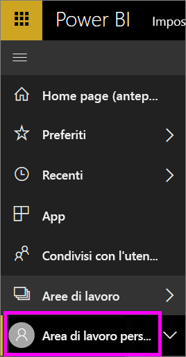
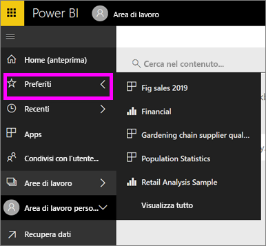

# Spostamento: ricerca e ordinamento del contenuto nel servizio Power BI
Sono disponibili vari modi per spostarsi all'interno del contenuto nel servizio Power BI. Nelle aree di lavoro il contenuto è organizzato in base al tipo: dashboard, report, cartelle di lavoro e set di dati.  Il contenuto è anche organizzato in base all'utilizzo: Preferiti, recenti, app, condivisi con l'utente corrente e in primo piano. Per usare una singola posizione, nella home page tutto il contenuto è organizzato in un'unica pagina. Questi percorsi diversi per il contenuto consentono di trovare rapidamente ciò che serve nel servizio Power BI.  

## Spostamento tra le aree di lavoro

I *consumer* di Power BI hanno in genere una sola area di lavoro, ovvero l'**area di lavoro personale**. L'**area di lavoro personale** includerà contenuto solo se sono stati scaricati esempi di Microsoft o se è stato creato o scaricato contenuto personale.  

All'interno dell'**area di lavoro personale**, il servizio Power BI separa il contenuto in base al tipo: dashboard, report, cartelle di lavoro e set di dati. Alla selezione di un'area di lavoro, verrà visualizzata questa organizzazione. In questo esempio, l'**area di lavoro personale** contiene un dashboard, due report, nessuna cartella di lavoro e due set di dati.

________________________________________

## Spostamento con la barra di spostamento sinistra
La barra di spostamento a sinistra classifica i contenuti in modo che sia ancora più semplice trovare le informazioni necessarie, rapidamente.  

- Il contenuto condiviso con l'utente è disponibile in **Condivisi con l'utente corrente**.
- Il contenuto visualizzato per ultimo è disponibile in **Recenti**. 
- Le app possono essere visualizzate selezionando **App**.
- **Home** è una visualizzazione a pagina singola del contenuto più importante, del contenuto consigliato e delle fonti di informazioni per l'apprendimento.

È anche possibile contrassegnare il contenuto come [preferito](end-user-favorite.md) e [in primo piano](end-user-featured.md). Scegliere un dashboard che si prevede di visualizzare più spesso e impostarlo come dashboard *in primo piano*. Ogni volta che si apre il servizio Power BI, viene visualizzato per prima il dashboard in primo piano. Se si visitano spesso determinati dashboard e app, è possibile impostarli come preferiti in modo che siano sempre disponibili nel riquadro di spostamento a sinistra.

.

## Considerazioni e risoluzione dei problemi
* Per i set di dati, l'opzione **Ordina per** non è disponibile dal proprietario.

## Passaggi successivi
[Power BI - Concetti di base](end-user-basic-concepts.md)

Altre domande? [Provare la community di Power BI](http://community.powerbi.com/)