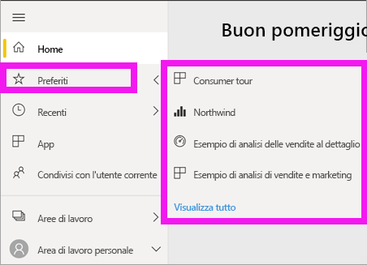

# Spostamento: ricerca e ordinamento del contenuto nel servizio Power BI
Sono disponibili vari modi per spostarsi all'interno del contenuto nel servizio Power BI. Nell'area di lavoro il contenuto è organizzato in base al tipo: dashboard e report.  Il contenuto è anche organizzato in base all'utilizzo: Preferiti, recenti, app, condivisi con l'utente corrente e in primo piano. Per usare una singola posizione, in *Home* di Power BI tutto il contenuto è organizzato in un'unica pagina. Questi percorsi diversi per accedere al contenuto consentono di trovare rapidamente ciò che serve nel servizio Power BI.  

## Spostamento tra le aree di lavoro

I *consumer* di Power BI hanno in genere una sola area di lavoro, ovvero l'**area di lavoro personale**. L'**area di lavoro personale** includerà contenuto solo se sono stati scaricati esempi di Microsoft o se sono stati creati o scaricati dashboard, report o app personali.  

All'interno dell'**area di lavoro personale**, il servizio Power BI separa il contenuto in base al tipo: dashboard, report, cartelle di lavoro e set di dati. Alla selezione di un'area di lavoro, verrà visualizzata questa organizzazione. In questo esempio, l'**area di lavoro personale** contiene un dashboard, un report, nessuna cartella di lavoro e un set di dati.

________________________________________
## Spostamento tramite il campo di ricerca
Usare la visualizzazione contenuto dell'**area di lavoro personale** per cercare, filtrare e ordinare il contenuto. Nel campo di ricerca digitare per intero o in parte il nome di un dashboard, un report, una cartella di lavoro o un proprietario.  

Se il contenuto è limitato, la ricerca e l'ordinamento non sono necessari.  In presenza di lunghi elenchi di dashboard e report, però, le funzionalità di ricerca e ordinamento risulteranno estremamente utili. L'elenco di report seguente, ad esempio, contiene 83 elementi. 

È anche possibile ordinare il contenuto in base al nome o al proprietario. Osservare la freccia a destra di **Nome**. Attualmente si sta applicando a 83 elementi l'ordinamento alfabetico crescente in base al nome. Per impostare l'ordinamento decrescente, selezionare **Nome**. La Freccia SU diventa Freccia GIÙ.

Non tutte le colonne possono essere ordinate. Passare il mouse sulle intestazioni colonna per individuare le colonne che possono essere ordinate.

___________________________________________________________________
## Spostamento con la barra di spostamento a sinistra
La barra di spostamento a sinistra classifica il contenuto in modi utili per trovare le informazioni necessarie, rapidamente.  

- Il contenuto condiviso con l'utente è disponibile in **Condivisi con l'utente corrente**.
- Il contenuto visualizzato per ultimo è disponibile in **Recenti**. 
- Le app possono essere visualizzate selezionando **App**.
- **Home** è una visualizzazione a pagina singola del contenuto più importante, del contenuto consigliato e delle fonti di informazioni per l'apprendimento.

È anche possibile contrassegnare il contenuto come [preferito](end-user-favorite.md) e [in primo piano](end-user-featured.md). Scegliere un dashboard o un report che si prevede di visualizzare più spesso e impostarlo come contenuto *in primo piano*. Ogni volta che si apre il servizio Power BI, viene visualizzato per primo il dashboard in primo piano. Se si visitano spesso determinati dashboard e app, è possibile impostarli come preferiti in modo che siano sempre disponibili nel riquadro di spostamento a sinistra.

.

## Considerazioni e risoluzione dei problemi
* Per i set di dati, l'opzione **Ordina per** non è disponibile dal proprietario.

## Passaggi successivi
[Ordinare gli oggetti visivi nei report](end-user-change-sort.md)

Altre domande? [Provare la community di Power BI](http://community.powerbi.com/)
