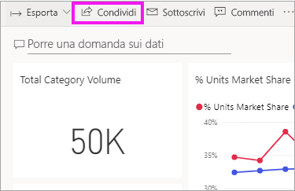
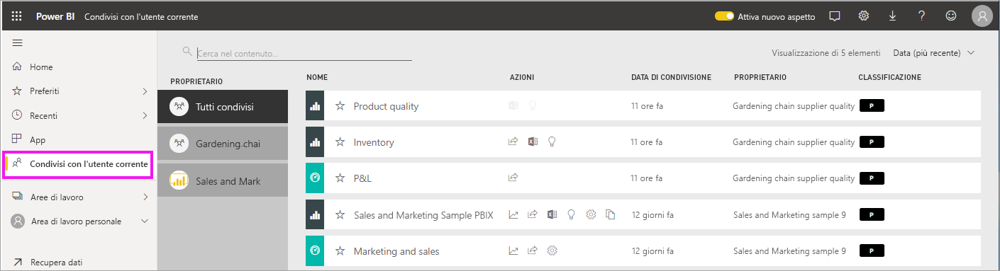
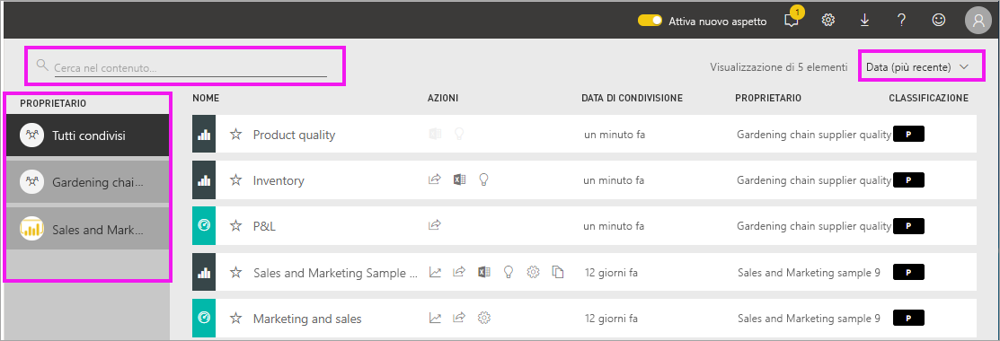

# Visualizzare i dashboard e i report condivisi con l'utente corrente

[!INCLUDE [power-bi-service-new-look-include](../includes/power-bi-service-new-look-include.md)]

Quando un collega condivide contenuto con un altro utente tramite il pulsante **Condividi**, tale contenuto viene visualizzato nel contenitore **Condivisi con l'utente corrente** dell'utente di destinazione. Il dashboard o il report è disponibile solo da **Condivisi con l'utente corrente** e non da **App**.

Il video seguente illustra l'elenco dei contenuti **Condivisi con l'utente corrente** e dimostra come accedervi e filtrarlo. Seguire quindi tutte le istruzioni riportate sotto il video per provare a farlo da soli. Per poter visualizzare i dashboard condivisi con l'utente è necessario disporre di una licenza Power BI Pro. Per informazioni dettagliate, leggere [What is Power BI Premium?](../service-premium-what-is.md) (Che cos'è Power BI Premium?).
    

> [!NOTE]
> Questo video usa una versione precedente del servizio Power BI.
    

<iframe width="560" height="315" src="https://www.youtube.com/embed/G26dr2PsEpk" frameborder="0" allowfullscreen></iframe>

## Interagire con il contenuto condiviso

Sono disponibili opzioni per l'interazione con i dashboard e i report condivisi, a seconda delle autorizzazioni assegnate dal *progettista*. Tra queste, c'è la possibilità di eseguire copie del dashboard, aprire il report nella [Visualizzazione di lettura](end-user-reading-view.md) e ripetere la condivisione con altri colleghi.

### Azioni disponibili dal contenitore **Condivisi con l'utente corrente**
Le azioni disponibili dipenderanno dalle impostazioni assegnate dal *progettista* del contenuto. Ecco alcune delle opzioni:
* Selezionare l'icona a forma di stella per [aggiungere un dashboard o un report a Preferiti](end-user-favorite.md) .
* Rimuovere un dashboard o un report  .
* Alcuni dashboard e report possono essere ricondivisi  .
* [Aprire il report in Excel](end-user-export.md)  
* [Visualizzare le informazioni dettagliate](end-user-insights.md) trovate da Power BI nei dati .
  
  > [!NOTE]
  > Per informazioni sulle classificazioni EGRC, selezionare il pulsante **Classificazione** o vedere [Classificazione dei dati del dashboard](../service-data-classification.md).
  > 

## Cercare e ordinare i dashboard condivisi
Se l'elenco di contenuti diventa lungo, sono disponibili diverse opzioni per trovare gli elementi necessari. È possibile usare il campo di ricerca, ordinare l'elenco per data oppure effettuare una selezione dalla colonna **Proprietario**.    

