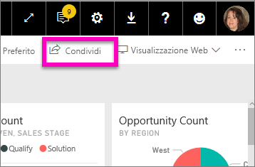
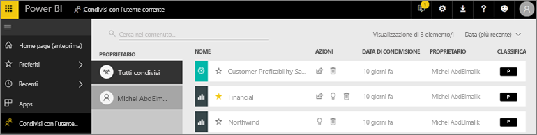
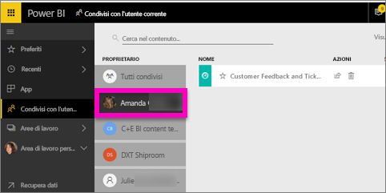

# Visualizzare i dashboard e i report condivisi con l'utente corrente
## Condiviso con me

Quando un collega condivide contenuto con un altro utente tramite il pulsante **Condividi**, tale contenuto viene visualizzato nel contenitore **Condivisi con l'utente corrente** dell'utente di destinazione. Il dashboard o il report è disponibile solo da **Condivisi con l'utente corrente** e non da **App**.

Il video seguente illustra l'elenco dei contenuti **Condivisi con l'utente corrente** e dimostra come accedervi e filtrarlo. Seguire quindi le istruzioni successive per sotto il video per fare una prova in prima persona. Per poter visualizzare i dashboard condivisi con l'utente è necessario disporre di una licenza Power BI Pro. Per informazioni dettagliate, leggere [What is Power BI Premium?](../service-premium.md) (Che cos'è Power BI Premium?).

<iframe width="560" height="315" src="https://www.youtube.com/embed/G26dr2PsEpk" frameborder="0" allowfullscreen></iframe>

Sono disponibili opzioni per l'interazione con i dashboard e i report, a seconda delle autorizzazioni assegnate dal progettista. Tra queste, c'è la possibilità di eseguire copie del dashboard, aprire il report nella [Visualizzazione di lettura](end-user-reading-view.md) e ripetere la condivisione con altri colleghi.

## Azioni disponibili dal contenitore **Condivisi con l'utente corrente**
* Selezionare l'icona a forma di stella per [Aggiungere un dashboard o un report a Preferiti](end-user-favorite.md).
* Rimuovere un dashboard o un report  
* Alcuni dashboard e report possono essere ricondivisi  
* In più, se gli elenchi si allungano, [usare il campo di ricerca e l'ordinamento per trovare le informazioni necessarie](end-user-search-sort.md).
  
  > [!NOTE]
  > Per informazioni sulle classificazioni EGRC, selezionare il pulsante di classificazione o visitare [Classificazione dei dati del dashboard](../service-data-classification.md).
  > 
  > 
* Selezionare il nome di un dashboard da aprire ed esplorare. Dopo aver aperto il dashboard condiviso è possibile usare Domande e risposte per porre domande sui dati sottostanti o selezionare un riquadro per aprire e interagire con il report nella Visualizzazione di lettura.

## Filtrare i dashboard condivisi in base al proprietario
Il contenuto della schermata **Condivisi con l'utente corrente** può essere ulteriormente filtrato in base al proprietario del contenuto. Ad esempio, se si seleziona **Amanda**, viene visualizzato solo il dashboard che Amanda ha condiviso con l'utente corrente.

