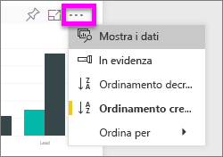
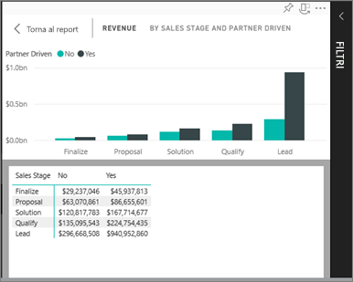
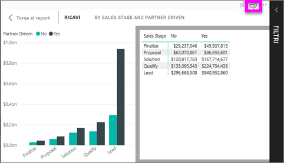

# Visualizzare i dati usati per creare la visualizzazione
## Visualizzare i dati
Una visualizzazione di Power BI viene costruita sulla base dei dati dei set di dati sottostanti. Se si è interessati a visualizzare il "dietro le quinte", Power BI consente di *visualizzare* i dati usati per creare l'oggetto visivo. Quando si seleziona **Mostra i dati**, Power BI mostra i dati di sotto o accanto alla visualizzazione.

## Uso di *Mostra i dati* nel servizio Power BI
1. Nel servizio Power BI aprire un report e selezionare un oggetto visivo.  
2. Per visualizzare i dati su cui si basa l'oggetto visivo, selezionare i puntini di sospensione (...) e scegliere **Mostra i dati**.
   
   
3. Per impostazione predefinita, i dati vengono visualizzati sotto l'oggetto visivo.
   
   

4. Per modificare l'orientamento, selezionare il layout verticale  nell'angolo in alto a destra della visualizzazione.
   
   

### Passaggi successivi
[Visualizzazioni nei report di Power BI](../visuals/power-bi-report-visualizations.md)    
[Report di Power BI](end-user-reports.md)    
