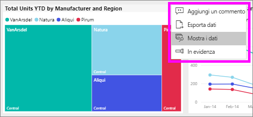
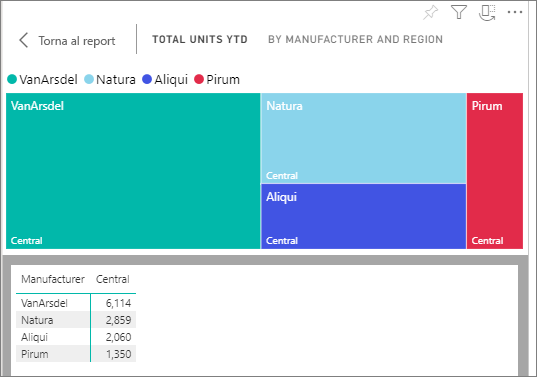
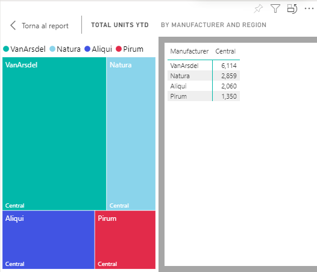

# Visualizzare i dati che è stati usati per creare l'oggetto visivo

Un oggetto visivo di Power BI viene costruito usando i dati di set di dati sottostanti. Se si è interessati a visualizzare il "dietro le quinte", Power BI consente di *visualizzare* i dati usati per creare l'oggetto visivo. Quando si seleziona **Mostra i dati**, Power BI Visualizza i dati di sotto (o accanto a) l'oggetto visivo.

1. Nel servizio Power BI [apre un report](end-user-report-open.md) e selezionare un oggetto visivo.  
2. Per visualizzare i dati su cui si basa l'oggetto visivo, selezionare i puntini di sospensione (...) e scegliere **Mostra i dati**.
   
   
3. Per impostazione predefinita, i dati vengono visualizzati sotto l'oggetto visivo.
   
   

4. Per modificare l'orientamento, selezionare il layout verticale  nell'angolo in alto a destra della visualizzazione.
   
   

## Passaggi successivi
[Oggetti visivi nei report di Power BI](../visuals/power-bi-report-visualizations.md)    
[Report di Power BI](end-user-reports.md)    
