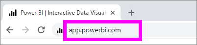
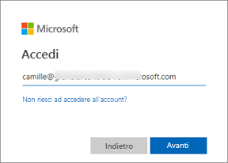
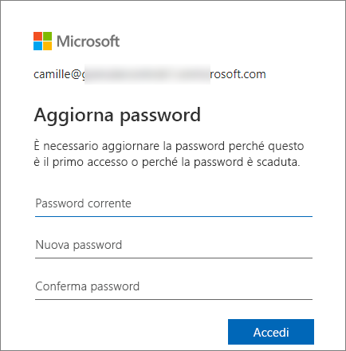
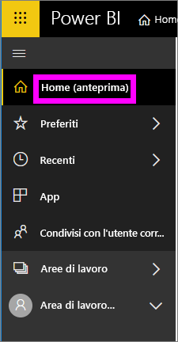
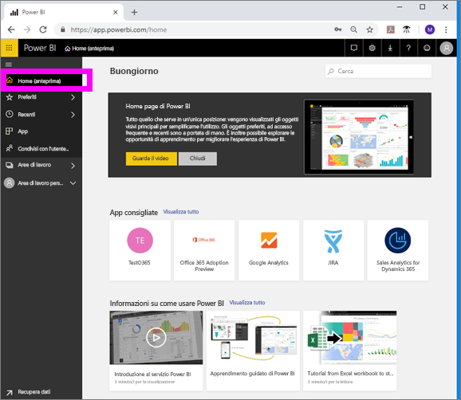
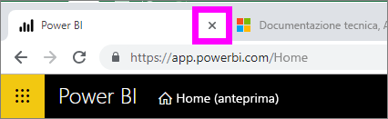
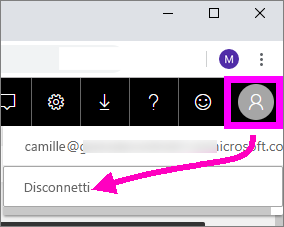

# Accedere al servizio Power BI

## Account di Power BI
Per accedere a Power BI è necessario un account. È possibile ottenere un account di Power BI in due modi. Il primo consiste nell'acquisto da parte della società di licenze di Power BI per i propri dipendenti. Il secondo consiste nella registrazione da parte dell'utente per ottenere una versione di valutazione gratuita o una licenza personale. Questo articolo descrive il primo scenario.

## Accedere per la prima volta

### Passaggio 1: aprire un browser
Il servizio Power BI viene eseguito in un browser.  Per questa ragione, il primo passaggio consiste nell'aprire il browser preferito e digitare **app.powerbi.com**.

### Passaggio 2: digitare l'indirizzo di posta elettronica
Al primo che accesso verrà richiesto di immettere l'indirizzo di posta elettronica.  Immettere l'indirizzo di posta elettronica aziendale o dell'istituto di istruzione usato per la registrazione in Power BI.  

Cercare nella cartella Posta in arrivo un messaggio di posta elettronica proveniente dall'amministratore di Power BI. La maggior parte degli amministratori invia un messaggio di benvenuto che contiene la password temporanea. Usare questo account di posta elettronica per l'accesso. 

 
### Passaggio 3: creare una nuova password
Se l'amministratore di Power BI ha inviato una password temporanea, immetterla nel campo **Password corrente**. Se non è stato ricevuta la password in un messaggio di posta elettronica, contattare l'amministratore di Power BI.

Power BI memorizzerà le credenziali e non sarà necessario immettere il nome utente (indirizzo di posta elettronica) al successivo accesso. 

### Passaggio 4: rivedere la Home page
Al primo accesso Power BI visualizza la **Home page**. Se la **Home page** non viene visualizzata, selezionarla dal riquadro di spostamento a sinistra. 

Nella Home page sono visualizzati tutti i contenuti che si è autorizzati a usare. È possibile che inizialmente i contenuti della Home page siano limitati, ma il loro numero aumenterà non appena si inizia a usare Power BI con i propri colleghi. 

Se non si vuole che Power BI visualizzi la Home page, è possibile [impostare un dashbord o report **in primo piano**](end-user-featured.md) da visualizzare in alternativa. 

## Interagire in modo sicuro con i contenuti
Quando si è un ***consumer***, altri utenti condividono contenuti con cui interagire per esaminare i dati e prendere decisioni relative all'azienda.  L'applicazione di filtri, la sottoscrizione, l'esportazione e il ridimensionamento dei dati non hanno effetto sul set di dati sottostante o sui contenuti originali condivisi (dashboard e report). Power BI è uno strumento sicuro per l'esplorazione dei dati e la sperimentazione. Ciò non significa che non è possibile salvare le modifiche apportate. Le modifiche tuttavia hanno effetto solo sulla **propria** visualizzazione dei contenuti. Il ripristino della visualizzazione predefinita originale è un'operazione estremamente semplice.

## Disconnettersi dal servizio Power BI
Quando si chiude o si esegue la disconnessione da Power BI, le modifiche vengono salvate per consentire di poter riprendere il lavoro dal punto in cui è stato interrotto.

Per chiudere Power BI, è sufficiente chiudere la scheda del browser in uso. 

 

Se si condivide un computer, è consigliabile disconnettersi ogni volta che si chiude Power BI.  Per disconnettersi, nell'angolo superiore destro selezionare l'immagine del profilo e scegliere **Disconnetti**. In alternativa, al termine delle operazioni chiudere semplicemente la scheda del browser.

 

## Risoluzione dei problemi e considerazioni
- Se è stata effettuata la registrazione per Power BI come utente singolo, accedere con l'indirizzo di posta elettronica usato per la registrazione.

- Se si usa Power BI con più account, durante l'accesso verrà richiesto di selezionare un account da un elenco e di immettere una password. 

## Passaggi successivi
[Visualizzare un'app di Power BI](end-user-app-view.md)
