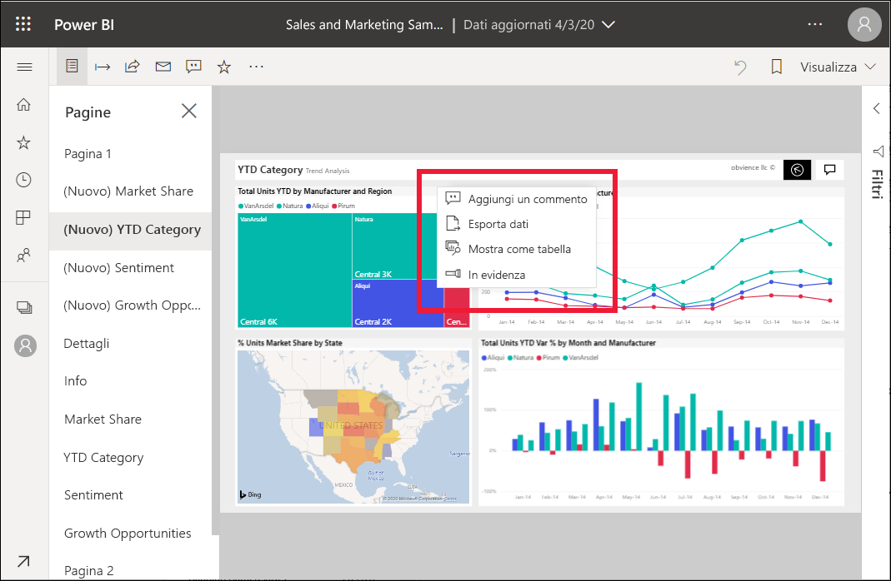
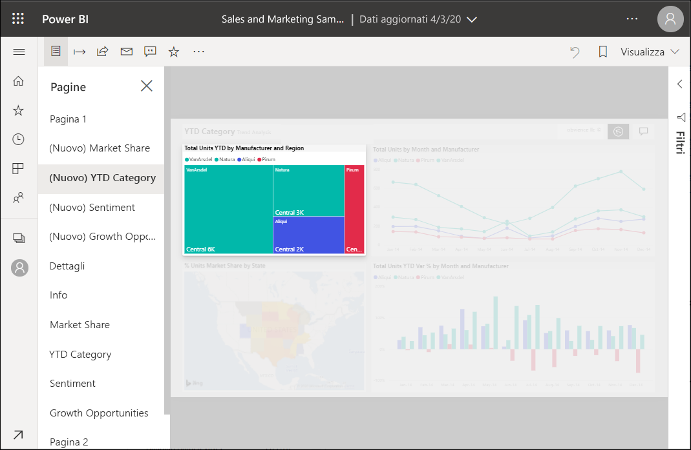

# Aggiungere In evidenza ai report di Power BI

[!INCLUDE[consumer-appliesto-yyny](../includes/consumer-appliesto-yyny.md)]

La funzionalità In evidenza consente di attirare l'attenzione su un oggetto visivo specifico in una pagina del report.  Se quando si aggiunge un segnalibro è selezionata la modalità In evidenza, tale modalità viene mantenuta nel segnalibro.

## Aggiungere una funzionalità In evidenza

1. [Aprire un report](end-user-report-open.md) nel servizio Power BI.

2. Decidere a quale oggetto visivo aggiungere In evidenza nella pagina del report. Selezionare l'elenco a discesa **Altre azioni (...)** .  

    

3. Scegliere l'opzione **In evidenza**. L'oggetto visivo selezionato viene evidenziato e tutti gli altri oggetti visivi nella pagina diventano quasi trasparenti. 

    

## Passaggi successivi

* [Visualizzare un riquadro del dashboard o un oggetto visivo di un report in modalità messa a fuoco](end-user-focus.md)

