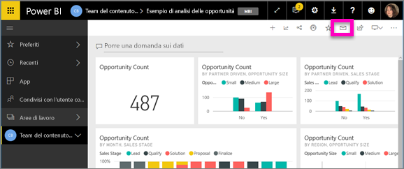
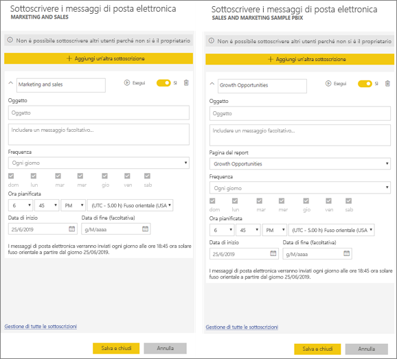
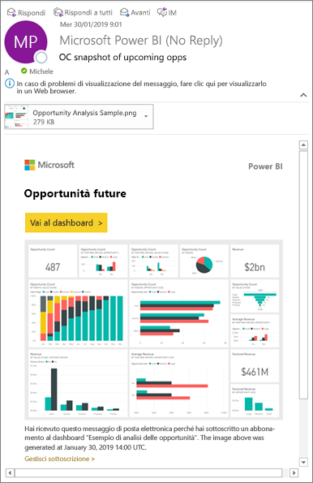
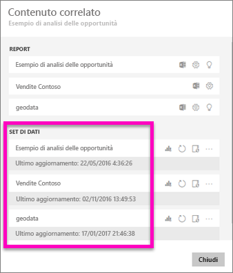
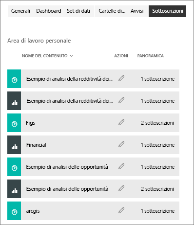

# Sottoscrivere un report o un dashboard nel servizio Power BI 
Rimanere aggiornati sui dashboard e sui report più importanti non è mai stato così facile. Una volta eseguita la sottoscrizione alle pagine report e ai dashboard che interessano, Power BI invierà uno snapshot nella posta in arrivo. È possibile specificare in Power BI la frequenza di ricezione dei messaggi di posta elettronica desiderata: giornaliera, settimanale o all'aggiornamento dei dati. È anche possibile impostare in Power BI un'ora specifica per l'invio dei messaggi di posta elettronica oppure inviarli subito.  

Per il messaggio di posta elettronica e lo snapshot verrà usata la lingua specificata nelle impostazioni di Power BI (vedere [Lingue e paesi/aree geografiche supportate per Power BI](../supported-languages-countries-regions.md)). Se non è definita alcuna lingua, Power BI usa la lingua in base alle impostazioni internazionali nel browser corrente. Per visualizzare o impostare la preferenza per la lingua, selezionare l'icona a forma di ingranaggio  > **Impostazioni > Generali > Lingua**. 

Il messaggio di posta elettronica ricevuto include un collegamento per passare al report o al dashboard. Nei dispositivi mobili con l'app Power BI installata, selezionando questo collegamento si avvia l'app (anziché l'azione predefinita di apertura del report o del +dashboard nel sito Web di Power BI).

## Requisiti
La **creazione** di una sottoscrizione per se stessi richiede una licenza di Power BI Pro. Gli utenti che visualizzano contenuti in un'app o un'area di lavoro Premium possono inoltre sottoscrivere i contenuti disponibili in tale posizione, anche senza una licenza di Power BI Pro. La **sottoscrizione per altri utenti** è disponibile solo per il proprietario del dashboard. 

## Sottoscrivere una pagina di report o dashboard
Il processo di sottoscrizione a un dashboard o un report è molto simile. Lo stesso pulsante consente di effettuare la sottoscrizione ai dashboard e ai report del servizio Power BI.
 
.

1. Aprire il dashboard o il report.
2. Dalla barra dei menu superiore selezionare **Sottoscrivi** oppure selezionare l'icona a forma di busta .
   
   

   
    
    La schermata a sinistra viene visualizzata quando si è all'interno di un dashboard e si seleziona **Sottoscrivi**. La schermata a destra viene visualizzata quando si è all'interno della pagina di un report e si seleziona **Sottoscrivi**. Per sottoscrivere più di una pagina di un report, selezionare **Aggiungi un'altra sottoscrizione** e selezionare una pagina diversa. 

4. Usare il dispositivo di scorrimento giallo per attivare e disattivare la sottoscrizione.  Lo spostamento del dispositivo di scorrimento sulla posizione Disattivato non comporta l'eliminazione della sottoscrizione. Per eliminare la sottoscrizione, selezionare l'icona a forma di cestino.

5. Facoltativamente, aggiungere un oggetto e i dettagli del messaggio di posta elettronica. 

5. Selezionare una **Frequenza** per la sottoscrizione.  È possibile scegliere Ogni giorno, Settimanale o Dopo l'aggiornamento dei dati (una volta al giorno).  Per ricevere il messaggio di posta elettronica di sottoscrizione solo in alcuni giorni, selezionare **Settimanale** e scegliere i giorni in cui si vuole ricevere il messaggio.  Ad esempio, se si vuole ricevere il messaggio di posta elettronica di sottoscrizione solo nei giorni lavorativi, selezionare la frequenza **Settimanale** e deselezionare le caselle sab e dom.   

6. Pianificare l'ora di invio del messaggio di posta elettronica selezionando la frequenza Ogni giorno o Settimanale e specificando un'**Ora** **pianificata** per la sottoscrizione.  Questo è il momento in cui inizia il processo di sottoscrizione. Potrebbero passare alcuni minuti prima che il messaggio venga recapitato alla Posta in arrivo.    

7. Pianificare la data di inizio e fine immettendo le date nei campi di data. Per impostazione predefinita, l'ora di inizio della sottoscrizione corrisponde alla data di creazione e la data di fine a un anno più tardi. Quando una sottoscrizione raggiunge una data di fine, viene interrotta finché non viene riabilitata.  Si riceveranno delle notifiche prima della data di fine pianificata in cui viene chiesto se si intende prorogare la sottoscrizione.     

8. Per riesaminare e testare la sottoscrizione, selezionare **Esegui adesso**.  In questo modo il messaggio di posta elettronica viene immediatamente inviato all'utente. 

8. Se è tutto corretto, selezionare **Salva e chiudi** per salvare la sottoscrizione. Si riceverà un messaggio di posta elettronica e uno snapshot del dashboard o del report in base alla pianificazione impostata. Tutte le sottoscrizioni con la frequenza impostata su **Dopo l'aggiornamento dei dati** invieranno un messaggio di posta elettronica solo dopo il primo aggiornamento pianificato per quel giorno.
   
   
   
    L'aggiornamento della pagina del report non aggiorna il set di dati. Solo il proprietario del set di dati può aggiornare manualmente un set di dati. Per cercare il nome dei set di dati sottostanti, selezionare **Visualizza elementi correlati** nella barra dei menu superiore o cercare il messaggio di posta elettronica originale della sottoscrizione.
   
    

## Gestire le sottoscrizioni
Le sottoscrizioni possono essere gestite solo dall'utente che le ha create. Selezionare di nuovo **Sottoscrivi** e scegliere **Gestisci tutte le sottoscrizioni** nell'angolo inferiore sinistro (vedere gli screenshot precedenti). 

Una sottoscrizione termina se la licenza Pro scade, il dashboard o il report viene eliminato dal proprietario o l'account utente usato per creare la sottoscrizione viene eliminato.

## Considerazioni e risoluzione dei problemi
* È possibile che i dashboard con più di 25 riquadri aggiunti o più di 4 pagine report dinamiche aggiunte non vengano visualizzati interamente nei messaggi di posta elettronica della sottoscrizione inviati agli utenti. È consigliabile contattare chi ha progettato il dashboard e chiedere di ridurre i riquadri aggiunti a meno di 25 e le pagine report dinamiche aggiunte a meno di quattro per garantire che il messaggio di posta elettronica venga visualizzato correttamente.  
* Per le sottoscrizioni tramite posta elettronica ai dashboard, i riquadri a cui è stata applicata la sicurezza a livello di riga non vengono visualizzati.  Per le sottoscrizioni tramite posta elettronica ai report, non sarà possibile creare una sottoscrizione se il set di dati usa la sicurezza a livello di riga.
* Se i collegamenti (al contenuto) che sono presenti nel messaggio di posta elettronica smettono di funzionare, è possibile che il contenuto sia stato eliminato. Nel messaggio di posta elettronica, sotto lo screenshot, è possibile verificare se si è eseguita la sottoscrizione o se questa è stata eseguita per proprio conto da un altro utente. Nella seconda ipotesi, chiedere al collega di annullare i messaggi di posta elettronica o eseguire di nuovo la sottoscrizione.
* Le sottoscrizioni alle pagine dei report sono associate al nome della pagina del report. Se si esegue la sottoscrizione a una pagina del report e la pagina viene rinominata, sarà necessario ricreare la sottoscrizione.
* Se non è possibile usare la funzionalità di sottoscrizione, contattare l'amministratore di sistema. L'organizzazione potrebbe aver disabilitato questa funzionalità per motivi di autenticazione o altri motivi.  
* Le sottoscrizioni tramite posta elettronica non supportano la maggior parte degli [oggetti visivi personalizzati](../power-bi-custom-visuals.md).  L'unica eccezione è costituita dagli oggetti visivi personalizzati che sono stati [certificati](../power-bi-custom-visuals-certified.md).  
* Attualmente le sottoscrizioni tramite posta elettronica non supportano oggetti visivi R personalizzati.  
* Per le sottoscrizioni ai dashboard, in particolare, alcuni tipi di riquadri non sono ancora supportati,  tra cui: riquadri di streaming, riquadri video, riquadri di contenuto Web personalizzato.     
* Le sottoscrizioni possono non riuscire nei dashboard o nei report con immagini grandi a causa dei limiti delle dimensioni della posta elettronica.    
* Power BI sospende automaticamente l'aggiornamento nei set di dati associati ai dashboard e ai report che non vengono visitati da più di due mesi.  Tuttavia, se si aggiunge una sottoscrizione a un dashboard o un report, l'aggiornamento non viene sospeso anche nel caso in cui non sia stato visitato.
* In rare occasioni il recapito delle sottoscrizioni via posta elettronica ai destinatari può richiedere più di quindici minuti.  In questo caso è consigliabile eseguire l'aggiornamento dei dati e la sottoscrizione via posta elettronica in momenti diversi per garantire il recapito tempestivo.  Se il problema persiste, contattare il supporto di Power BI.

## Passaggi successivi

[Cercare e ordinare il contenuto](end-user-search-sort.md)
