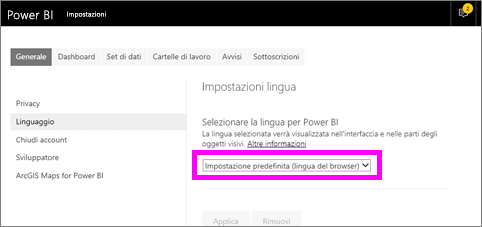
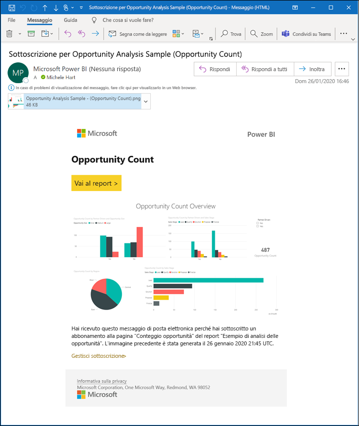
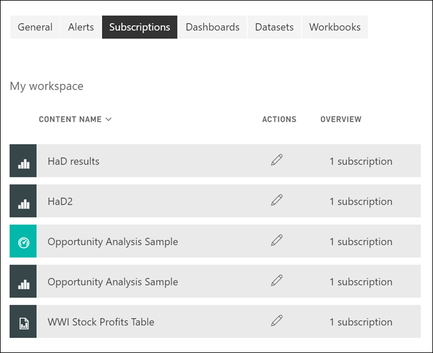

# Sottoscrivere un report o un dashboard nel servizio Power BI 

[!INCLUDE[consumer-appliesto-ynny](../includes/consumer-appliesto-ynny.md)]

[!INCLUDE [power-bi-service-new-look-include](../includes/power-bi-service-new-look-include.md)]

Rimanere aggiornati sui dashboard e sui report più importanti non è mai stato così facile. Basta sottoscrivere le pagine dei report e dei dashboard più importanti e Power BI invierà uno snapshot nella posta in arrivo. È possibile specificare in Power BI la frequenza di ricezione dei messaggi di posta elettronica desiderata: giornaliera, settimanale o all'aggiornamento dei dati. È anche possibile impostare in Power BI un'ora specifica per l'invio dei messaggi di posta elettronica oppure inviarli subito.  In tutto, è possibile impostare fino a 24 sottoscrizioni diverse per ogni report o dashboard.

Per il messaggio di posta elettronica e lo snapshot verrà usata la lingua specificata nelle impostazioni di Power BI (vedere [Lingue e paesi/aree geografiche supportate per Power BI](../fundamentals/supported-languages-countries-regions.md)). Se non è definita alcuna lingua, Power BI usa la lingua in base alle impostazioni internazionali nel browser corrente. Per visualizzare o impostare la preferenza per la lingua, selezionare l'icona a forma di ingranaggio  > **Impostazioni > Generali > Lingua**. 

Il messaggio di posta elettronica ricevuto include un collegamento per passare al report o al dashboard. Nei dispositivi mobili con l'app Power BI installata, selezionando questo collegamento si avvia l'app (anziché l'azione predefinita di apertura del report o del +dashboard nel sito Web di Power BI).

## Requisiti
La **creazione** di una sottoscrizione per se stessi richiede un tipo di [licenza](end-user-license.md) specifico. Se non si riesce a creare una sottoscrizione, contattare l'amministratore di Power BI. La **sottoscrizione per altri utenti** è disponibile solo per il proprietario del dashboard o del report. Sottoscrivere i report impaginati è leggermente diverso. Per maggiori dettagli, vedere [Subscribe yourself and others to a paginated report in the Power BI service](paginated-reports-subscriptions.md) (Sottoscrivere per se stessi e altri utenti un report impaginato nel servizio Power BI). 

## Sottoscrivere una pagina di report o dashboard
Il processo di sottoscrizione a un dashboard o a un report è molto simile. Lo stesso pulsante consente di effettuare la sottoscrizione ai dashboard e ai report del servizio Power BI.
 
.

1. Aprire il dashboard o il report.
2. Dalla barra dei menu superiore selezionare **Sottoscrivi** oppure selezionare l'icona a forma di busta .
   

   
    
    La schermata a sinistra viene visualizzata quando si è all'interno di un dashboard e si seleziona **Sottoscrivi**. La schermata a destra viene visualizzata quando si è all'interno della pagina di un report e si seleziona **Sottoscrivi**. 
    
    a. Per effettuare una sottoscrizione a più di una pagina di un report, scegliere **Aggiungi un'altra sottoscrizione** e selezionare una pagina diversa dall'elenco a discesa nella parte superiore.

    b. Usare il dispositivo di scorrimento giallo per attivare e disattivare la sottoscrizione.  Lo spostamento del dispositivo di scorrimento sulla posizione Disattivato non comporta l'eliminazione della sottoscrizione. Per eliminare la sottoscrizione, selezionare l'icona a forma di cestino.

    c. Facoltativamente, aggiungere un oggetto e i dettagli del messaggio di posta elettronica. 

    d. Selezionare una **Frequenza** per la sottoscrizione.  È possibile scegliere Ogni giorno, Settimanale o Dopo l'aggiornamento dei dati (una volta al giorno).  Per ricevere il messaggio di posta elettronica di sottoscrizione solo in alcuni giorni, selezionare **Settimanale** e scegliere i giorni in cui si vuole ricevere il messaggio.  Ad esempio, se si vuole ricevere il messaggio di posta elettronica di sottoscrizione solo nei giorni lavorativi, selezionare la frequenza **Settimanale** e deselezionare le caselle sab e dom. Se si seleziona **Ogni mese**, immettere il giorno o i giorni del mese per i quali si desidera ricevere il messaggio di posta elettronica di sottoscrizione.   

    e. Se si sceglie Ogni giorno, Ogni ora, Ogni mese o Ogni settimana, è anche possibile scegliere un'ora pianificata per la sottoscrizione. L'orario può essere l'ora in punto o l'ora e 15, 30 o 45 minuti. Selezionare mattina (AM) o pomeriggio/sera (PM). È anche possibile specificare il fuso orario. Se si sceglie Ogni ora, in Ora pianificata selezionare l'orario desiderato per l'avvio della sottoscrizione e l'esecuzione avverrà ogni ora dopo tale orario.  

    f. Pianificare la data di inizio e fine immettendo le date nei campi di data. Per impostazione predefinita, l'ora di inizio della sottoscrizione corrisponde alla data di creazione e la data di fine a un anno più tardi. È possibile modificarla impostando una data nel futuro (fino all'anno 9999) in qualsiasi momento prima della scadenza della sottoscrizione. Quando una sottoscrizione raggiunge una data di fine, viene interrotta finché non viene riabilitata.  Si riceveranno delle notifiche prima della data di fine pianificata in cui viene chiesto se si intende prorogare la sottoscrizione.     

    g. Per riesaminare e testare la sottoscrizione, selezionare **Esegui adesso**.  In questo modo il messaggio di posta elettronica viene immediatamente inviato all'utente. 

3. Se è tutto corretto, selezionare **Salva e chiudi** per salvare la sottoscrizione. Si riceverà un messaggio di posta elettronica e uno snapshot del dashboard o del report in base alla pianificazione impostata. Tutte le sottoscrizioni con la frequenza impostata su **Dopo l'aggiornamento dei dati** invieranno un messaggio di posta elettronica solo dopo il primo aggiornamento pianificato per quel giorno.
   
   
   
    L'aggiornamento della pagina del report non aggiorna il set di dati. Solo il proprietario del set di dati può aggiornare manualmente un set di dati. Per cercare il nome del proprietario dei set di dati sottostanti, selezionare l'elenco a discesa nella barra dei menu superiore o cercare il messaggio di posta elettronica originale della sottoscrizione.
   
    

## Gestire le sottoscrizioni
Le sottoscrizioni possono essere gestite solo dall'utente che le ha create. Selezionare di nuovo **Sottoscrivi** e scegliere **Gestisci tutte le sottoscrizioni** nell'angolo inferiore sinistro (vedere gli screenshot precedenti). Le sottoscrizioni visualizzate variano in base all'area di lavoro attiva. Per vedere contemporaneamente tutte le sottoscrizioni per tutte le aree di lavoro, assicurarsi che **Area di lavoro personale** sia attivo. Per altre informazioni sulle aree di lavoro, vedere [Workspaces in Power BI](end-user-workspaces.md) (Aree di lavoro in Power BI). 

Una sottoscrizione termina se la licenza Pro scade, il dashboard o il report viene eliminato dal proprietario o l'account utente usato per creare la sottoscrizione viene eliminato.

## Considerazioni e risoluzione dei problemi
* Per evitare che i messaggi di posta elettronica di sottoscrizione vengano deviati alla cartella della posta indesiderata, aggiungere l'alias di posta elettronica di Power BI (no-reply-powerbi@microsoft.com) ai propri contatti. Se si usa Microsoft Outlook, fare clic con il pulsante destro del mouse sull'alias e selezionare **Aggiungi ai contatti di Outlook**. 
* È possibile che i dashboard con più di 25 riquadri aggiunti o più di quattro pagine report dinamiche aggiunte non vengano visualizzati interamente nei messaggi di posta elettronica della sottoscrizione inviati agli utenti. È consigliabile contattare chi ha progettato il dashboard e chiedere di ridurre i riquadri aggiunti a meno di 25 e le pagine report dinamiche aggiunte a meno di quattro per garantire che il messaggio di posta elettronica venga visualizzato correttamente.  
* Per le sottoscrizioni tramite posta elettronica ai dashboard, i riquadri a cui è stata applicata la sicurezza a livello di riga non vengono visualizzati.  
* Se i collegamenti (al contenuto) che sono presenti nel messaggio di posta elettronica smettono di funzionare, è possibile che il contenuto sia stato eliminato. Nel messaggio di posta elettronica, sotto lo screenshot, è possibile verificare se si è eseguita la sottoscrizione o se questa è stata eseguita per proprio conto da un altro utente. Nella seconda ipotesi, chiedere al collega di annullare i messaggi di posta elettronica o eseguire di nuovo la sottoscrizione.
* Per le sottoscrizioni ai dashboard, alcuni tipi di riquadri non sono ancora supportati, tra cui: riquadri di streaming, riquadri video, riquadri di contenuto Web personalizzato. 
* Le sottoscrizioni alle pagine dei report sono associate al nome della pagina del report. Se si esegue la sottoscrizione a una pagina del report e la pagina viene rinominata, sarà necessario ricreare la sottoscrizione.
* Se non è possibile usare la funzionalità di sottoscrizione, contattare l'amministratore di sistema. È possibile che l'organizzazione abbia disabilitato questa funzionalità.  
* Le sottoscrizioni tramite posta elettronica non supportano la maggior parte degli [oggetti visivi personalizzati](../developer/visuals/power-bi-custom-visuals.md).  L'unica eccezione è costituita dagli oggetti visivi personalizzati di Power BI che sono stati [certificati](../developer/visuals/power-bi-custom-visuals-certified.md).    
* Le sottoscrizioni tramite posta elettronica vengono inviate con gli stati di filtro e filtro dei dati predefinito del report. Eventuali modifiche ai valori predefiniti apportate dopo la sottoscrizione non vengono visualizzate nel messaggio di posta elettronica. I report impaginati supportano questa funzionalità e consentono di impostare i valori dei parametri specifici per ogni sottoscrizione.  
* Attualmente le sottoscrizioni tramite posta elettronica non supportano oggetti visivi di Power BI basati su R.  
* Per le sottoscrizioni ai dashboard, in particolare, alcuni tipi di riquadri non sono ancora supportati,  tra cui: riquadri di streaming, riquadri video, riquadri di contenuto Web personalizzato.     
* Le sottoscrizioni possono non riuscire nei dashboard o nei report con immagini grandi a causa dei limiti delle dimensioni della posta elettronica.    
* Power BI sospende automaticamente l'aggiornamento nei set di dati associati ai dashboard e ai report che non vengono visitati da più di due mesi.  Tuttavia, se si aggiunge una sottoscrizione a un dashboard o un report, l'aggiornamento non viene sospeso anche nel caso in cui non sia stato visitato.
* In rare occasioni il recapito delle sottoscrizioni via posta elettronica ai destinatari può richiedere più di quindici minuti.  In questo caso è consigliabile eseguire l'aggiornamento dei dati e la sottoscrizione via posta elettronica in momenti diversi per garantire il recapito tempestivo.  Se il problema persiste, contattare il supporto di Power BI.

## Passaggi successivi

[Cercare e ordinare il contenuto](end-user-search-sort.md)
