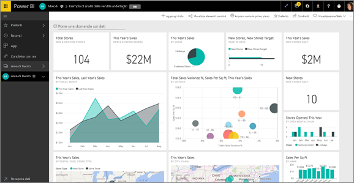
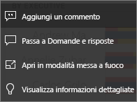
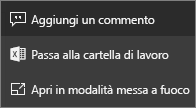
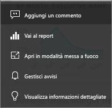

# Riquadri del dashboard in Power BI
Un riquadro è uno snapshot dei dati, aggiunto al dashboard da un *designer*. È possibile creare un riquadro da un report, da un set di dati, da un dashboard, dalla casella Domande e risposte, da Excel, da SQL Server Reporting Services (SSRS) e da altre origini.  Questo screenshot mostra numerosi riquadri diversi aggiunti a un dashboard.

Oltre ai riquadri aggiunti dai report, i *designer* possono aggiungere riquadri autonomi direttamente nel dashboard usando **Aggiungi riquadro**. I riquadri autonomi includono caselle di testo, immagini, video, streaming di dati e contenuto Web.

Per saperne di più sui componenti essenziali di Power BI,  vedere [Power BI - Concetti di base](end-user-basic-concepts.md).

## Interazione con i riquadri in un dashboard

1. Passare il puntatore del mouse sul riquadro per visualizzare i puntini di sospensione.
   
    
2. Selezionare i puntini di sospensione per aprire il menu Azione per il riquadro. Le opzioni disponibili variano a seconda del tipo di oggetto visivo e del metodo usato per creare il riquadro. Ecco alcuni esempi di cosa può essere visualizzato.

    - Riquadro creato con domande e risposte
   
        

    - Riquadro creato da una cartella di lavoro
   
        

    - Riquadro creato da un report
   
        
   
    Da qui è possibile:
   
   * [Aprire il report usato per creare questo riquadro](end-user-reports.md)   
   
   * [Aprire la domanda di Domande e risposte usata per creare il riquadro ](end-user-reports.md)   
   

   * [Aprire il foglio di lavoro usato per creare questo riquadro ](end-user-reports.md)   
    * [Visualizzare il riquadro in modalità messa a fuoco ](end-user-focus.md)   
     * [Eseguire analisi su informazioni dettagliate ](end-user-insights.md) 
    * [Aggiungere un commento e avviare una discussione](end-user-comment.md)

3. Per chiudere il menu delle azioni, selezionare un'area vuota nell'area di disegno.

### Selezionare (fare clic su) un riquadro
Quando si seleziona un riquadro, gli elementi visualizzati dipendono da come è stato creato il riquadro e se contiene un [collegamento personalizzato](../service-dashboard-edit-tile.md). In questo caso, selezionando il riquadro si viene reindirizzati a tale collegamento. In caso contrario viene visualizzato il report, la cartella di lavoro di Excel Online, il report SSRS locale o la domanda di Domande e risposte da cui è stato creato il riquadro.

> [!NOTE]
> Fanno eccezione i riquadri video creati direttamente nel dashboard con **Aggiungi riquadro**. Se si seleziona un riquadro video creato in questo modo, il video viene riprodotto direttamente nel dashboard.   
> 
> 

## Considerazioni e risoluzione dei problemi
* Se il report usato per creare la visualizzazione non è stato salvato, selezionando il riquadro non viene eseguita alcuna azione.
* Se il riquadro è stato creato da una cartella di lavoro in Excel Online e non si ha almeno l'autorizzazione di lettura per la cartella di lavoro, quest'ultima non viene aperta in Excel Online quando si seleziona il riquadro.
* Per i riquadri creati direttamente nel dashboard con **Aggiungi riquadro**, se è stato impostato un collegamento ipertestuale personalizzato, tale URL verrà aperto selezionando il titolo, il sottotitolo e/o il riquadro.  In caso contrario, per impostazione predefinita, selezionando uno di questi riquadri creati direttamente nel dashboard per un'immagine, un codice Web o una casella di testo non succede nulla.
* Se non si ha l'autorizzazione per il report in SSRS, la selezione di un riquadro creato da SSRS produrrà un pagina che indica che non è possibile accedere (rsAccessDenied).
* Se non si ha accesso alla rete in cui si trova il server SSRS, la selezione di un riquadro creato da SSRS produrrà una pagina che indica che non è possibile trovare il server (HTTP 404). Il dispositivo deve avere accesso al server di report per visualizzare il report.
* Se la visualizzazione originale usata per creare il riquadro viene modificata, il riquadro non cambia.  Se ad esempio il *designer* ha aggiunto un grafico a linee da un report che è stato convertito successivamente in un grafico a barre, il riquadro del dashboard continua a mostrare un grafico a linee. I dati vengono aggiornati ma il tipo di visualizzazione rimane uguale.

## Passaggi successivi
[Aggiornamento dei dati](../refresh-data.md)

[Power BI - Concetti di base](end-user-basic-concepts.md)
