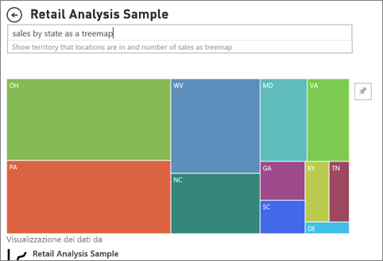

# Tipi di oggetti visivi in Power BI
È possibile trovare gli oggetti visivi nei report, dashboard, le App e domande e risposte. Alcuni di questi tipi di oggetti visivi sono disponibili con Power BI, e alcuni sono *gli oggetti visivi personalizzati*. Gli oggetti visivi personalizzati vengono creati all'esterno di Power BI e in modo che possano essere aggiunti dalle *finestre di progettazione dei report* ai report, ai dashboard e alle app di Power BI. 

Questo articolo viene fornita una panoramica degli oggetti visivi inclusi nello stesso pacchetto con Power BI.  Questi sono gli oggetti visivi che si verificano più spesso. 

> [!NOTE]
> Per informazioni sugli oggetti visivi personalizzati, cercare gli oggetti nella sezione **Power BI visuals** (Oggetti visivi di Power BI) di [Microsoft AppSource](https://appsource.microsoft.com/marketplace/apps?product=power-bi-visuals). Per ogni oggetto visivo, verrà visualizzata la descrizione, le informazioni sull'autore e gli screenshot o un video. 

## Elenco di oggetti visivi disponibili in Power BI
Tutti questi oggetti visivi sono reperibili nell'App Power BI, i dashboard, report, e [specificate in domande e risposte](end-user-q-and-a.md). Per informazioni su come interagire con gli oggetti visivi, vedere [interagire con gli oggetti visivi nel report, dashboard e App](end-user-visualizations.md)

### Grafici ad area: di base (su più livelli) e in pila

Il grafico ad area di base si basa sul grafico a linee, in cui l'area compresa tra l'asse e la linea viene riempita. I grafici ad aree enfatizzano l'entità del cambiamento nel tempo e possono essere usati per attirare l'attenzione sul valore totale in una tendenza. Ad esempio, i dati che rappresentano il profitto nel tempo possono essere tracciati in un grafico ad aree per enfatizzare il profitto totale.

### Grafici a barre e istogrammi

 

I grafici a barre sono l'impostazione standard per esaminare un valore specifico in categorie diverse.

### Schede: con numero singolo

Le schede con numero singolo visualizzano un unico fatto, un singolo punto dati. A volte l'unico elemento che si vuole visualizzare in un dashboard o in un report di Power BI è un solo numero, ad esempio le vendite totali, la quota di mercato anno per anno o le opportunità totali.  

### Schede: con più righe

Le schede con più righe visualizzano uno o più punti dati, uno per ogni riga.

### Grafici combinati

Un grafico combinato include un istogramma e un grafico a linee. La combinazione dei due grafici in uno permette di confrontare i dati in modo più rapido. Poiché i grafici combinati possono avere uno o due assi Y, assicurarsi di esaminarli con attenzione. 

I grafici combinati rappresentano un'ottima scelta nelle seguenti situazioni:
- quando si ha un grafico a linee e un istogramma con lo stesso asse X.
- per confrontare più misure con intervalli di valori diversi
- per illustrare la correlazione tra due misure in un singolo oggetto visivo
- per verificare se una misura incontra la destinazione definita da un'altra misura
- per risparmiare spazio nell'area di disegno

### Grafici ad anello

I grafici ad anello sono simili ai grafici a torta.  Indicano la relazione delle parti a un intero. L'unica differenza è data dal fatto che il centro è vuoto e consente di inserire un'etichetta o un'icona.

### Grafici a imbuto

I grafici a imbuto rappresentano un processo caratterizzato da fasi e da un flusso sequenziale di elementi da una fase a quella successiva.  Un esempio è un processo di vendita che inizia con i lead e termina con l'acquisto.

Ad esempio un imbuto delle vendite che tiene traccia dei clienti in varie fasi: Lead > Lead qualificato > Cliente potenziale > Contratto > Chiusura. La forma dell'imbuto indica a colpo d'occhio lo stato del processo di cui si sta tenendo traccia.
Ogni fase dell'imbuto rappresenta una percentuale del totale. Quindi, nella maggior parte dei casi un grafico a imbuto ha proprio la forma di un imbuto, con la prima fase nella parte più larga e ogni fase successiva più piccola rispetto alla precedente. È utile anche un grafico a imbuto a forma di pera, che consente di identificare un problema nel processo. Generalmente, la prima fase, ovvero la fase di "imbocco" è la più grande.

I grafici a imbuto rappresentano un'ottima scelta nelle seguenti situazioni:
- quando i dati sono in sequenza e attraversano almeno 4 fasi.
- quando è previsto che il numero di "elementi" nella prima fase sia maggiore rispetto al numero nella fasi finale.
- per calcolare una potenzialità, ad esempio fatturato/vendite/trattative e così via, per fasi.
- per calcolare tassi di conversione e conservazione e tenerne traccia.
- per individuare colli di bottiglia in un processo lineare.
- per tenere traccia del flusso di lavoro di un carrello.
- per tenere traccia dello stato di avanzamento e del successo delle campagne di marketing/pubblicità click-through.

### Grafici di misuratore

Un grafico a misuratore radiale è contraddistinto da un arco circolare e consente di visualizzare un unico valore che misura lo stato rispetto al raggiungimento di un obiettivo o a un indicatore KPI. L'obiettivo, o valore di destinazione, è rappresentato dalla linea (lancetta). Lo stato rispetto al raggiungimento dell'obiettivo è rappresentato dall'ombreggiatura. Il valore che rappresenta lo stato è visualizzato in grassetto all'interno dell'arco. Tutti i valori possibili sono distribuiti uniformemente lungo l'arco, da quello minimo (all'estrema sinistra) a quello massimo (all'estrema destra).

Nell'esempio precedente un rivenditore di auto vuole tenere traccia delle vendite medie mensili del team vendite. L'obiettivo è 140 ed è rappresentato dalla lancetta nera. Il valore minimo possibile per le vendite medie è pari a 0, mentre quello massimo è stato impostato su 200. L'ombreggiatura blu mostra che al momento per il mese corrente la media è pari all'incirca a 120 vendite, ma manca ancora una settimana al raggiungimento dell'obiettivo.

I misuratori radiali sono ideali per:
- mostrare lo stato rispetto al raggiungimento di un obiettivo
- rappresentare una misura percentile, ad esempio un indicatore KPI
- mostrare l'integrità di una singola misura
- visualizzare informazioni facilmente comprensibili e analizzabili

 ### Grafico dei fattori di influenza chiave

Un grafico dei fattori di influenza chiave visualizza i collaboratori principali di un risultato o valore selezionato.

I fattori di influenza chiave rappresentano un'ottima scelta per comprendere i fattori che influenzano una metrica chiave. Ad esempio, *che cosa influenza i clienti nella scelta di effettuare un secondo ordine *oppure* perché le vendite sono state così elevate lo scorso giugno*. 

### Indicatori KPI

Un indicatore di prestazioni chiave (KPI) è un segnale visivo che comunica lo stato di avanzamento verso un obiettivo misurabile. 

Gli indicatori KPI rappresentano un'ottima scelta nelle seguenti situazioni:
- per misurare lo stato di avanzamento, in modo da stabilire se si è avanti o indietro
- per misurare la distanza da un obiettivo, e stabilire quindi quanto manca alla fine

### Grafici a linee

I grafici a linee evidenziano la forma complessiva di un'intera serie di valori, in genere nel tempo.

### Mappe: mappe di base

Usare una mappa di base per associare informazioni categoriche e quantitative a posizioni nello spazio.

### Mappe: Mappe di ArcGIS

Dalla combinazione tra le mappe ArcGIS e Power BI nasce una soluzione di mapping di livello superiore, che non si limita alla presentazione di punti su una mappa. Le opzioni disponibili per mappe di base, tipi di posizione, temi, gli stili di simboli e livelli di riferimento consente di creare oggetti visivi mappa ricche. La combinazione di livelli di dati autorevoli (ad esempio dati di censimento) su una mappa con l'analisi spaziale consente una conoscenza più approfondita dei dati nell'oggetto visivo.

### Mappe: mappe colorate (Choropleth)

Nelle mappe colorate vengono usate ombreggiature, tinte o motivi per visualizzare proporzionalmente le differenze relative a un valore in un'area geografica. In questo modo è possibile visualizzare queste differenze relative con ombreggiature chiare (frequenza o valore minore) e scure (frequenza o valore maggiore).

### Mappe: mappe delle forme

Le mappe delle forme confrontano le aree di una mappa usando i colori. A differenza dell'oggetto visivo mappa, le mappe delle forme non sono in grado di visualizzare la posizione geografica precisa dei punti dati su una mappa. Lo scopo principale di questo oggetto visivo è di illustrare il confronto tra aree in una mappa applicando alle aree colori diversi.

### Matrice

L'oggetto visivo matrice è un tipo di oggetto visivo tabella (vedere "Tabella" di seguito) che supporta un layout con rientri. Spesso, le progettazioni dei report inseriscono matrici nei report e nei dashboard per consentire agli utenti di selezionare uno o più elementi (righe, colonne, celle) nella matrice per evidenziare altri oggetti visivi in una pagina del report.  

### Grafici a torta

I grafici a torta indicano la relazione tra un intero e le parti. 

### Grafico a nastri

I grafici a nastri indicano quale categoria di dati ha il rango più elevato (il valore più grande). I grafici a nastri rappresentano una valida opzione nella visualizzazione delle variazioni di posizione, con il valore massimo visualizzato sempre in cima per ogni periodo di tempo.

### Grafici a dispersione, grafici a bolle e tracciati a punti

Un grafico a dispersione ha sempre due assi di valori per mostrare un set di valori numerici lungo un asse orizzontale e un altro set di dati numerici lungo un asse verticale. Nel grafico vengono visualizzati i punti in corrispondenza dell'intersezione di un valore numerico x e un valore numerico y, combinando questi valori in punti dati singoli. Questi punti dati possono essere distribuiti uniformemente o in maniera non uniforme sull'asse orizzontale, a seconda dei dati.

Un grafico a bolle sostituisce i punti dati con bolle, con le dimensioni della bolla che rappresentano una dimensione aggiuntiva dei dati.

Un tracciato a punti è simile a un grafico a bolle e a un grafico a dispersione, ad eccezione del fatto che è possibile tracciare dati numerici o categorici lungo l'asse X.

### Grafico a dispersione - Alta densità

Per definizione, verranno campionati i dati ad alta densità per creare oggetti visivi abbastanza rapidamente che sono disponibili all'interattività. Il campionamento ad alta densità usa un algoritmo che elimina la sovrapposizione dei punti e assicura che tutti i punti nel set di dati vengano rappresentati nell'oggetto visivo. Non si limita a tracciare un campione rappresentativo dei dati.  

Ciò garantisce la combinazione migliore di velocità di risposta, rappresentazione e conservazione dei punti importanti nell'intero set di dati.

### Filtri dei dati

Un filtro dei dati è un grafico autonomo che può essere usato per filtrare gli altri oggetti visivi nella pagina. I filtri dei dati sono disponibili in molti formati diversi (categoria, intervallo, data e così via) e possono essere formattati per consentire la selezione di uno solo, di molti o di tutti i valori disponibili. 

I filtri dei dati rappresentano un'ottima scelta per:
- visualizzare filtri importanti o di uso comune nell'area di disegno del report in modo da facilitare l'accesso
- facilitare la visualizzazione dello stato filtrato corrente senza dover aprire un elenco a discesa
- filtrare per colonne non necessarie e nascoste nelle tabelle di dati
- creare report più mirati inserendo i filtri dei dati in corrispondenza di oggetti visivi importanti

### Immagini autonome

Un'immagine autonoma è un'immagine che è stata aggiunta a un report o dashboard. 

### Tabelle

Una tabella è una griglia contenente dati correlati in una serie logica di righe e colonne. Può anche contenere intestazioni e una riga per i totali. Le tabelle funzionano bene con confronti quantitativi in cui si analizzano molti valori per una singola categoria. Ad esempio, questa tabella mostra cinque diverse misure per Categoria.

Le tabelle rappresentano un'ottima scelta nelle seguenti situazioni:
- visualizzare e confrontare dati dettagliati e valori esatti (anziché rappresentazioni visive)
- visualizzare i dati in un formato tabulare
- visualizzare i dati numerici per categorie

### Mappe ad albero

Le mappe ad albero sono grafici di rettangoli colorati con la dimensione che rappresenta un valore.  Possono essere gerarchici, con rettangoli nidificati all'interno di rettangoli principali. Lo spazio all'interno di ogni rettangolo viene allocato in base al valore in corso di misurazione e i rettangoli vengono disposti per dimensione dall'angolo superiore sinistro (il più grande) all'angolo inferiore destro (il più piccolo).

La mappe ad albero rappresentano un'ottima scelta nelle seguenti situazioni:
- per visualizzare grandi quantità di dati gerarchici
- quando un grafico a barre non consente di gestire in modo efficiente un numero di valori elevato
- per visualizzare le proporzioni tra le singole parti e l'insieme
- per mostrare il modello di distribuzione della misura nei vari livelli di categorie nella gerarchia
- per visualizzare gli attributi mediante la dimensione e la codifica a colori
- per individuare modelli, outlier, elementi più importanti ed eccezioni

### Grafici a cascata

Un grafico a cascata mostra il totale aggiornato ogni volta che si aggiungono o si sottraggono valori. È utile per comprendere in che modo un valore iniziale (ad esempio, il reddito netto) è interessato da una serie di modifiche positive e negative.

Le colonne sono contraddistinte dal colore per poter vedere rapidamente gli aumenti e le diminuzioni. Le colonne del valore iniziale e del valore finale spesso iniziano sull'asse orizzontale, mentre i valori intermedi sono colonne mobili. In virtù di questo aspetto, i grafici a cascata sono spesso denominati grafici a ponte.

I grafici a cascata rappresentano un'ottima scelta nelle seguenti situazioni:
- quando è necessario modificare la misura in serie temporali o categorie diverse;
- per controllare le principali modifiche che contribuiscono a determinare il valore totale;
- per rappresentare graficamente il profitto annuo di un'azienda mostrando le varie fonti di ricavi e calcolare il profitto (o la perdita) totale;
- per illustrare il numero di dipendenti iniziale e finale dell'azienda in un anno;
- per visualizzare la quantità di denaro incassata e spesa ogni mese e il saldo corrente per il proprio conto.

## Indicare a domande e risposte l'oggetto visivo da usare
Quando si digitano query in linguaggio naturale con Power BI domande e risposte, è possibile specificare il tipo di oggetto visivo nella query.  ad esempio:

“***sales by state as a treemap***“

## Passaggi successivi
[Interagire con gli oggetti visivi nel report, dashboard e App](end-user-visualizations.md)    
[Riferimento all'oggetto visivo a destra da sqlbi.com](http://www.sqlbi.com/wp-content/uploads/videotrainings/dashboarddesign/visuals-reference-may2017-A3.pdf)
