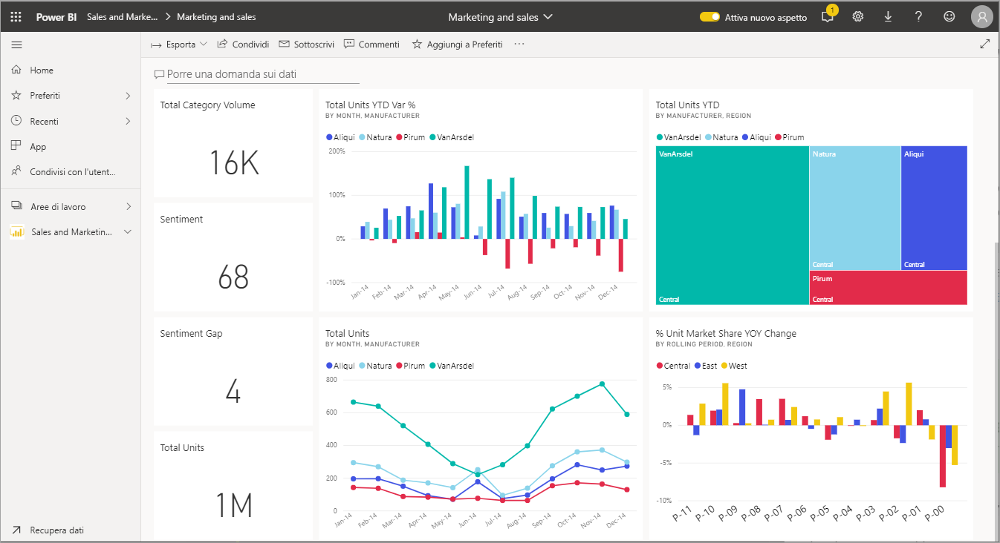
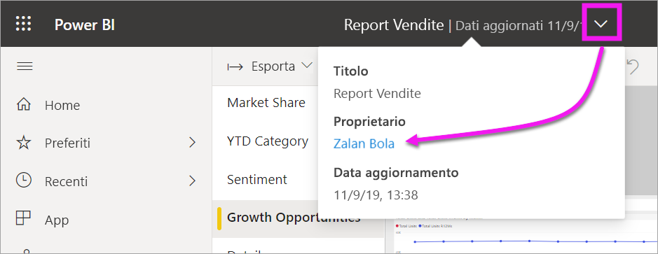

# Interagire con gli oggetti visivi in report, dashboard e app

Essenzialmente, una ***visualizzazione*** (o *oggetto visivo*) è un tipo di grafico creato dai *designer* di Power BI usando i dati contenuti nei report e nei set di dati. 

Gli oggetto visivi si trovano nei dashboard, nei report e possono essere creati in tempo reale usando Domande e risposte di Power BI. Quando un progettista crea un oggetto visivo in un report, può *aggiungere* tale oggetto visivo a un dashboard. Un [oggetto visivo in un dashboard viene chiamato *riquadro*](end-user-tiles.md). Questo dashboard ha otto riquadri. 

> [!TIP]
> È consigliabile leggere prima di tutto l'argomento introduttivo [Concetti di base di Power BI per i *consumer*](end-user-basic-concepts.md) prima di leggere questo contenuto più dettagliato.

## Cosa si può fare con gli oggetti visivi?

Gli oggetti visivi vengono creati dai *designer* di report e dashboard e condivisi con i *consumer*. Per i consumer sono disponibili molte opzioni per interagire con gli oggetti visivi in modo da ottenere informazioni dettagliate e prendere decisioni basate sui dati aziendali. La maggior parte di queste opzioni è elencata nella tabella seguente con collegamenti a istruzioni dettagliate.

Per molte di queste opzioni, l'amministratore o il *progettista* può impedire di visualizzare o usare queste funzionalità. Alcune di queste funzionalità inoltre funzionano solo per oggetti visivi specifici.  In caso di domande, rivolgersi all'amministratore o al proprietario del report o del dashboard. Per trovare il proprietario, selezionare il menu a discesa del dashboard o del report. 

> [!IMPORTANT]
> Prima di tutto, è importante introdurre la funzionalità Domande e risposte. Domande e risposte è lo strumento di ricerca in linguaggio naturale di Power BI. Si digita una domanda usando il linguaggio naturale e lo strumento Domande e risposte offre risposte sotto forma di un oggetto visivo. Domande e risposte è un modo con cui i consumer possono creare oggetti visivi personalizzati. Tuttavia, gli oggetti visivi creati con Domande e risposte non possono essere salvati. Se però si vogliono ricavare informazioni specifiche dai dati e il progettista non ha incluso tali informazioni in un report o in un dashboard, lo strumento Domande e risposte è una valida opzione. Per altre informazioni su Domande e risposte, vedere [Domande e risposte per i consumer](end-user-q-and-a.md).

|Attività  |In un dashboard  |In un report  | In Domande e risposte
|---------|---------|---------|--------|
|[Aggiungere commenti a un oggetto visivo per se stessi o avviare una conversazione con i colleghi sull'oggetto visivo](end-user-comment.md).     |  sì       |   sì      |  no  |
|[Aprire ed esplorare il report in cui è stato creato l'oggetto visivo](end-user-tiles.md).     |    sì     |   n/d      |  no |
|[Visualizzare un elenco dei filtri e dei filtri dei dati che interessano l'oggetto visivo](end-user-report-filter.md).     |    no     |   sì      |  sì |
|[Aprire ed esplorare un oggetto visivo in Domande e risposte (se il *progettista* ha usato Domande e risposte per creare l'oggetto visivo)](end-user-q-and-a.md).     |   sì      |   n/d      |  n/d  |
|[Creare un oggetto visivo in Domande e risposte (per l'esplorazione, non sarà possibile salvarlo)](end-user-q-and-a.md).     |   sì      |   se il progettista ha aggiunto Domande e risposte al report      |  sì  |
|[Chiedere a Power BI di cercare fatti o tendenze interessanti](end-user-insights.md) nei dati dell'oggetto visivo.  Questi oggetti visivi generati automaticamente sono chiamati *informazioni dettagliate*.     |    sì     |  per l'intero report, non per i singoli oggetti visivi       | no   |
|[Visualizzare un solo oggetto visivo alla volta tramite la modalità *messa a fuoco*](end-user-focus.md).     | sì        |   sì      | n/d  |
|[Cercare l'ultimo aggiornamento dell'oggetto visivo](end-user-fresh.md).     |  sì       |    sì     | n/d  |
|[Visualizzare un solo oggetto visivo alla volta, senza bordi o barre di spostamento, nella *modalità a schermo intero* o nella modalità *messa a fuoco*](end-user-focus.md).     |   sì      |  sì       | per impostazione predefinita  |
|[Stampare](end-user-print.md).     |  sì       |   sì      | no  |
|[Esaminare l'oggetto visivo aggiungendo e modificando i filtri dell'oggetto visivo.](end-user-report-filter.md)     |    no     |   sì      | no  |
|Passare il mouse su un oggetto visivo per vedere dettagli aggiuntivi e descrizioni comando.     |    sì     |   sì      | sì  |
|[Applicare il filtro incrociato e l'evidenziazione incrociata negli altri oggetti visivi nella pagina.](end-user-interactions.md)    |   no      |   sì      | n/d  |
|[Visualizzare i dati usati per creare l'oggetto visivo](end-user-show-data.md).     |  no       |   sì      | no  |
| [Modificare la modalità di ordinamento dell'oggetto visivo](end-user-change-sort.md). | no  | sì  | è possibile modificare l'ordinamento riformulando la domanda  |
| Aggiungere un elemento in evidenza a un oggetto visivo. | no  | sì  |  no |
| [Esportare in Excel.](end-user-export.md) | sì | sì | no|
| [Creare un avviso](end-user-alerts.md) per ricevere una notifica quando un valore supera una soglia impostata.  | sì  | no  | no |
| [Applicare il filtro incrociato e l'evidenziazione incrociata agli altri oggetti visivi nella pagina](end-user-report-filter.md).  | no      | sì  | no  |
| [Eseguire il drill di un oggetto visivo con una gerarchia](end-user-drill.md).  | no  | sì   | no |

## Passaggi successivi
Tornare a [Concetti di base per i consumer](end-user-basic-concepts.md)    
[Selezionare un oggetto visivo per aprire un report](end-user-report-open.md)    
[Tipi di oggetti visivi disponibili in Power BI](end-user-visual-type.md)