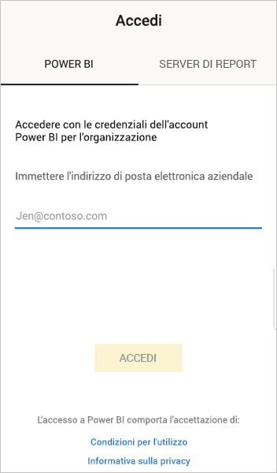
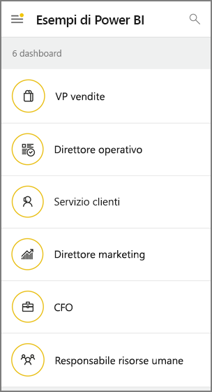
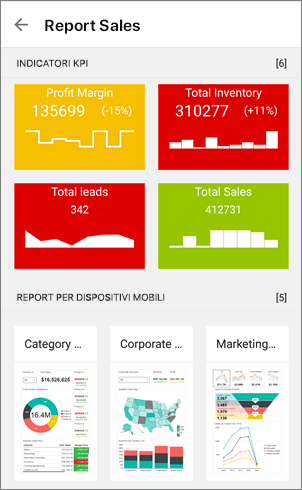
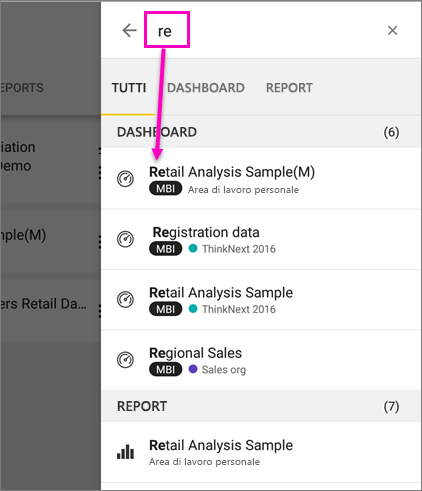
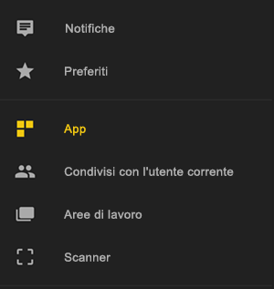
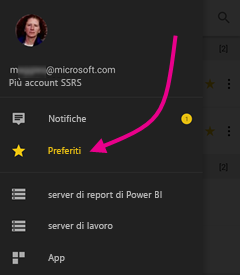
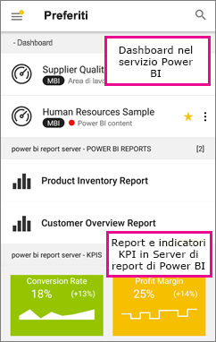

# Introduzione all'app Power BI per dispositivi mobili nei dispositivi Android
L'app Android per Microsoft Power BI offre l'esperienza BI per dispositivi mobili per Power BI, Server di report di Power BI e Reporting Services. Visualizzare e interagire con i dashboard aziendali locali e nel cloud ovunque ci si trovi con l'accesso mobile in tempo reale e abilitato per il tocco. Esplorare i dati nei dashboard e condividerli con i colleghi nei messaggi di posta elettronica o di testo. 

È possibile creare report di Power BI in Power BI Desktop e pubblicarli:

* [Pubblicarli nel servizio Power BI](../../power-bi-overview.md) e creare dashboard.
* [Pubblicarli in locale nel Server di report di Power BI](../../report-server/quickstart-create-powerbi-report.md).

Nell'app Power BI per Android è quindi possibile interagire con i dashboard e i report, in locale o nel cloud.

Informazioni sulle [Novità delle app Power BI per dispositivi mobili](../../mobile-whats-new-in-the-mobile-apps.md).

## Prerequisiti

### Ottenere l'app

[Scaricare l'app Power BI per Android](http://go.microsoft.com/fwlink/?LinkID=544867) da Google Play.
  
Power BI può essere eseguito in diversi telefoni Android con sistema operativo Android 5.0 o versioni successive. Per verificare la versione nel proprio dispositivo, andare in **Impostazioni** > **Informazioni sul dispositivo** > **Versione di Android**. 

**Iniziare subito dopo aver aperto l'app**    
Anche senza iscriversi o accedere, dopo aver aperto l'app è possibile passare tra le pagine di accesso per una rapida panoramica di tutte le potenzialità dell'app Power BI in un dispositivo Android. Toccare **Ignora** per visualizzare ed esplorare gli esempi e acquisire esperienza pratica con l'app. È possibile [tornare agli esempi](mobile-android-app-get-started.md#try-the-power-bi-and-reporting-services-samples) in qualsiasi momento dalla home page dei dashboard.

Informazioni sulle [Novità delle app Power BI per dispositivi mobili](../../mobile-whats-new-in-the-mobile-apps.md).

## Iscriversi al servizio Power BI sul Web
Se non è ancora stata eseguita l'iscrizione, passare al [servizio Power BI http://powerbi.com/)](http://powerbi.com/) per registrare un account per creare e archiviare dashboard e report e riunire i dati. È quindi possibile accedere a Power BI dal dispositivo Android, per visualizzare i propri dashboard ovunque ci si trovi.

1. Nel servizio Power BI toccare [Iscriviti](http://go.microsoft.com/fwlink/?LinkID=513879) per creare un account di Power BI.
2. Iniziare a [creare dashboard e report personalizzati](../../service-get-started.md).

## Introduzione all'app Power BI sul dispositivo
1. Nel dispositivo Android aprire l'app Power BI per Android.
   
   
2. Per visualizzare i dashboard e i report di Power BI, toccare **Power BI**.  
   
   Se viene visualizzato un messaggio che indica che non è possibile eseguire l'accesso a Power BI, vedere ["Non è stato possibile eseguire l'autenticazione perché il certificato SSL aziendale non è considerato attendibile"](mobile-android-app-error-corporate-ssl-account-is-untrusted.md) per informazioni dettagliate su come risolvere il problema.

   Per visualizzare i report e gli indicatori KPI del Server di report di Power BI e di Reporting Services, toccare **Server di report**.
   
   

## Provare gli esempi di Power BI e Reporting Services
Anche senza iscriversi, è possibile provare a usare gli esempi di Power BI e Reporting Services. Dopo avere scaricato l'app, è possibile visualizzare gli esempi o iniziare a usarli. È possibile tornare agli esempi in qualsiasi momento dalla home page dei dashboard.

### Esempi di Power BI
È possibile visualizzare e interagire con gli esempi di dashboard Power BI, ma non sarà possibile eseguire alcune operazioni, come ad esempio aprire i report dietro i dashboard, condividere gli esempi con altre persone o impostarli come preferiti.

1. Toccare il pulsante di spostamento globale  nell'angolo in alto a sinistra.
2. Toccare **Impostazioni** > **Esplora gli esempi**, quindi selezionare un ruolo ed esplorare il dashboard degli esempi per tale ruolo.  
   
   

### Esempi di report per dispositivi mobili di Reporting Services
1. Toccare il pulsante di spostamento globale  nell'angolo in alto a sinistra.
2. Toccare **Esempi per Reporting Services**, quindi aprire la cartella dei report sulle vendite al dettaglio o dei report sulle vendite per analizzare gli indicatori KPI e i report per dispositivi mobili.
   
   

## Ricerca di un dashboard o report
* Toccare la lente di ingrandimento nell'angolo superiore destro , quindi digitare il termine da trovare.
  
    
  
    Per impostazione predefinita la ricerca viene eseguita in tutti i dashboard e report, ma è anche possibile cercare solo nell'uno o nell'altro.

## Cercare il contenuto nelle app Power BI per dispositivi mobili
A seconda della provenienza, i dashboard e i report sono memorizzati in posizioni diverse nelle app Power BI per dispositivi mobili. Leggere altre informazioni su come [cercare il contenuto nelle app per dispositivi mobili](../../mobile-apps-quickstart-view-dashboard-report.md). In più, è sempre possibile cercare qualsiasi contenuto presente nelle app Power BI per dispositivi mobili. 

## Visualizzare i dashboard, i report e gli indicatori KPI preferiti
Nella pagina Preferiti delle app per dispositivi mobili vengono visualizzati tutti i dashboard preferiti di Power BI, insieme ai report e agli indicatori KPI del Server di report di Power BI e di Reporting Services. Quando si aggiunge un dashboard ai *Preferiti* nell'app Power BI per dispositivi mobili, è possibile accedervi da tutti i dispositivi, incluso il servizio Power BI nel proprio browser. 

* Toccare **Preferiti**.
  
   
  
   I Preferiti di Power BI i preferiti nel Server di report di Power BI e nel portale Reporting Services vengono visualizzati tutti in questa pagina.
  
   

Altre informazioni sui [dashboard preferiti nelle app Power BI per dispositivi mobili](mobile-apps-favorites.md).

## Supporto aziendale per le app Power BI per dispositivi mobili
Le organizzazioni possono usare Microsoft Intune per gestire dispositivi e applicazioni, tra cui le app Power BI per dispositivi mobili iOS e Android.

Microsoft Intune permette alle organizzazioni di controllare aspetti come la richiesta di un PIN di accesso, la modalità di gestione dei dati nell'applicazione e anche la crittografia dei dati dell'applicazione quando l'app non è in uso.

> [!NOTE]
> Se si usa l'app Power BI per dispositivi mobili in un dispositivo Android e l'organizzazione ha configurato Microsoft Intune MAM, l'aggiornamento dati in background è disattivato. La volta successiva che si accede all'app, Power BI aggiorna i dati dal servizio Power BI sul Web.
> 
> 

Altre informazioni sulla [configurazione delle app Power BI per dispositivi mobili per Android con Microsoft Intune](../../service-admin-mobile-intune.md). 

## Passaggi successivi
Ecco alcune operazioni che è possibile eseguire nell'app Power BI per dispositivi Android con dashboard e report di Power BI e con report e indicatori KPI in Server di report di Power BI o nel portale Web di Reporting Services.

### Dashboard e report di Power BI
* Visualizzare le [app](../end-user-apps.md).
* Visualizzare i [dashboard](../../mobile-apps-view-dashboard.md).
* Esplorare i [riquadri nei dashboard](../../mobile-tiles-in-the-mobile-apps.md).
* Aprire i [report di Power BI](../../mobile-reports-in-the-mobile-apps.md).
* Visualizzare le [app](../end-user-apps.md).
* [Aggiungere annotazioni e condividere i riquadri](mobile-annotate-and-share-a-tile-from-the-mobile-apps.md).
* Condividere i [dashboard](../../mobile-share-dashboard-from-the-mobile-apps.md).
* [Scansionare un codice a matrice di Power BI](../../mobile-apps-qr-code.md) con il telefono Android per aprire un riquadro del dashboard o un report correlato. 
* Visualizzare le [notifiche sugli aggiornamenti all'account di Power BI](../../mobile-apps-notification-center.md), ad esempio sui dashboard condivisi con i colleghi.

### Report e indicatori KPI nei portali Web del server di report di Power BI e di Reporting Services
* [Visualizzare report e indicatori KPI nel portale Web](mobile-app-ssrs-kpis-mobile-on-premises-reports.md) nell'app Power BI per dispositivi Android.
* Creare [gli indicatori KPI nel portale Web](https://docs.microsoft.com/sql/reporting-services/working-with-kpis-in-reporting-services).
* Creare [report in Power BI Desktop e pubblicarli nel portale Web del server di report di Power BI](../../report-server/quickstart-create-powerbi-report.md)

### Vedere anche
* [Scaricare l'app Android](http://go.microsoft.com/fwlink/?LinkID=544867) dall'App Store Android.
* [Che cos'è Power BI?](../../power-bi-overview.md)
* Domande? [Provare a rivolgersi alla community di Power BI](http://community.powerbi.com/)

