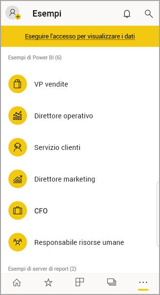

# Iniziare a usare l'app Power BI per dispositivi mobili nei dispositivi Android
L'app Android per Microsoft Power BI offre l'esperienza BI per dispositivi mobili per Power BI, Server di report di Power BI e Reporting Services. Visualizzare e interagire con i dashboard aziendali locali e nel cloud ovunque ci si trovi con l'accesso mobile in tempo reale e abilitato per il tocco. Esplorare i dati nei dashboard e condividerli con i colleghi nei messaggi di posta elettronica o di testo. 

È possibile creare report di Power BI in Power BI Desktop e pubblicarli:

* [Pubblicarli nel servizio Power BI](../../fundamentals/power-bi-overview.md) e creare dashboard.
* [Pubblicarli in locale nel Server di report di Power BI](../../report-server/quickstart-create-powerbi-report.md).

Nell'app Power BI per Android è quindi possibile interagire con i dashboard e i report, in locale o nel cloud.

Informazioni sulle [Novità delle app Power BI per dispositivi mobili](../../mobile-whats-new-in-the-mobile-apps.md).

## Prerequisiti

### Ottenere l'app

[Scaricare l'app Power BI per Android](https://go.microsoft.com/fwlink/?LinkID=544867) da Google Play.
  
Power BI può essere eseguito in diversi telefoni Android con sistema operativo Android 5.0 o versioni successive. Per verificare la versione nel proprio dispositivo, andare in **Impostazioni** > **Informazioni sul dispositivo** > **Versione di Android**. 

**Iniziare subito dopo aver aperto l'app**    
Anche senza iscriversi o accedere, dopo aver aperto l'app è possibile passare tra le pagine di accesso per una rapida panoramica di tutte le potenzialità dell'app Power BI in un dispositivo Android. Toccare **Ignora** per visualizzare ed esplorare gli esempi e acquisire esperienza pratica con l'app. È possibile [tornare agli esempi](mobile-android-app-get-started.md#try-the-power-bi-and-reporting-services-samples) in qualsiasi momento dalla home page dei dashboard.

Informazioni sulle [Novità delle app Power BI per dispositivi mobili](../../mobile-whats-new-in-the-mobile-apps.md).

## Iscriversi al servizio Power BI sul Web
Se non è ancora stata eseguita l'iscrizione, passare al [servizio Power BI](https://powerbi.com/) per registrare un account per creare e archiviare i dashboard i report e riunire i dati. È quindi possibile accedere a Power BI dal dispositivo Android, per visualizzare i propri dashboard ovunque ci si trovi.

1. Nel servizio Power BI toccare [Iscriviti](https://go.microsoft.com/fwlink/?LinkID=513879) per creare un account di Power BI.
2. Iniziare a [creare dashboard e report personalizzati](../../fundamentals/service-get-started.md).

## Introduzione all'app Power BI sul dispositivo
1. Nel dispositivo Android aprire l'app Power BI per Android.
   
   
2. Per accedere a Power BI, toccare la scheda **Power BI** e immettere i dettagli di accesso.

    Se viene visualizzato un messaggio che indica che non è possibile eseguire l'accesso a Power BI, vedere ["Non è stato possibile eseguire l'autenticazione perché il certificato SSL aziendale non è considerato attendibile"](mobile-android-app-error-corporate-ssl-account-is-untrusted.md) per informazioni dettagliate su come risolvere il problema.

   Per accedere ai report per dispositivi mobili e agli indicatori KPI di Reporting Services, toccare la scheda **Server di report** e immettere i dettagli di accesso.
   
   

## Provare gli esempi di Power BI e Reporting Services
Anche senza iscriversi, è possibile visualizzare e interagire con gli esempi di Power BI e Reporting Services.

Per accedere agli esempi, toccare **Altre opzioni** (...) sulla barra di spostamento e scegliere **Esempi**.

Alcuni esempi di Power BI sono seguiti da diversi esempi di server di report.
   
   

   
   > [!NOTE]
   > Non tutte le funzionalità sono disponibili negli esempi. Ad esempio, non è possibile visualizzare i report di esempio sottostanti ai dashboard, condividere gli esempi con altri utenti e impostarli come preferiti. 
   > 
   >

## Cercare il contenuto nelle app Power BI per dispositivi mobili

Toccare la lente di ingrandimento nell'intestazione per avviare la ricerca dei contenuti di Power BI.

## Visualizzare i dashboard e i report preferiti
Toccare **Preferiti**  () sulla barra di spostamento per visualizzare la pagina Preferiti. 

Altre informazioni sui [dashboard preferiti nelle app Power BI per dispositivi mobili](mobile-apps-favorites.md).

## Supporto aziendale per le app Power BI per dispositivi mobili
Le organizzazioni possono usare Microsoft Intune per gestire dispositivi e applicazioni, tra cui le app Power BI per dispositivi mobili iOS e Android.

Microsoft Intune permette alle organizzazioni di controllare aspetti come la richiesta di un PIN di accesso, la modalità di gestione dei dati nell'applicazione e anche la crittografia dei dati dell'applicazione quando l'app non è in uso.

> [!NOTE]
> Se si usa l'app Power BI per dispositivi mobili in un dispositivo Android e l'organizzazione ha configurato Microsoft Intune MAM, l'aggiornamento dati in background è disattivato. La volta successiva che si accede all'app, Power BI aggiorna i dati dal servizio Power BI sul Web.
> 
> 

Altre informazioni sulla [configurazione delle app Power BI per dispositivi mobili con Microsoft Intune](../../admin/service-admin-mobile-intune.md). 

## Passaggi successivi
Ecco alcune operazioni che è possibile eseguire nell'app Power BI per dispositivi Android con dashboard e report di Power BI e con report e indicatori KPI in Server di report di Power BI o nel portale Web di Reporting Services.

### Dashboard e report di Power BI
* Visualizzare le [app](../../collaborate-share/service-create-distribute-apps.md).
* Visualizzare i [dashboard](../../mobile-apps-view-dashboard.md).
* Esplorare i [riquadri nei dashboard](../../mobile-tiles-in-the-mobile-apps.md).
* Aprire i [report di Power BI](../../mobile-reports-in-the-mobile-apps.md).
* Visualizzare le [app](../../collaborate-share/service-create-distribute-apps.md).
* [Aggiungere annotazioni e condividere i riquadri](mobile-annotate-and-share-a-tile-from-the-mobile-apps.md).
* Condividere i [dashboard](../../mobile-share-dashboard-from-the-mobile-apps.md).
* [Scansionare un codice a matrice di Power BI](../../mobile-apps-qr-code.md) con il telefono Android per aprire un riquadro del dashboard o un report correlato. 
* Visualizzare le [notifiche sugli aggiornamenti all'account di Power BI](../../mobile-apps-notification-center.md), ad esempio sui dashboard condivisi con i colleghi.

### Report e indicatori KPI nei portali Web del server di report di Power BI e di Reporting Services
* [Visualizzare report e indicatori KPI nel portale Web](mobile-app-ssrs-kpis-mobile-on-premises-reports.md) nell'app Power BI per dispositivi Android.
* Creare [gli indicatori KPI nel portale Web](https://docs.microsoft.com/sql/reporting-services/working-with-kpis-in-reporting-services).
* Creare [report in Power BI Desktop e pubblicarli nel portale Web del server di report di Power BI](../../report-server/quickstart-create-powerbi-report.md)

### Vedere anche
* [Scaricare l'app Android](https://go.microsoft.com/fwlink/?LinkID=544867) dall'App Store Android.
* [Che cos'è Power BI?](../../fundamentals/power-bi-overview.md)
* Domande? [Contattare la community di Power BI](https://community.powerbi.com/)
