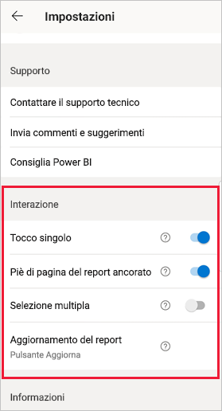
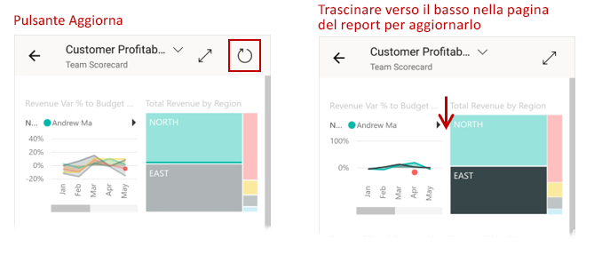
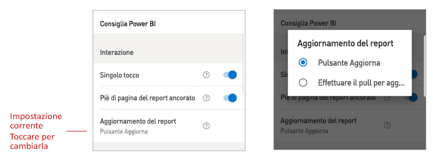

# Configurare le impostazioni di interazione con i report

## Panoramica

L'app per dispositivi mobili Power BI include varie impostazioni di "interazione" configurabili che consentono di controllare la modalità di interazione con i dati e di definire il comportamento di alcuni elementi nell'app per dispositivi mobili Power BI. La tabella seguente illustra le impostazioni di interazione attualmente disponibili e i dispositivi in cui sono presenti.

|| Telefono Android | iPhone | Tablet Android  | iPad |
|-|:-:|:-:|:-:|:-:|
| [Interazione con tocco singolo o doppio sugli oggetti visivi del report](#single-tap) |✔|✔|||
| [Selezione multipla e selezione singola dei punti dati negli oggetti visivi del report](#multi-select) |✔|✔|✔|✔|
| [Piè di pagina del report ancorato o dinamico](#docked-report-footer) |✔|✔|||
| [Aggiornamento del report con pulsante o con trascinamento verso il basso](#report-refresh) |✔||||
|

Per accedere alle impostazioni di interazione, toccare l'immagine del profilo personale per aprire il [pannello laterale](./mobile-apps-home-page.md#header), scegliere **Impostazioni** e individuare la sezione **Interazione**.

Le impostazioni di interazione sono descritte nelle sezioni seguenti.

## Impostazioni di interazione

### Tocco singolo
Quando si scarica l'app per dispositivi mobili Power BI, è impostata per l'interazione con tocco singolo. Questo significa che quando si tocca un oggetto visivo per eseguire un'azione, ad esempio la selezione di un elemento del filtro dei dati, l'evidenziazione incrociata, il clic su un collegamento o un pulsante e così via, il tocco seleziona l'oggetto visivo ed esegue l'azione desiderata.

Se si preferisce, è possibile disattivare l'interazione con tocco singolo. Si avrà quindi un'interazione con doppio tocco. Con l'interazione con doppio tocco è prima necessario toccare un oggetto visivo per selezionarlo e poi toccare di nuovo l'oggetto visivo per eseguire l'azione desiderata.

### Selezione multipla

L'opzione di selezione multipla consente di selezionare più punti dati in una pagina del report. Quando la selezione multipla è attivata, ogni punto dati toccato viene aggiunto agli altri punti dati selezionati e i risultati combinati vengono evidenziati automaticamente in tutti gli oggetti visivi della pagina. Quando la selezione multipla è disattivata e si tocca per selezionare un punto dati, la nuova selezione sostituisce quella corrente.

Per deselezionare un punto dati, toccarlo di nuovo.

>[!NOTE]
>La selezione multipla non è supportata negli oggetti visivi di Power BI.
>
>La modalità di selezione multipla sarà supportata nei server di report di Power BI a partire dalla versione successiva del server di report.

### Piè di pagina del report ancorato

L'impostazione del piè di pagina del report ancorato determina se il piè di pagina del report rimane ancorato (ovvero fisso e sempre visibile) nella parte inferiore del report oppure se viene nascosto e visualizzato nuovamente in base alle azioni eseguite nel report, ad esempio lo scorrimento.

Nei telefoni Android l'impostazione del piè di pagina del report ancorato è **attiva** per impostazione predefinita e questo significa che il piè di pagina del report è ancorato e sempre visibile nella parte inferiore del report. Impostare l'opzione su **disattivato** se si preferisce un piè di pagina dinamico nei report, che viene visualizzato e scompare a seconda delle azioni eseguite nel report.

### Aggiornamento del report

L'impostazione di aggiornamento dei report consente di definire la modalità di avvio degli aggiornamenti dei report. È possibile scegliere di aggiungere un pulsante di aggiornamento in tutte le intestazioni dei report oppure di usare l'azione di trascinamento verso il basso per aggiornare (trascinando leggermente dall'alto verso il basso) nella pagina del report. Nella figura seguente sono illustrate le due alternative. 

Per impostazione predefinita, nei telefoni Android viene aggiunto un pulsante di aggiornamento.

Per modificare l'impostazione di aggiornamento del report, passare all'opzione per l'aggiornamento del report nelle impostazioni di interazione. Viene visualizzata l'impostazione corrente. Toccare il valore per aprire un popup in cui è possibile scegliere un nuovo valore.

## Configurazione remota

Le interazioni possono anche essere configurate in modalità remota da un amministratore usando uno strumento MDM con un file di configurazione dell'app. In questo modo è possibile standardizzare l'esperienza di interazione con i report per l'intera organizzazione o per gruppi specifici di utenti nell'organizzazione. Per informazioni dettagliate, vedere [Configurare l'interazione usando la gestione dei dispositivi mobili](./mobile-app-configuration.md).

## Passaggi successivi
* [Interazione con i report](./mobile-reports-in-the-mobile-apps.md#interact-with-reports)
* [Configurare l'interazione usando la gestione dei dispositivi mobili](./mobile-app-configuration.md)
