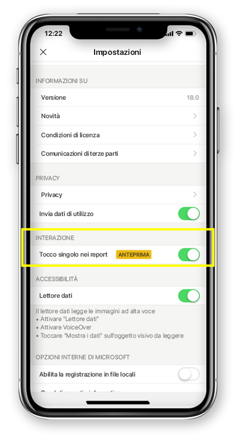

# Configurare l'interazione con i report tramite tocco singolo o doppio
Si applica a:

|  |  | 
|:--- |:--- |
| iPhone |Telefoni Android |

Un report di Power BI è una vista interattiva dei dati con elementi visivi che rappresentano conclusioni e approfondimenti diversi ottenuti da tali dati.

È possibile configurare la modalità di interazione con i dati. È possibile decidere se usare l'interazione tramite tocco singolo o doppio.

* Con l'interazione tramite doppio tocco, il primo tocco su un oggetto visivo seleziona l'oggetto e solo il secondo tocco esegue l'azione vera e propria, ad esempio la selezione di un elemento filtro dei dati, l'evidenziazione incrociata o il clic su un collegamento, un pulsante e così via.

* Con l'interazione tramite tocco singolo, un solo tocco esegue entrambe le operazioni: selezione dell'oggetto visivo ed esecuzione dell'azione.

A partire dall'app Power BI versione 18.0 per iOS e 112540 per Android, tutte le nuove installazioni verranno configurate con il tocco singolo come comportamento predefinito.
Agli utenti che hanno già installato Power BI nel telefono ed eseguono l'aggiornamento a una di queste nuove versioni verrà proposto di passare al tocco singolo.

## Cambiare il comportamento di interazione

Per cambiare il comportamento di interazione, è possibile passare alle impostazioni dell'app e attivare o disattivare l'interazione tramite tocco singolo.

Le informazioni di questo articolo sono valide sia per i report orizzontali che per i report per il telefono.

## Passaggi successivi
* [Visualizzare e interagire con i report di Power BI ottimizzati per il proprio telefono](mobile-apps-view-phone-report.md)
* Domande? [Provare a rivolgersi alla community di Power BI](http://community.powerbi.com/)

