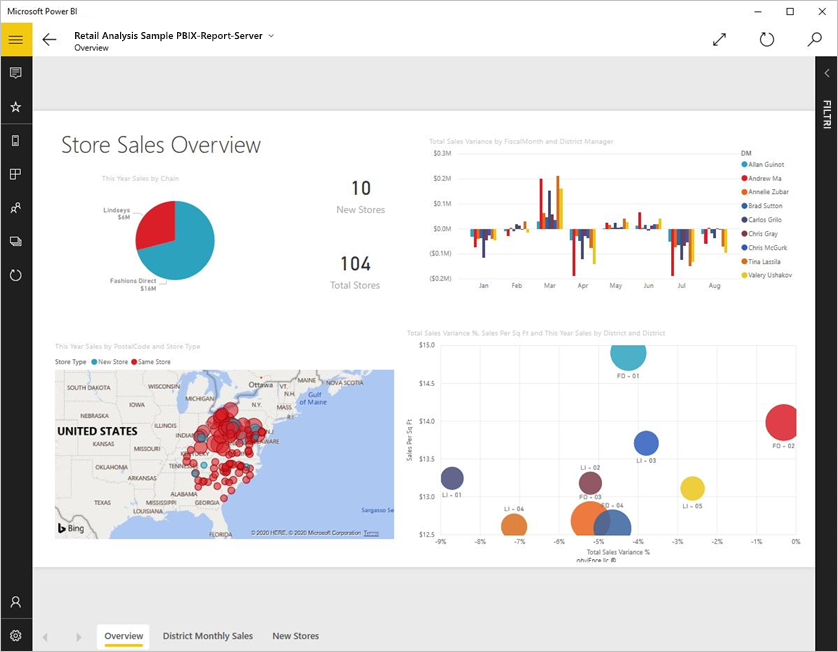
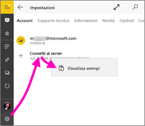
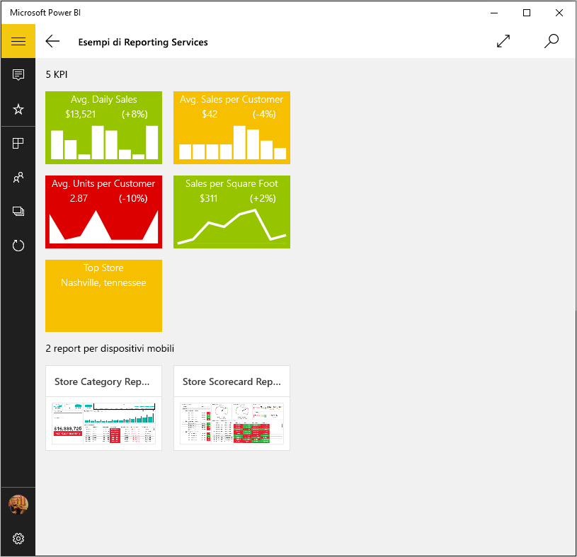
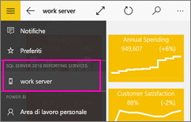
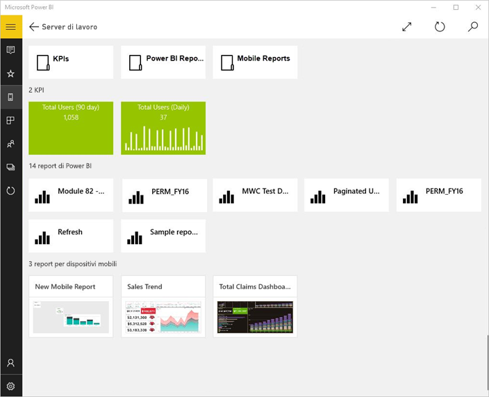
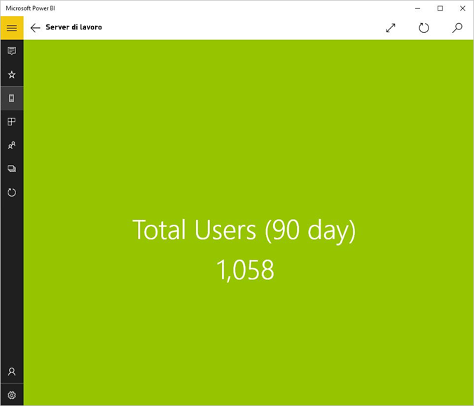
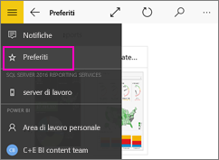
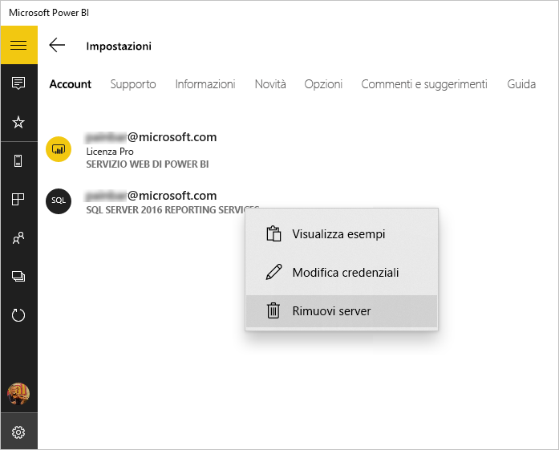

# Visualizzare report e indicatori KPI locali nell' app Power BI per Windows
L'app Power BI per Windows 10 consente di accedere in tempo reale a informazioni aziendali importanti in locale, usando dispositivi mobili abilitati per il tocco in SQL Server 2016 Reporting Services. 

## Operazioni preliminari
[Creare report per dispositivi mobili di Reporting Services](https://msdn.microsoft.com/library/mt652547.aspx) con SQL Server 2016 Enterprise Edition Mobile Report Publisher e pubblicarli nel [portale Web di Reporting Services](https://msdn.microsoft.com/library/mt637133.aspx). Creare gli indicatori KPI direttamente nel portale Web. Organizzarli in cartelle e contrassegnare i Preferiti, in modo da poterli trovare facilmente. 

Quindi, nell'app Power BI per Windows 10, visualizzare gli indicatori KPI, i report per dispositivi mobili e i report di Power BI, organizzati in cartelle o raccolti come Preferiti. 

> [!NOTE]
> Il dispositivo deve eseguire Windows 10. L'app funziona meglio su dispositivi con almeno 1 GB di RAM e 8 GB di memoria interna.

>[!NOTE]
>Il supporto delle app Power BI per dispositivi mobili per i **telefoni con Windows 10 Mobile** non sarà più disponibile dal 16 marzo 2021. [Altre informazioni](https://go.microsoft.com/fwlink/?linkid=2121400)

## Esaminare gli esempi senza un server SQL Server 2016 Reporting Services
Anche se non si ha accesso a un portale Web di Reporting Services, è comunque possibile esplorare le funzionalità dei report per dispositivi mobili di Reporting Services.

1. Aprire l'app Power BI nel dispositivo Windows 10.
2. Toccare il pulsante di spostamento globale  nell'angolo in alto a sinistra.
3. Toccare l'icona **Impostazioni**, fare clic con il pulsante destro del mouse oppure toccare e tenere premuto **Connetti al server**, quindi toccare **Visualizza esempi**.
   
   
4. Aprire la cartella dei report sulle vendite al dettaglio o dei report sulle vendite per analizzare gli indicatori KPI e i report per dispositivi mobili.
   
   

Esplorare gli esempi per interagire con gli indicatori KPI e i report per dispositivi mobili.

## Connettersi al server di report di SQL Server Reporting Services
1. Nella parte inferiore del riquadro di spostamento toccare **Impostazioni** 
2. Toccare **Connetti al server**.
3. Specificare l'indirizzo del server, il nome utente e la password. Usare questo formato per l'indirizzo del server:
   
     `https://<servername>/reports` OPPURE `https://<servername>/reports`
   
   > [!NOTE]
   > Includere **http** o **https** all'inizio della stringa di connessione.
   > 
   > 
   
    Toccare **Opzioni avanzate** per assegnare un nome al server, se necessario.
4. Toccare il segno di spunta per connettersi. 
   
   È ora possibile visualizzare il server nel riquadro di spostamento.
   
   
   
   >[!TIP]
   >Toccare il pulsante di spostamento  in qualsiasi momento per passare dai report per dispositivi mobili di Reporting Services ai dashboard e viceversa nel servizio Power BI. 
   > 

## Visualizzare gli indicatori KPI e i report per dispositivi mobili di Reporting Services nell'app Power BI
Gli indicatori KPI di Reporting Services, i report per dispositivi mobili e i report di Power BI (anteprima) vengono visualizzati nelle stesse cartelle in cui si trovano nel portale Web di Reporting Services.

* Toccare un indicatore KPI per visualizzarlo in modalità messa a fuoco.
  
    
* Toccare un report per dispositivi mobili per aprirlo e interagire con esso nell'app Power BI.
  
    

## Visualizzare i report e gli indicatori KPI preferiti
È possibile contrassegnare gli indicatori KPI, i report per dispositivi mobili e i report di Power BI come preferiti nel portale Web di Reporting Services e quindi visualizzarli in un'unica cartella nel dispositivo Windows 10, insieme ai dashboard e ai report di Power BI preferiti.

* Toccare **Preferiti**.
  
   
  
   I Preferiti nel portale Web vengono visualizzati tutti in questa pagina.
  
Altre informazioni sui [dashboard preferiti nelle app Power BI per dispositivi mobili](mobile-apps-favorites.md).

## Rimuovere una connessione a un server di report
È possibile essere connessi a un solo server di report alla volta dall'app Power BI per dispositivi mobili. Se ci si vuole connettere a un altro server, è necessario disconnettersi dal server corrente.

1. Nella parte inferiore del riquadro di spostamento toccare **Impostazioni** .
2. Toccare e tenere premuto il nome del server a cui non si vuole essere connessi.
3. Toccare **Rimuovi server**.
   
    

## Creare r.Report per dispositivi mobili di Reporting Services e indicatori KPI
Non creare gli indicatori KPI e i report per dispositivi mobili di Reporting Services nell'app Power BI per dispositivi mobili. ma crearli in SQL Server Mobile Report Publisher e un portale Web di SQL Server 2016 Reporting Services 

* [Creare report per dispositivi mobili personalizzati di Reporting Services](https://msdn.microsoft.com/library/mt652547.aspx) e pubblicarli in un portale Web di Reporting Services.
* Creare [indicatori KPI in un portale Web di Reporting Services](https://msdn.microsoft.com/library/mt683632.aspx)

## Passaggi successivi
* [Introduzione all'app Power BI per dispositivi mobili per Windows 10](mobile-windows-10-phone-app-get-started.md)  
* [Che cos'è Power BI?](../../fundamentals/power-bi-overview.md)  
* Domande? [Provare a rivolgersi alla community di Power BI](https://community.powerbi.com/)

