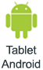
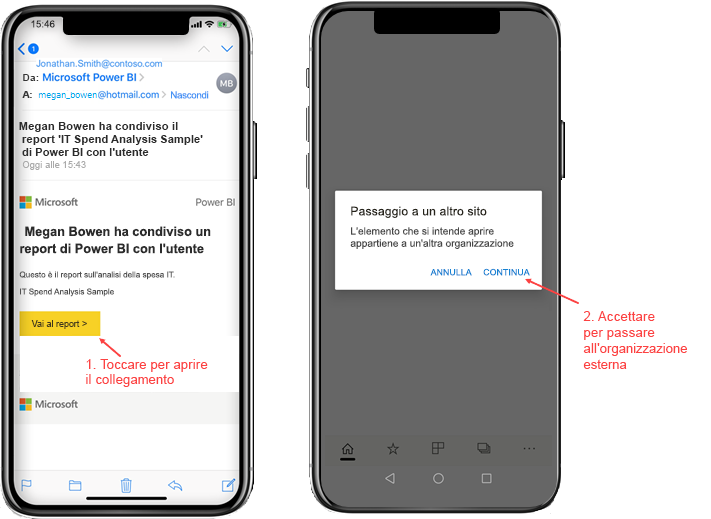
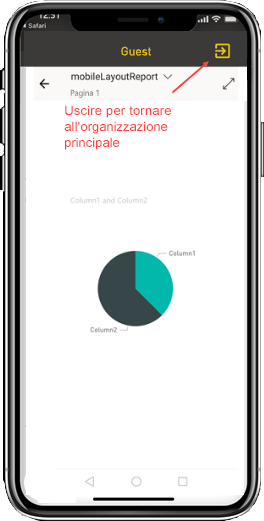
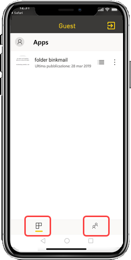

# Visualizzare il contenuto di Power BI condiviso con l'utente da un'organizzazione esterna

Power BI si integra con Azure Active Directory Business to Business (Azure AD B2B) per consentire la distribuzione sicura di contenuto di Power BI agli utenti guest all'esterno dell'organizzazione e gli utenti guest esterni possono usare l'app Power BI per dispositivi mobili per accedere a tale contenuto di Power BI condiviso. 

Si applica a:

|  |  |  |  |
|:--- |:--- |:--- |:--- |
| iPhone |iPad |Telefoni Android |Tablet Android |

## Accesso al contenuto condiviso

**In primo luogo, è necessario che qualcuno appartenente a un'organizzazione esterna condivida un elemento.** Quando qualcuno [condivide un elemento con un altro utente](../../service-share-dashboards.md), dalla stessa organizzazione o da un'organizzazione esterna, l'altro utente riceve un messaggio di posta elettronica contenente un collegamento all'elemento condiviso. Seguendo il collegamento nel dispositivo mobile, si apre l'app Power BI per dispositivi mobili. Se l'app rileva che l'elemento è stato condiviso da un'organizzazione esterna, si riconnette a tale organizzazione con l'identità del destinatario. L'app carica quindi tutti gli elementi che sono stati condivisi con tale utente dall'organizzazione.

> [!NOTE]
> Se questo è il primo elemento condiviso con l'utente guest esterno, è necessario richiedere l'invito in un browser. Non è possibile richiedere l'invito nell'app Power BI.

Fino a quando si è connessi a un'organizzazione esterna, nell'app viene visualizzata un'intestazione nera. Questa intestazione indica che non si è connessi all'organizzazione principale. Per riconnettersi all'organizzazione principale, uscire dalla modalità Guest.

Anche se è necessario avere un collegamento a un artefatto di Power BI per connettersi a un'organizzazione esterna, dopo che l'app ha effettuato il passaggio, è possibile accedere a tutti gli elementi condivisi (non solo all'elemento aperto dal messaggio di posta elettronica). Per visualizzare tutti gli elementi a cui è possibile accedere nell'organizzazione esterna, passare al menu dell'app e selezionare **Condivisi con l'utente corrente**. In **App** si trovano anche le altre app che è possibile usare.

## Limitazioni

- Gli utenti devono avere un account Power BI attivo e un tenant principale.
- Per poter accedere al contenuto condiviso da un tenant esterno, gli utenti devono avere eseguito l'accesso al tenant principale di Power BI.
- L'accesso condizionale e gli altri criteri di Intune non sono supportati in Azure AD B2B e in Power BI per dispositivi mobili, quindi l'app impone solo i criteri dell'organizzazione principale, se esistenti.
- Le notifiche push vengono ricevute solo dal sito dell'organizzazione principale (anche quando l'utente è connesso come guest a un'organizzazione esterna). Aprendo la notifica, l'app viene riconnessa al sito dell'organizzazione principale dell'utente.
- Se l'utente arresta l'app, una volta riaperta l'app si connette automaticamente all'organizzazione principale dell'utente.
- Quando si è connessi a un'organizzazione esterna, alcune azioni sono disabilitate: elementi preferiti, avvisi dati, inserimento di commenti e condivisione.
- I dati offline non sono disponibili durante la connessione a un'organizzazione esterna.
- Se nel dispositivo è installata l'app Portale aziendale, il dispositivo deve essere registrato.
