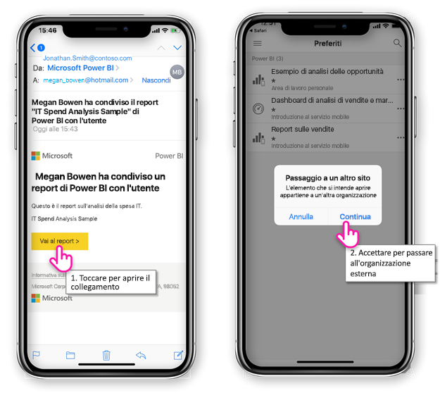
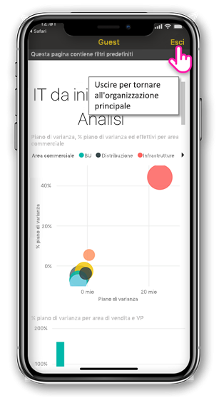
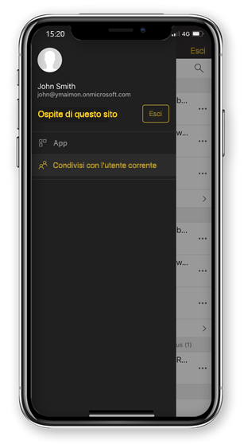

# Visualizzare il contenuto Power BI condiviso con l'utente di un'organizzazione esterna

Power BI si integra con Azure Active Directory business-to-business (AD B2B Azure) per consentire la distribuzione sicura del contenuto di Power BI agli utenti guest esterni all'organizzazione. E utenti guest esterni possono usare l'app per dispositivi mobili di Power BI per l'accesso a tale contenuto Power BI condiviso con loro. 

Si applica a:

|  |  |  |  |
|:--- |:--- |:--- |:--- |
| iPhone |iPad |Telefoni Android |Tablet Android |

## L'accesso al contenuto condiviso

**In primo luogo, è necessario un utente di un'organizzazione esterna per condividere un elemento con l'utente.** Se qualcuno è presente [condivide un elemento con l'utente](../../service-share-dashboards.md), sia della stessa organizzazione o da un'organizzazione esterna, viene visualizzato un messaggio di posta elettronica con un collegamento al cui elemento condiviso. Seguire questo collegamento nel proprio dispositivo mobile viene aperto l'app per dispositivi mobili di Power BI. Se l'app riconosce che l'elemento è stato condiviso di un'organizzazione esterna, l'app si riconnette con l'identità dell'organizzazione stessa. L'app viene quindi caricato tutti gli elementi che sono stati condivisi con l'utente di tale organizzazione.

> [!NOTE]
> Se si tratta del primo elemento condiviso con l'utente come utente guest esterni, è necessario richiedere l'invito in un browser. È possibile non è possibile richiedere l'invito di nelle app Power BI.

Fino a quando è connessi a un'organizzazione esterna, un'intestazione di colore nera viene visualizzato nell'app. Questa intestazione indica che non si è connessi all'organizzazione principale. Per connettersi all'organizzazione principale, uscire dalla modalità guest.

Anche se è necessario disporre di un collegamento all'artefatto Power BI per connettersi a un'organizzazione esterna, una volta che l'app attiva, è possibile accedere a tutti gli elementi condivisi con l'utente (non solo l'elemento è stato aperto dal messaggio di posta elettronica). Per visualizzare tutti gli elementi che è possibile accedere all'interno dell'organizzazione esterna, passare al menu dell'app e selezionare **condiviso con me**. Sotto **app** è trovare le app che è possibile usare anche.

## Limitazioni

- Accesso condizionale e altri criteri di Intune non sono supportati in Azure AD B2B e in Power BI per dispositivi mobili. Ciò significa che l'app impone solo i criteri dell'organizzazione principale, se presenti.
- Le notifiche push vengono ricevute da solo il sito dell'organizzazione principale (anche quando l'utente è connesso come utente guest a un'organizzazione esterna). Apertura della notifica si connette nuovamente l'app al sito dell'organizzazione principale dell'utente.
- Se l'utente si arresta l'app, quando riaperto l'app si connette automaticamente a organizzazione principale dell'utente.
- Quando si è connessi a un'organizzazione esterna, alcune azioni sono disabilitati: elementi preferiti, gli avvisi dati, aggiunta di commenti e la condivisione.
- I dati offline non sono disponibili durante la connessione a un'organizzazione esterna.
- Se hai l'app portale aziendale installata nel dispositivo, il dispositivo deve essere registrato.
