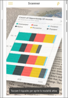
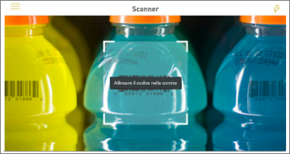

# Ottenere dati concreti con le app Power BI per dispositivi mobili
Le app per dispositivi mobili di Power BI possono connettere il modo reale direttamente alle informazioni di business intelligence correlate, in molti modi diversi. 

## Codici a matrice per i riquadri
È possibile creare un codice a matrice per un report o un riquadro in un dashboard e inserire il codice a matrice dove necessario. Quando i colleghi eseguono la scansione del codice con i propri telefoni iPhone o Android o con l'app Power BI per realtà mista, potranno vedere il riquadro associato a tale codice a matrice. In un iPhone il riquadro verrà visualizzato in realtà aumentata.

Altre informazioni:

* [Creazione di un codice a matrice per un riquadro in Power BI](../../service-create-qr-code-for-tile.md)
* [Scansione di un codice a matrice di Power BI dal dispositivo mobile](mobile-apps-qr-code.md)
* [Scansione di un codice a matrice con l'app Power BI per realtà mista](mobile-mixed-reality-app.md#scan-a-report-qr-code-in-holographic-view).

## Codici a matrice per i report
È possibile creare un codice a matrice per un report.  Quando i colleghi effettuano la scansione del codice con i propri iPhone (questa funzionalità sarà presto disponibile nei telefoni Android), verrà visualizzato il report associato a tale codice a matrice. 

Altre informazioni sulla [creazione di un codice a matrice per un report in Power BI](../../service-create-qr-code-for-report.md)

## Codici a barre
È possibile contrassegnare i dati di codice a barre nel report, in modo che i colleghi possano effettuare la scansione di un codice a barre in un prodotto e passare direttamente al report specifico, filtrato in base al prodotto.

Altre informazioni:

* [Contrassegnare i dati di codice a barre in un report](../../desktop-mobile-barcodes.md)
* [Scansione di un codice a barre dall'app Power BI nell'iPhone](mobile-apps-scan-barcode-iphone.md)

## Filtrare in base alla località
È possibile classificare i dati geografici in un report in Power BI Desktop. Quando i colleghi visualizzano il report nell'app per dispositivi mobili di Power BI per iOS, Power BI fornisce automaticamente i filtri geografici corrispondenti alla posizione dell'utente.

Altre informazioni sui [filtri in base alla località](mobile-apps-geographic-filtering.md).

## Passaggi successivi
* [Creare un codice a matrice per un riquadro in Power BI](../../service-create-qr-code-for-tile.md)
* [Creare un codice a matrice per un report in Power BI](../../service-create-qr-code-for-report.md)

