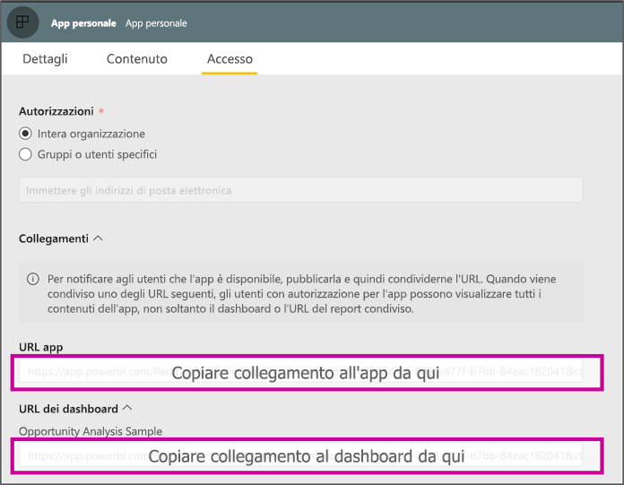

# <a name="create-a-link-to-a-specific-location-in-the-power-bi-mobile-apps"></a>Creare un collegamento a una posizione specifica nelle app Power BI per dispositivi mobili
È possibile usare i collegamenti per accedere direttamente a elementi specifici in Power BI: report, dashboard e riquadro.

Esistono principalmente due scenari per l'uso di collegamenti in Power BI per dispositivi mobili: 

* Per aprire Power BI dall'**esterno dell'app** e accedere a un contenuto specifico (report/dashboard/app). Si tratta in genere di uno scenario di integrazione, in cui si vuole aprire Power BI per dispositivi mobili da un'altra app. 
* Per **spostarsi** all'interno di Power BI, come quando si vuole creare una navigazione personalizzata in Power BI.


## <a name="use-links-from-outside-of-power-bi"></a>Usare i collegamenti dall'esterno di Power BI
Quando si usa un collegamento dall'esterno dell'app Power BI, è necessario assicurarsi che venga aperto dall'app e, se l'app non è installata nel dispositivo, è necessario dare all'utente la possibilità di installarla. Proprio a questo scopo, è stato creato un formato di collegamento speciale. Questo formato di collegamento assicurerà che il dispositivo usi l'app per aprire il collegamento e, se l'app non è installata nel dispositivo, l'utente potrà accedere allo store per ottenerla.

Il collegamento dovrebbe iniziare come indicato di seguito  
```html
https://app.powerbi.com/Redirect?[**QUERYPARAMS**]
```

> [!IMPORTANT]
> Se il contenuto è ospitato in un data center speciale come quelli governativi, in Cina e così via, il collegamento deve iniziare con l'indirizzo di Power BI corretto, ad esempio `app.powerbigov.us` o `app.powerbi.cn`.   
>


I **PARAMETRI DELLA QUERY** sono:
* **action** (obbligatorio) = OpenApp / OpenDashboard / OpenTile / OpenReport
* **appId** = per aprire un report o un dashboard che fanno parte di un'app 
* **groupObjectId** = per aprire un report o un dashboard che fanno parte dell'area di lavoro (ma non dell'area di lavoro personale)
* **dashboardObjectId** = ID dell'oggetto dashboard (se l'azione è OpenDashboard o OpenTile)
* **reportObjectId** = ID dell'oggetto report (se l'azione è OpenReport)
* **tileObjectId** = ID dell'oggetto riquadro (se l'azione è OpenTile)
* **reportPage** = per aprire una sezione del report specifica (se l'azione è OpenReport)
* **ctid** = ID dell'elemento organizzazione (pertinente per lo scenario B2B, può essere omesso se l'elemento appartiene all'organizzazione dell'utente).

**Esempi:**

* Aprire il collegamento dell'app 
  ```html
  https://app.powerbi.com/Redirect?action=OpenApp&appId=appidguid&ctid=organizationid
  ```

* Aprire il dashboard che fa parte di un'app 
  ```html
  https://app.powerbi.com/Redirect?action=OpenDashboard&appId=**appidguid**&dashboardObjectId=**dashboardidguid**&ctid=**organizationid**
  ```

* Aprire il report che fa parte di un'area di lavoro
  ```html
  https://app.powerbi.com/Redirect?Action=OpenReport&reportObjectId=**reportidguid**&groupObjectId=**groupidguid**&reportPage=**ReportSectionName**
  ```

### <a name="how-to-get-the-right-link-format"></a>Come ottenere il formato di collegamento corretto

#### <a name="links-of-apps-and-items-in-app"></a>Collegamenti di app ed elementi nell'app

Per le **app e per i report e il dashboard che fanno parte di un'app**, il modo più semplice per ottenere il collegamento consiste nell'accedere all'area di lavoro dell'app e scegliere "Aggiorna app". Verrà aperta l'esperienza "Pubblica app" e nella scheda Accesso sarà presente una sezione **Collegamenti**. Espandendo tale sezione, verrà visualizzato l'elenco dell'app e tutti i collegamenti al contenuto che possono essere usati per accedervi direttamente.



#### <a name="links-of-items-not-in-app"></a>Collegamenti di elementi non inclusi nell'app 

Per i report e i dashboard che non fanno parte di un'app, è necessario estrarre gli ID dall'URL dell'elemento.

Ad esempio, per trovare l'ID oggetto del **dashboard** con 36 caratteri, passare al dashboard specifico nel servizio Power BI 

```html
https://app.powerbi.com/groups/me/dashboards/**dashboard guid comes here**?ctid=**organization id comes here**`
```

Per trovare l'ID oggetto del **report** con 36 caratteri, passare al report specifico nel servizio Power BI.
Questo è un esempio di report da "Area di lavoro personale"

```html
https://app.powerbi.com/groups/me/reports/**report guid comes here**/ReportSection3?ctid=**organization id comes here**`
```
L'URL precedente contiene anche una pagina specifica del report, **"ReportSection3"** .

Questo è un esempio di un report da un'area di lavoro (non da Area di lavoro personale)

```html
https://app.powerbi.com/groups/**groupid comes here**/reports/**reportid comes here**/ReportSection1?ctid=**organizationid comes here**
```

## <a name="use-links-inside-power-bi"></a>Usare i collegamenti all'interno di Power BI

I collegamenti all'interno di Power BI funzionano nelle app per dispositivi mobili esattamente come nel servizio Power BI.

Per aggiungere al report un collegamento che punti a un altro elemento di Power BI, è sufficiente copiare l'URL dell'elemento dalla barra degli indirizzi del browser. Per altre informazioni, vedere [Aggiungere un collegamento ipertestuale a una casella di testo in un report](https://docs.microsoft.com/power-bi/service-add-hyperlink-to-text-box).

## <a name="use-report-url-with-filter"></a>Usare l'URL del report con un filtro
Come il servizio Power BI, le app Power BI per dispositivi mobili supportano anche l'URL del report che contiene un parametro di query di filtro. È possibile aprire un report nell'app Power BI per dispositivi mobili e filtrarlo in base a uno stato specifico. Questo URL, ad esempio, apre il report Sales e lo filtra per area (Territory)

```html
https://app.powerbi.com/groups/me/reports/**report guid comes here**/ReportSection3?ctid=**organization id comes here**&filter=Store/Territory eq 'NC'
```

Per altre informazioni, vedere [Filtrare un report usando i parametri della stringa di query nell'URL](https://docs.microsoft.com/power-bi/service-url-filters).

## <a name="next-steps"></a>Passaggi successivi
I vostri commenti e suggerimenti ci aiutano a decidere quali funzioni implementare in futuro, quindi non perdete l'occasione di votare quali funzionalità vorreste avere a disposizione nelle app per dispositivi mobili di Power BI. 

* [App Power BI per dispositivi mobili](mobile-apps-for-mobile-devices.md)
* Seguire @MSPowerBI su Twitter
* Partecipare alla conversazione nella [community di Power BI](http://community.powerbi.com/)
* [Che cos'è Power BI?](../../power-bi-overview.md)

