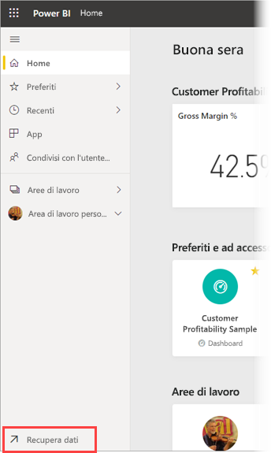
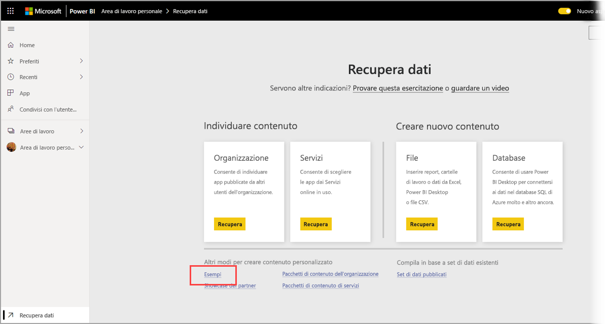
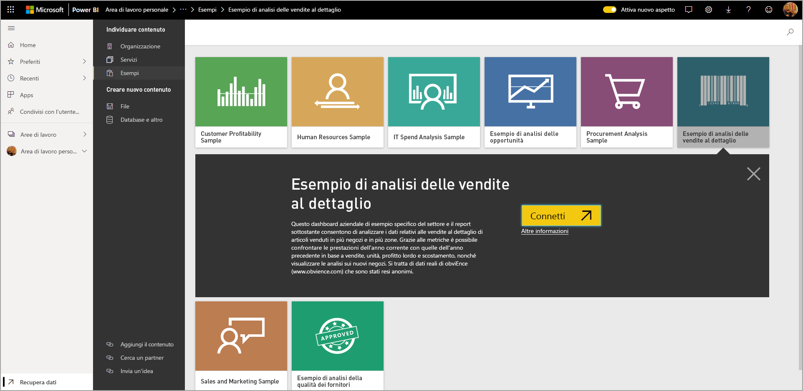
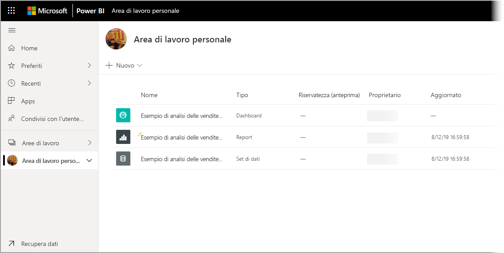

# Download degli esempi nell'area di lavoro personale nel servizio Power BI

Parte della documentazione sulle app per dispositivi mobili disponibile qui usa dati di esempio a scopo illustrativo. Per seguire le procedure sul proprio dispositivo, è possibile scaricare i dati di esempio nell'account del servizio Power BI, per poi visualizzarli dall'app Power BI per dispositivi mobili sul dispositivo. Questo articolo descrive come scaricare i dati di esempio nel proprio account del servizio Power BI. 

## Prerequisiti

È necessario avere un account del servizio Power BI per poter scaricare i dati. Se non si è ancora iscritti a Power BI, [iscriversi per ottenere una versione di prova gratuita](https://app.powerbi.com/signupredirect?pbi_source=web) prima di iniziare.

## Scarica un esempio

1. Aprire il [servizio Power BI](https://app.powerbi.com) nel browser ed eseguire l'accesso.

2. Selezionare **Recupera dati** nell'angolo inferiore sinistro del riquadro di spostamento. Se il riquadro di spostamento è nascosto e il collegamento Recupera dati non è visibile, visualizzare il riquadro facendo clic sull'icona Mostra il riquadro di spostamento .  
   
    

3. Nella pagina Recupera dati selezionare il collegamento **Esempi**.
   
   

4. Selezionare un esempio da scaricare. Assicurarsi di scegliere l'esempio correlato all'esercitazione, alla guida di avvio rapido o all'articolo che si sta usando. Dopo averlo selezionato, fare clic su **Connetti**.
  
   
   
5. Power BI importa l'esempio, aggiungendo un nuovo dashboard, report e set di dati all'area di lavoro personale.
   
   
  
A questo punto si è pronti per visualizzare gli esempi nel proprio dispositivo mobile.

## Passaggi successivi
* [Guida introduttiva](mobile-apps-quickstart-view-dashboard-report.md)
* Domande? Controllare la [sezione dedicata alle app per dispositivi mobili della Community di Power BI](https://go.microsoft.com/fwlink/?linkid=839277)
