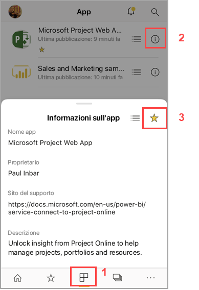

# Creare e visualizzare i Preferiti nelle app Power BI per dispositivi mobili
Si applica a:

|  |  |  |  |  |
|:--- |:--- |:--- |:--- |:--- |
| iPhone |iPad |Telefoni Android |Tablet Android |Dispositivi Windows 10 |

Informazioni su come creare e visualizzare i dashboard, i report e le app preferiti di Power BI, insieme ai report e agli indicatori KPI locali preferiti del Server di report di Power BI e di Reporting Services nelle app per dispositivi mobili.

Quando si crea un preferito nelle app Power BI per dispositivi mobili, è possibile visualizzarlo nella pagina Preferiti del servizio Power BI ([https://powerbi.com](https://powerbi.com)) e da tutti i dispositivi mobili. 

È anche possibile [aggiungere dashboard e app di Power BI ai Preferiti nel servizio Power BI](../end-user-favorite.md). In questo modo saranno visibili nella pagina Preferiti dell'app per dispositivi mobili.

È possibile contrassegnare gli indicatori KPI e i report come preferiti nel portale Web del server di report di Power BI o di Reporting Services e quindi visualizzarli in un'unica cartella nel dispositivo mobile, assieme ai dashboard di Power BI preferiti.

## Visualizzare i Preferiti di Power BI
* Toccare il menu di spostamento in alto  e quindi toccare **Preferiti**.
  
  
  
  Tutti i preferiti sono visibili insieme in questa pagina:
  
  

## Aggiungere un'app ai Preferiti
1. Nell'elenco di app nell'app per dispositivi mobili toccare **Altre opzioni** (...) accanto all'app > **Aggiungi a Preferiti**.
   
    
   
    L'app è ora elencata insieme alle altre app e agli altri dashboard preferiti.
   
    

## Aggiungere un dashboard o un report ai Preferiti nelle app per dispositivi mobili iOS e Windows 10
È possibile aggiungere un dashboard o un report di Power BI ai Preferiti dall'elenco dei dashboard o dei report oppure dal dashboard o dal report stesso.

* Nell'elenco dei dashboard o dei report nell'app per dispositivi mobili toccare la stella vuota accanto al nome . La stella diventa gialla .
  
    
* Nel dashboard o nel report toccare la stella vuota sulla barra multifunzione . La stella diventa gialla .
  
    

## Aggiungere un dashboard o un report ai Preferiti nelle app per dispositivi mobili Android
È possibile aggiungere un dashboard o un report ai Preferiti dall'elenco dei dashboard o dei report oppure dal dashboard o dal report stesso.

* Nell'elenco dei dashboard o dei report nell'app per dispositivi mobili toccare il pulsante **Altre opzioni** (...) accanto al nome e quindi toccare **Aggiungi a Preferiti**. Verrà visualizzata una stella gialla accanto al nome .
  
    
* Nel dashboard o nel report toccare la stella vuota sulla barra multifunzione . La stella diventa di colore grigio scuro .
  
    

## Aggiungere ai Preferiti i report e gli indicatori KPI del server di report di Power BI e di Reporting Services
È possibile visualizzare i report e gli indicatori KPI del server di report di Power BI e di Reporting Services nelle app Power BI per dispositivi mobili, ma non è possibile aggiungerli ai Preferiti nelle app per dispositivi mobili. È possibile [contrassegnarli come Preferiti nel portale Web](../../report-server/tutorial-explore-report-server-web-portal.md#tag-your-favorites). 

## Passaggi successivi
* [Aggiungere dashboard ai Preferiti nel servizio Power BI](../end-user-favorite.md) 
* Domande? [Provare a rivolgersi alla community di Power BI](https://community.powerbi.com/)

