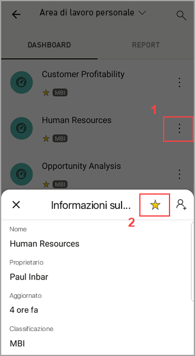

# Creare e visualizzare i Preferiti nelle app Power BI per dispositivi mobili
Si applica a:

|  |  |  |  |  |
|:--- |:--- |:--- |:--- |:--- |
| iPhone |iPad |Telefoni Android |Tablet Android |Dispositivi Windows 10 |

>[!NOTE]
>Il supporto delle app Power BI per dispositivi mobili per i **telefoni con Windows 10 Mobile** non sarà più disponibile dal 16 marzo 2021. [Altre informazioni](https://go.microsoft.com/fwlink/?linkid=2121400)

Informazioni su come creare e visualizzare i dashboard, i report e le app preferiti di Power BI, insieme ai report e agli indicatori KPI locali preferiti del Server di report di Power BI e di Reporting Services nelle app per dispositivi mobili.

Quando si imposta un elemento come preferito nell'app Power BI per dispositivi mobili, questo viene visualizzato nella pagina Preferiti del [servizio Power BI](https://powerbi.com) e in tutti i dispositivi mobili in uso.

Per visualizzare la pagina Preferiti, toccare l'icona Preferiti sulla barra di spostamento:

È anche possibile [aggiungere dashboard e app di Power BI ai Preferiti nel servizio Power BI](../end-user-favorite.md). In questo modo saranno visibili nella pagina Preferiti dell'app per dispositivi mobili.

È possibile contrassegnare gli indicatori KPI e i report come preferiti nel portale Web del server di report di Power BI o di Reporting Services e quindi visualizzarli in un'unica cartella nel dispositivo mobile, assieme ai dashboard di Power BI preferiti.

## Aggiungere un'app ai Preferiti
1. Toccare l'icona App sulla barra di spostamento inferiore per visualizzare la pagina delle app.

2. In un dispositivo iOS, toccare il pulsante Info a destra del nome dell'app che si vuole impostare come preferita. Nei dispositivi Android, al posto del pulsante Info viene visualizzato Altre opzioni (...). 

3. Nella sezione Informazioni sull'app toccare la stella.
   
    
   
    L'app verrà elencata nella pagina Preferiti, insieme agli altri dashboard, app e report preferiti.
   
## Aggiungere un dashboard o un report ai Preferiti nelle app per dispositivi mobili iOS e Windows 10
È possibile aggiungere un dashboard o un report di Power BI ai Preferiti dall'elenco dei dashboard o dei report oppure dal dashboard o dal report stesso.

* Nell'elenco dei dashboard o dei report nell'app per dispositivi mobili toccare la stella vuota accanto al nome . La stella diventa gialla .
  
    
* Se si è all'interno di un dashboard, toccare l'icona della stella vuota  sulla barra multifunzione. Se si è all'interno di un report, la stella si trova in **Altre opzioni** (...).  La stella diventa nera .
  
    

## Aggiungere un dashboard o un report ai Preferiti nelle app per dispositivi mobili Android
È possibile aggiungere un dashboard o un report ai Preferiti dall'elenco dei dashboard o dei report oppure dal dashboard o dal report stesso.

* Nell'elenco dei dashboard o dei report nell'app per dispositivi mobili toccare il pulsante verticale **Altre opzioni** (...) accanto al nome e quindi toccare la stella Preferiti nella scheda di informazioni visualizzata.
  
    

* Se si è all'interno di un dashboard, toccare la stella vuota sulla barra multifunzione . La stella diventa di colore grigio scuro .
  
    

* Se si è all'interno di un report, scorrere rapidamente verso il basso per visualizzare la barra multifunzione, toccare **Altre opzioni** (...), quindi scorrere verso il basso per trovare la stella vuota  e toccarla. La stella diventa di colore grigio scuro .
  
    

## Aggiungere ai Preferiti i report e gli indicatori KPI del server di report di Power BI e di Reporting Services
È possibile visualizzare i report e gli indicatori KPI del server di report di Power BI e di Reporting Services nelle app Power BI per dispositivi mobili, ma non è possibile aggiungerli ai Preferiti nelle app per dispositivi mobili. È possibile [contrassegnarli come Preferiti nel portale Web](../../report-server/tutorial-explore-report-server-web-portal.md#tag-your-favorites). 

## Passaggi successivi
* [Aggiungere dashboard ai Preferiti nel servizio Power BI](../end-user-favorite.md) 
* Domande? [Contattare la community di Power BI](https://community.powerbi.com/)

