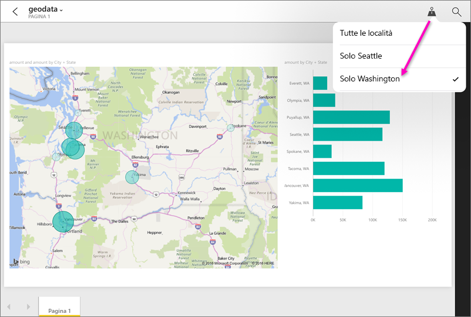

# Filtrare un report in base alla posizione geografica nelle app Power BI per dispositivi mobili
Si applica a:

|  |  |  |  |  |
|:--- |:--- |:--- |:--- |:--- |
| iPhone |iPad |Telefoni Android |Tablet Android |Telefoni Windows 10 |

Se quando si visualizza un report di Power BI in un dispositivo mobile viene visualizzata un'icona a forma di piccola puntina da disegno nell'angolo superiore destro, sarà possibile filtrare il report in base alla propria posizione geografica.

> [!NOTE]
> È possibile filtrare in base alla località solo se i nomi geografici del report sono in inglese, ad esempio "New York City" o "Germany". I tablet e i PC Windows 10 non supportano i filtri geografici, ma i telefoni Windows 10 sì.
> 
> 

## Filtrare il report in base alla propria posizione geografica
1. Aprire un report nell'app per dispositivi mobili di Power BI nel dispositivo mobile.
2. Se il report include dati geografici, viene visualizzato un messaggio che chiede di consentire a Power BI di accedere alla posizione. Fare clic su **Consenti** e toccare di nuovo **Consenti**.
3. Toccare la puntina da disegno . È possibile filtrare per città, provincia o paese/area geografica, in base ai dati contenuti nel report. Il filtro elenca solo le opzioni corrispondenti alla posizione attuale.
   
    

## Perché non sono visibili i tag della posizione in un report?
Per visualizzare i tag della posizione, queste tre condizioni devono essere tutte vere. 

* La persona che ha creato il report in Power BI Desktop ha [suddiviso in categorie i dati geografici](../../desktop-mobile-geofiltering.md) per almeno una colonna, ad esempio città, stato o paese/area geografica.
* Ci si trova in una delle posizioni per cui esistono dati in tale colonna.
* Si sta usando uno di questi dispositivi mobili:
  * iOS (iPad, iPhone, iPod).
  * Telefono o tablet Android.
  * Telefono Windows 10 (altri dispositivi Windows 10, come i tablet e i PC, non supportano i filtri geografici).

Altre informazioni su come [impostare un filtro geografico](../../desktop-mobile-geofiltering.md) in Power BI Desktop.

### Passaggi successivi
* [Connettersi ai dati di Power BI dal mondo reale](mobile-apps-data-in-real-world-context.md) con le app per dispositivi mobili
* [Categorizzazione dei dati in Power BI Desktop](../../desktop-data-categorization.md) 
* Domande? [Provare a rivolgersi alla community di Power BI](http://community.powerbi.com/)

