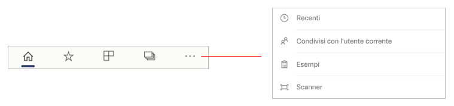

# Presentazione della home page dell'app per dispositivi mobili
In questa presentazione si acquisisce familiarità con la home page dell'app Power BI per dispositivi mobili e con gli strumenti di navigazione che offre per ottenere rapidamente le informazioni necessarie.

Si applica a:

|  |  |  |
|:--- |:--- |:--- |
| iPhone | iPad | Telefoni | 

Quando si apre l'app Power BI per dispositivi mobili viene visualizzata la home page, da cui è possibile accedere rapidamente ai report, ai dashboard e alle app visitati più di frequente o di recente. È inoltre disponibile un feed attività che tiene l'utente aggiornato sui cambiamenti del contenuto di Power BI, oltre a pratici strumenti di navigazione che consentono di accedere rapidamente al contenuto che serve.

 
## Scheda Accesso rapido

La scheda Accesso rapido mostra i report, i dashboard e le app visualizzati più di frequente o di recente, raggruppati in sezioni comprimibili. Per vedere un elenco più lungo degli elementi visualizzati di recente, toccare **Visualizza tutto** a destra di Recenti. 

## Feed attività

Il feed attività aiuta a tenere traccia di ciò che accade al contenuto di Power BI. Mostra tutte le notifiche, gli avvisi, i commenti e le @mentions più recenti.

Gli aggiornamenti disponibili nel feed includono:
* **Dati aggiornati**: quando vengono aggiornati i dati sottostanti in uno dei report o dei dashboard in Preferiti o in Recenti.
* **Nuovi commenti**: quando gli utenti creano un commento in un report o in un dashboard presente in Preferiti o in Recenti oppure quando qualcuno vi fa riferimento in un commento.
* **Avvisi dati**: quando i dati raggiungono una soglia precedentemente impostata in un [avviso dati](../../mobile-set-data-alerts-in-the-mobile-apps.md).
* **Aggiornamenti di app**: quando l'autore di un'app pubblica un aggiornamento per un'app che si sta usando.

 Toccare un elemento di attività per passare alla posizione pertinente e approfondire l'esplorazione.

Gli elementi di attività sono aggregati, pertanto tutti gli aggiornamenti dei dati provenienti dalla stessa app o area di lavoro vengono raggruppati insieme. Usare il  freccia per espandere e visualizzare gli elementi aggregati. L'elemento più recente è sempre all'inizio dell'elenco.

## Barra di spostamento

In fondo alla pagina è disponibile la barra di spostamento.

La barra di spostamento consente di accedere rapidamente agli elementi seguenti:

*  **Home page**: consente di tornare alla home page.
*  **Preferiti**: report, dashboard e app contrassegnati come [preferiti](../../mobile-apps-favorites.md).
*  **App**: le app installate nell'account.
*  **Aree di lavoro**: cartelle di lavoro che riuniscono i report e i dashboard creati dagli autori di contenuti.
*  **Recenti**: gli elementi visualizzati di recente.
*  **Condivisi con l'utente corrente**: gli elementi che altre persone hanno condiviso con l'utente.
*  **Esempi**: esempi di Power BI da usare per acquisire familiarità con le funzionalità di Power BI.
*  **Scanner**: fotocamera del dispositivo che può essere usata per digitalizzare [codici a barre](../../mobile-apps-scan-barcode-iphone.md) e [codici a matrice](../../mobile-apps-qr-code.md).

## Intestazione

Nella parte superiore della pagina, l'intestazione mostra il nome della pagina, del report o del dashboard di Power BI attualmente attivo.

L'intestazione fornisce gli elementi di navigazione seguenti:
* **Immagine o avatar del profilo**: apre il pannello laterale che consente di [spostarsi tra l'account del servizio Power BI e l'account del server di report](../../mobile-app-ssrs-kpis-mobile-on-premises-reports.md), oltre che di accedere alle impostazioni dell'app Power BI per dispositivi mobili.

    

* **Notifiche**: apre la [pagina Notifiche](../../mobile-apps-notification-center.md) in cui è possibile visualizzare e accedere alle notifiche. Un punto sull'icona di notifica a forma di campana indica che sono presenti nuove notifiche.

    

* **Ricerca**: consente di cercare contenuti di Power BI nella sottoscrizione.

    

## Passaggi successivi
In questa presentazione è stata esplorata la home page dell'app Power BI per dispositivi mobili. È possibile leggere altre informazioni sull'app Power BI per dispositivi mobili. 
* [Esplorare dashboard e report](../../mobile-apps-quickstart-view-dashboard-report.md)
* [Esplorare i report nelle app per dispositivi mobili di Power BI](../../mobile-reports-in-the-mobile-apps.md)
