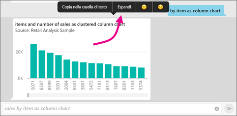

# Analista virtuale Domande e risposte nelle app iOS - Power BI

Il modo più semplice per conoscere i dati consiste nel porre domande a tal proposito con parole proprie. In questo articolo è possibile porre domande e visualizzare informazioni dettagliate in primo piano sui dati di esempio con l'analista virtuale Domande e risposte nell'app Power BI per dispositivi mobili su iPad, iPhone e iPod Touch. 

Si applica a:

|  |  |
|:--- |:--- |
| iPhone |iPad |

L'analista virtuale Domande e risposte è un'esperienza di conversazione di Business Intelligence che accede ai dati di Domande e risposte sottostanti nel servizio Power BI [(https://powerbi.com)](https://powerbi.com). Suggerisce informazioni dettagliate sui dati e consente di digitare o pronunciare le proprie domande.

Se non si è ancora iscritti a Power BI, [iscriversi per ottenere una versione di prova gratuita](https://app.powerbi.com/signupredirect?pbi_source=web) prima di iniziare.

## Prerequisiti

* **Installare l'app Power BI per iOS**: [Scaricare l'app per iOS](https://go.microsoft.com/fwlink/?LinkId=522062) nell'iPhone o iPad.
Queste versioni supportano l'app Power BI per iOS:
    * iPad con iOS 11 o versioni successive.
    * iPhone 5 e versioni successive con iOS 11 o versioni successive.
* **Scaricare gli esempi di analisi delle vendite al dettaglio e di analisi delle opportunità**: il primo passaggio da eseguire consiste nel download degli esempi di analisi delle vendite al dettaglio e di analisi delle opportunità nel servizio Power BI. Leggere l'articolo su [come scaricare un esempio](./mobile-apps-download-samples.md) nel proprio account Power BI per iniziare. Assicurarsi di scegliere l'esempio di analisi delle vendite al dettaglio e l'esempio di analisi delle opportunità.

Una volta completati i prerequisiti, si è pronti per provare l'analista virtuale di Domande e risposte.

## Provare a formulare domande nell'iPhone o iPad
1. Sulla barra di spostamento inferiore dell'iPhone o iPad toccare il pulsante Aree di lavoro , passare ad Area di lavoro personale e aprire il dashboard dell'esempio di analisi delle vendite al dettaglio.

2. Toccare l'icona dell'analista virtuale Domande e risposte  dal menu azione nella parte inferiore della pagina (nella parte superiore della pagina in un iPad).
     Lo strumento di analisi virtuale Domande e risposte offre alcuni suggerimenti iniziali.
3. Digitare **show**, toccare **sales** nell'elenco dei suggerimenti, quindi toccare **Invia** .

    
4. Toccare **by** tra le parole chiave, quindi toccare **item** nell'elenco dei suggerimenti e infine **Invia** .

    
5. Toccare **as** tra le parole chiave, toccare l'icona dell'istogramma , quindi toccare **Invia** .
6. Toccare a lungo il grafico risultante, quindi toccare **Espandi**.

    

    Il grafico viene aperto in modalità messa a fuoco nell'app.

    
7. Toccare la freccia nell'angolo in alto a sinistra per tornare alla finestra chat dell'analista virtuale Domande e risposte.
8. Toccare la X a destra della casella di testo per eliminare il testo e ricominciare.
9. Provare una nuova domanda: toccare **top** tra le parole chiave, toccare **sale by avg $/unit ly** > **Invia** .

    
10. Scegliere **by** tra le parole chiave, toccare **item** nell'elenco dei suggerimenti in alto e quindi **Invia** .

     
11. Digitare **as**, selezionare l'icona del grafico a linee  nell'elenco dei suggerimenti e quindi **Invia** .

    

## Provare a formulare domande
È ora possibile porre domande sui dati nell'app Power BI per dispositivi mobili parlando anziché digitando.

1. Toccare l'icona dell'analista virtuale Domande e risposte  dal menu azione nella parte inferiore della pagina (nella parte superiore della pagina in un iPad).
2. Toccare l'icona di microfono .

    

1. Quando l'icona di microfono è attiva, iniziare a parlare. Ad esempio, pronunciare "prezzo unitario medio in base all'ora", quindi toccare **Invia** .

    

### Domande sulla privacy durante l'uso del riconoscimento vocale?
Vedere la sezione dedicata al riconoscimento vocale della pagina sulle [novità di iOS](https://go.microsoft.com/fwlink/?linkid=845624) nelle Guide per gli sviluppatori iOS Apple.

## Guida e commenti e suggerimenti
* Richiesta di assistenza Basta dire "Ciao" o "Aiuto" per ottenere assistenza su come iniziare una nuova domanda.
* Si vuole inviare commenti e suggerimenti sui risultati? Effettuare un tocco prolungato su un grafico o un altro risultato, quindi toccare la faccina sorridente o imbronciata.

    

    I commenti e suggerimenti sono anonimi e sono utili per migliorare le risposte alle domande.

## Migliorare i risultati dell'analista virtuale Domande e risposte
È possibile migliorare i risultati che gli utenti e i clienti ottengono quando usano l'analista virtuale Domande e risposte in un set di dati, ponendo domande più mirate o migliorando il set di dati.

### Come porre domande
* Seguire i [Suggerimenti per porre domande in Domande e risposte](../end-user-q-and-a-tips.md) nel servizio Power BI o nell'analista virtuale Domande e risposte nell'app per dispositivi mobili iOS.

### Come migliorare il set di dati
* Migliorare il set di dati in Power BI Desktop o nel servizio Power BI per [verificare che i dati funzionino bene con Domande e risposte e l'analista virtuale Domande e risposte](../../create-reports/service-prepare-data-for-q-and-a.md).

## Passaggi successivi
* [Domande e risposte nel servizio Power BI](../end-user-q-and-a.md)
* Domande? Controllare la [sezione dedicata alle app per dispositivi mobili della Community di Power BI](https://go.microsoft.com/fwlink/?linkid=839277)
