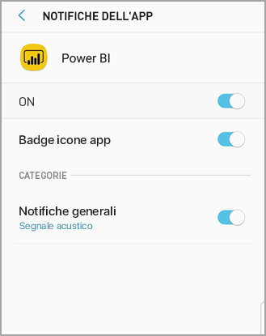

# Ottenere le notifiche nelle app per dispositivi mobili di Power BI
Si applica a:

|  |  |  |  |  |
|:--- |:--- |:--- |:--- |:--- |
| iPhone |iPad |Telefoni Android |Tablet Android |Dispositivi Windows 10 |

>[!NOTE]
>Il supporto delle app Power BI per dispositivi mobili per i **telefoni con Windows 10 Mobile** non sarà più disponibile dal 16 marzo 2021. [Altre informazioni](https://go.microsoft.com/fwlink/?linkid=2121400)

Le notifiche forniscono informazioni correlate all'esperienza di Power BI direttamente all'utente, nel servizio Power BI o nel dispositivo mobile. Quando si aprono le notifiche, viene visualizzato un feed sequenziale di messaggi sugli [avvisi impostati](mobile-set-data-alerts-in-the-mobile-apps.md), sui nuovi dashboard condivisi con l'utente, sulle modifiche apportate all'area di lavoro del gruppo, sulle informazioni relative a eventi e riunioni di Power BI e altro ancora.

> [!NOTE]
> In un dispositivo iOS al primo accesso alla [versione aggiornata delle app di Power BI](https://powerbi.microsoft.com/mobile/) viene visualizzato un messaggio che richiede se si vogliono ricevere notifiche da Power BI. È anche possibile configurare la modalità di invio delle notifiche da parte di Power BI nelle **Impostazioni** per il dispositivo. 
> 
> 

## Visualizzare le notifiche nel dispositivo mobile
1. Quando si ricevono notifiche nel dispositivo mobile, per impostazione predefinita Power BI riproduce un suono e mostra un banner di notifica.
   
   
   

   È possibile [modificare la modalità di invio delle notifiche di Power BI](mobile-apps-notification-center.md#change-or-turn-off-notifications-on-your-mobile-device).
2. Se sono state ricevute notifiche, quando si accede a Power BI nel dispositivo mobile viene visualizzato un punto giallo sull'icona di notifica a forma di campana  (iOS e Android) o sul pulsante di spostamento globale  (dispositivi Windows 10). 

3. Per visualizzare le notifiche nel centro notifiche, toccare la campana di notifica  (iOS e Android) o l'icona del centro notifiche  (dispositivi Windows 10).
   
    Le notifiche vengono visualizzate a partire dalla più recente e con i messaggi non letti evidenziati. Le notifiche vengono conservate per 90 giorni, a meno che non vengano eliminate o che non si raggiunga il limite massimo di 100.
   
   
4. Per chiudere una notifica sui dispositivi iOS e Android, toccare, tenere premuto e scorrere rapidamente. Nei dispositivi Windows 10, fare clic con il pulsante destro del mouse e scegliere **Ignora**.

## Modificare o disattivare le notifiche nel dispositivo mobile
È possibile modificare la modalità di invio delle notifiche da parte di Power BI.

1. In un dispositivo iOS passare a **Impostazioni** > **Notifiche**. 
   
    In un telefono Android passare a **Impostazioni** > **Notifiche**.
   
    In un dispositivo Windows in **Impostazioni** passare a **Sistema** > **Notifiche e azioni**.
2. Nell'elenco di app selezionare **Power BI**. 
3. Qui è possibile disattivare completamente le notifiche o scegliere le notifiche desiderate.
   
    **In un iPhone**
   
    
   
    **In un telefono Android**
   
    

    **In un dispositivo Windows 10**

    

## Passaggi successivi
* [Avvisi per i dati nel servizio Power BI](../../service-set-data-alerts.md)
* [Impostare avvisi per i dati nell'app iPhone (Power BI per iOS)](mobile-set-data-alerts-in-the-mobile-apps.md)
* [Impostare gli avvisi per i dati nell'app Power BI per dispositivi mobili per Windows 10](mobile-set-data-alerts-in-the-mobile-apps.md)
* [Scaricare la versione più recente delle app Power BI](https://powerbi.microsoft.com/mobile/) per dispositivi mobili

