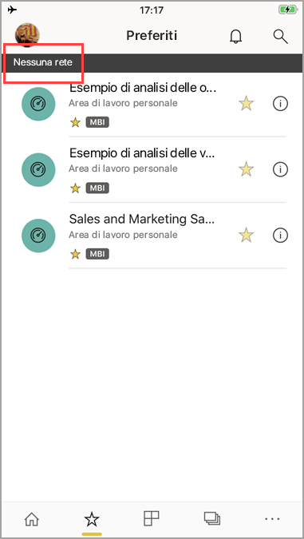

# Visualizzazione dei dati offline nelle app per dispositivi mobili di Power BI
Si applica a:

|  |  |  |  |  |
|:--- |:--- |:--- |:--- |:--- |
| iPhone |iPad |Telefoni Android |Tablet Android |Dispositivi Windows 10 |

>[!NOTE]
>Il supporto delle app Power BI per dispositivi mobili per i **telefoni con Windows 10 Mobile** non sarà più disponibile dal 16 marzo 2021. [Altre informazioni](https://go.microsoft.com/fwlink/?linkid=2121400)

Uno dei vantaggi della visualizzazione di Power BI in un'app per dispositivi mobili invece che in un browser, è che è possibile visualizzare i dati anche quando non si è connessi a una rete. 

Per impostazione predefinita, i dati in Power BI vengono aggiornati spesso in modo da offrire risposte adeguate alle esigenze dell'azienda, anche quando si è in viaggio.

## Accesso ai dati offline
Quando si è offline si ha la possibilità di accedere e interagire con i dashboard a cui è stato eseguito l'accesso precedentemente dall'app per dispositivi mobili.

È anche possibile accedere in sola lettura ai report di Power BI cui si ha eseguito l'accesso in precedenza dall'app per dispositivi mobili. È possibile visualizzare il report completo, ma non eseguire filtri o filtri incrociati, ordinare i dati o usare filtri dei dati.

## Aggiornamento dei dati in background
L'aggiornamento in background aggiorna i dashboard preferiti, oltre ai dashboard e ai report visualizzati nelle ultime due settimane, con i dati nel servizio Power BI (non l'origine dati). Se si è connessi alla rete Wi-Fi, l'aggiornamento in background viene eseguito ogni 2 ore. In caso contrario, in una rete 3G Power BI aggiorna il contenuto ogni 24 ore.

L'aggiornamento in background può essere disattivato, ad esempio per evitare l'uso della rete. Controllare le impostazioni del dispositivo.

> [!NOTE]
> Se si usa l'app Power BI per dispositivi mobili in un dispositivo iOS e l'organizzazione ha configurato Microsoft Intune MAM, l'aggiornamento dati in background è disattivato. La volta successiva che si accede all'app, Power BI aggiorna i dati dal servizio Power BI sul Web.
> 
> Altre informazioni sulla [configurazione delle app Power BI per dispositivi mobili con Microsoft Intune](../../admin/service-admin-mobile-intune.md). 
> 
> 

## Indicatori offline
Power BI fornisce indicatori chiari a indicare che si sta entrando o uscendo dalla modalità offline, o che vi sono dashboard, report e riquadri mancanti perché non disponibili offline.

## Limitazioni
Quando si è offline con Power BI su dispositivo mobile, è possibile riscontrare queste limitazioni:

* Power BI è in grado di archiviare offline nella memoria cache un massimo di 250 MB di dati.
* Alcuni tipi di riquadro, come le tessere mappa di Bing e alcuni riquadri personalizzati, richiedono una connessione server attiva, quindi non sono disponibili offline.
* Intere cartelle di lavoro di Excel in Power BI non sono disponibili offline.
* È possibile visualizzare report per dispositivi mobili di Reporting Services e indicatori KPI offline, se sono stati visualizzati durante la connessione. Non vengono aggiornati in background, ma ogni volta che vengono aperti.
* Nelle app per dispositivi mobili di Power BI non è possibile visualizzare i file di Power BI Desktop (con estensione pbix) salvati nel Server di report di Power BI. 
* I report impaginati (RDL) non sono disponibili mentre la rete è offline.

## Passaggi successivi
I commenti e i suggerimenti degli utenti aiutano a decidere quali funzioni implementare in futuro, quindi è consigliabile votare le funzionalità che si vorrebbe avere nelle app per dispositivi mobili di Power BI. 

* [App Power BI per dispositivi mobili](mobile-apps-for-mobile-devices.md)
* Seguire @MSPowerBI su Twitter
* Partecipare alla conversazione nella [community di Power BI](https://community.powerbi.com/)
* [Che cos'è Power BI?](../../fundamentals/power-bi-overview.md)