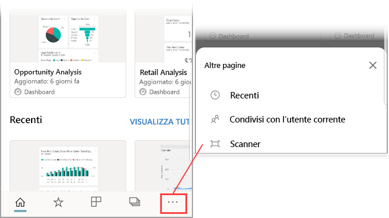
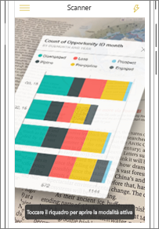
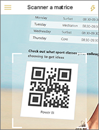
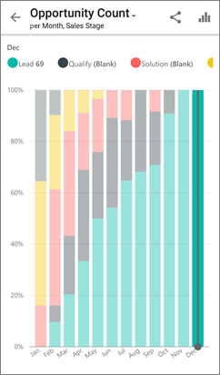

# Scansionare un codice a matrice di Power BI dal dispositivo mobile
Si applica a:

|  |  |  |  |
|:--- |:--- |:--- |:--- |
|iPhone |iPad |Telefoni Android |Tablet Android |

I codici a matrice in Power BI possono connettere qualsiasi elemento nel mondo reale direttamente a informazioni correlate di BI &#151; senza dover effettuare nessuno spostamento o ricerca.

Si supponga che un collega abbia [creato un codice a matrice nel servizio Power BI](../../service-create-qr-code-for-tile.md) per report o un riquadro in un dashboard, abbia condiviso il dashboard o il report e abbia inserito il codice a matrice in un percorso chiave, ad esempio in un messaggio di posta elettronica o in un elemento specifico. 

È possibile scansionare il codice a matrice per l'accesso immediato al riquadro o al report rilevante, direttamente dal telefono, usando lo scanner nell'app Power BI o qualsiasi altro scanner installato nel telefono. 

Se il collega non ha condiviso il dashboard o report, è possibile richiedere l'accesso direttamente dall'app per dispositivi mobili. 

> [!NOTE]
> È anche possibile eseguire la [scansione del codice a matrice di un report con l'app Power BI per realtà mista](mobile-mixed-reality-app.md#scan-a-report-qr-code-in-holographic-view).

## Acquisire un codice a matrice di Power BI sull'iPhone con lo scanner di Power BI

1. Sulla barra di spostamento toccare **Altre opzioni** (...) e quindi toccare **Scanner**.

    

2. Se la fotocamera non è abilitata, è necessario consentire all'app di Power BI l’utilizzo della fotocamera. Questa approvazione è necessaria una sola volta. 
 
3. Puntare lo scanner in corrispondenza del codice a matrice di Power BI. 
   
    
4. Il riquadro o report apparirà come sospeso sullo sfondo nella realtà aumentata.
   
    

5. Toccare il report o il riquadro per aprirlo in modalità messa a fuoco oppure tornare allo scanner.

### Scansionare un codice a matrice da uno scanner esterno sull’iPhone
1. Puntare qualsiasi scanner installato nel telefono sul codice a matrice di Power BI rilevante per l'accesso immediato al riquadro o al report. 
2. Se non è installata l'app Power BI, si verrà reindirizzati all'[App Store di Apple per effettuarne il download](https://go.microsoft.com/fwlink/?LinkId=522062) nel proprio iPhone.

## Scansionare un codice a matrice di Power BI sul dispositivo Android con lo scanner di Power BI

1. Sulla barra di spostamento toccare **Altre opzioni** (...) e quindi toccare **Scanner**.

    

2. Se la fotocamera non è abilitata, è necessario consentire all'app di Power BI l’utilizzo della fotocamera. Questa approvazione è necessaria una sola volta. 

3. Puntare lo scanner in corrispondenza del codice a matrice di Power BI. 
   
    
4. Il riquadro o report si apre automaticamente in Power BI.
   
    

### Scansionare un codice a matrice da uno scanner esterno sul dispositivo Android
1. Puntare qualsiasi scanner installato nel dispositivo Android in corrispondenza del rilevante codice a matrice di Power BI per l'accesso immediato al riquadro o al report. 
2. Se non è installata l'app Power BI, si verrà reindirizzati a [Google Play per eseguirne il download](https://go.microsoft.com/fwlink/?LinkID=544867). 

## Passaggi successivi
* [Connettersi ai dati di Power BI dal mondo reale](mobile-apps-data-in-real-world-context.md) con le app per dispositivi mobili
* [Creare un codice a matrice per un riquadro nel servizio Power BI](../../service-create-qr-code-for-tile.md)
* [Creare un codice a matrice per un report nel servizio Power BI](../../service-create-qr-code-for-report.md)
* È anche possibile eseguire la [scansione di un codice a matrice con l'app Power BI per realtà mista](mobile-mixed-reality-app.md)
* Domande? [Provare a rivolgersi alla community di Power BI](https://community.powerbi.com/)

