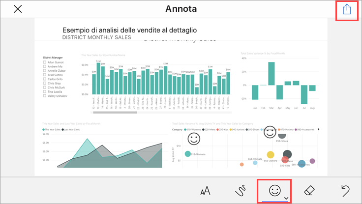

# Avvio rapido: Esplorare dashboard e report nelle app Power BI per dispositivi mobili
Questo argomento di avvio rapido offre una breve presentazione dell'app Power BI per dispositivi mobili ed esplora un dashboard e un report di esempio. Viene illustrata l'app Power BI per iOS, ma è possibile seguire facilmente le procedure su altri dispositivi.

Si applica a:

|  |  |  |  |
|:--- |:--- |:--- |:--- |
| iPhone | iPad | Telefoni | Windows 10 |

>[!NOTE]
>Il supporto delle app Power BI per dispositivi mobili per i **telefoni con Windows 10 Mobile** non sarà più disponibile dal 16 marzo 2021. [Altre informazioni](https://go.microsoft.com/fwlink/?linkid=2121400)

Un dashboard è un portale attraverso cui accedere al ciclo di vita e ai processi aziendali. Offre infatti una panoramica, ovvero una posizione unica da cui controllare lo stato corrente delle attività aziendali. Un report è una vista interattiva dei dati con oggetti visivi che rappresentano conclusioni e approfondimenti diversi ottenuti da tali dati. 

## Prerequisiti

* **Iscriversi a Power BI**: Se non si è ancora iscritti a Power BI, [iscriversi per ottenere una versione di prova gratuita](https://app.powerbi.com/signupredirect?pbi_source=web) prima di iniziare.
* **Installare l'app Power BI per il dispositivo in uso**: scaricare l'app Power BI per dispositivi mobili** dall'[App Store](https://apps.apple.com/app/microsoft-power-bi/id929738808) (iOS) o da [Google Play](https://play.google.com/store/apps/details?id=com.microsoft.powerbim&amp;amp;clcid=0x409) (Android).
* **Scaricare l'esempio di analisi delle vendite al dettaglio**: il primo passaggio da eseguire consiste nel download dell'esempio di analisi delle vendite al dettaglio nel servizio Power BI. Leggere l'articolo su [come scaricare un esempio](./mobile-apps-download-samples.md) nel proprio account Power BI per iniziare. Assicurarsi di scegliere l'esempio di analisi delle vendite al dettaglio.

Una volta completati i prerequisiti e scaricato l'esempio di analisi delle vendite al dettaglio nel proprio account Power BI, si è pronti per iniziare questa presentazione rapida.

## Visualizzare un dashboard sul dispositivo mobile
1. Nel dispositivo aprire l'app Power BI e accedere con le credenziali dell'account Power BI, le stesse usate nel servizio Power BI nel browser.
 
1. Toccare quindi l'icona **Aree di lavoro** , scegliere **Area di lavoro personale** e quindi toccare Esempio di analisi delle vendite al dettaglio per aprirlo.

    
   
    L'aspetto dei dashboard di Power BI sul dispositivo mobile è leggermente diverso da quello visualizzato nel servizio Power BI. Tutti i riquadri hanno la stessa larghezza e sono disposti consecutivamente dall'alto verso il basso.

5. Toccare l'icona a forma di stella  nella barra degli strumenti inferiore per impostare il dashboard come preferito. Quando si aggiunge un elemento ai Preferiti nell'app per dispositivi mobili, viene contrassegnato come preferito anche nel servizio Power BI e viceversa.

6. Scorrere verso il basso e toccare il grafico a linee "This Year's Sales, Last Year's Sales".

    

    Si apre in modalità messa a fuoco.

7. In modalità messa a fuoco toccare **Apr** nel grafico. Nella parte superiore del grafico vengono visualizzati i valori per aprile.

    

8. Toccare l'icona del report  nella parte inferiore della schermata (nei dispositivi Android è possibile che si trovi nella parte superiore della schermata). Il report correlato a questo riquadro viene aperto in modalità orizzontale.

    

9. Toccare la bolla gialla "040 - Juniors" nel grafico a bolle. I valori correlati negli altri grafici vengono evidenziati. 

    

10. Scorrere rapidamente verso l'alto fino a vedere una barra degli strumenti nella parte inferiore e quindi toccare **Altre opzioni (...)** .

    

11. Scorrere l'elenco verso il basso e selezionare **Annota**.

    

12. Sulla barra degli strumenti di annotazione toccare l'icona della faccina sorridente e quindi toccare la pagina del report in cui si vogliono aggiungere alcune faccine sorridenti.
 
    

13. Toccare **Condividi** nell'angolo in alto a destra.

14. Scegliere il modo in cui condividere il report.  

    

    È possibile condividere lo snapshot con chiunque, sia all'interno che all'esterno dell'organizzazione. Se gli utenti fanno parte dell'organizzazione e hanno un account di Power BI, potranno anche aprire il report di esempio di analisi delle vendite al dettaglio.

## Pulire le risorse

Dopo aver completato questa guida di avvio rapido, se si vuole è possibile eliminare il dashboard, il report e il set di dati dell'esempio di analisi delle vendite al dettaglio.

1. Aprire il servizio Power BI ([Servizio Power BI](https://app.powerbi.com)) ed eseguire l'accesso.

2. Nel riquadro di spostamento selezionare **Area di lavoro personale**.

3. Selezionare la scheda Dashboard e quindi fare clic sull'icona del cestino.

    

    Fare clic sulla scheda Report ed eseguire la stessa operazione.

4. Selezionare ora la scheda Set di dati, fare clic su **Altre opzioni** (...) e scegliere **Elimina**. 

    

## Passaggi successivi

In questo argomento di avvio rapido si sono esplorati un dashboard e un report di esempio nel dispositivo mobile. Continuare per altre informazioni sull'uso del servizio Power BI. 

> [!div class="nextstepaction"]
> [Avvio rapido: Navigazione nel servizio Power BI](../end-user-experience.md)

