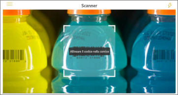
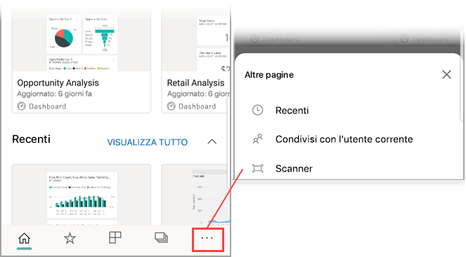

# Effettuare la scansione di un codice a barre con il dispositivo dall'app Power BI per dispositivi mobili
Effettuare la scansione di codici a barre nel mondo reale per passare direttamente a informazioni di business intelligence filtrate nell'app per dispositivi mobili di Power BI.

Si applica a:

|  |  |  |  |
|:--- |:--- |:--- |:--- |
|iPhone |iPad |Telefoni Android |Tablet Android |

Si supponga che un collega abbia [contrassegnato un campo di codice a barre in un report di Power BI Desktop](../../desktop-mobile-barcodes.md) e abbia condiviso il report con l'utente. 

Quando si effettua la scansione del codice a barre di un prodotto con lo scanner nell'app Power BI del dispositivo, viene visualizzato il report o l'elenco di report con tale codice a barre. È possibile aprire il report filtrato in base a tale codice a barre.

## Effettuare la scansione di un codice a barre con lo scanner di Power BI
1. Sulla barra di spostamento toccare **Altre opzioni** (...) e quindi toccare **Scanner**.

    

2. Se la fotocamera non è abilitata, è necessario consentire all'app di Power BI l’utilizzo della fotocamera. Questa approvazione è necessaria una sola volta. 
4. Posizionare lo scanner in corrispondenza del codice a barre su un prodotto. Viene visualizzato un elenco di report associati al codice a barre.
5. Toccare il nome del report per aprirlo nel dispositivo, filtrato automaticamente in base al codice a barre.

## Filtrare in base ad altri codici a barre con un report aperto
Quando si visualizza sul dispositivo un report filtrato in base a un codice a barre, può essere necessario filtrare lo stesso report in base a un codice a barre diverso.

* Se l'icona del codice a barre ha un filtro , il filtro è attivo e il report è già filtrato in base a un codice a barre. 
* Se l'icona non contiene alcun filtro , il filtro non è attivo e il report non è filtrato in base ad alcun codice a barre. 

In entrambi i casi, toccare l'icona per aprire un piccolo menu con uno scanner mobile.

* Mettere a fuoco lo scanner sul nuovo elemento per impostare il filtro del report su un valore di codice a barre diverso. 
* Selezionare **Clear barcode filter** (Cancella filtro codice a barre) per tornare al report senza filtri.
* Selezionare **Filter by recent barcodes** (Filtra in base a codici a barre recenti) per impostare il filtro del report su uno dei codici a barre di cui è stata effettuata la scansione entro la sessione corrente.

## Problemi con la scansione di un codice a barre
Ecco alcuni messaggi che potrebbero essere visualizzati quando si effettua la scansione di un codice a barre su un prodotto.

### "Non è stato possibile filtrare il report..."
Il report a cui si è scelto di applicare il filtro è basato su un modello di dati che non include questo valore di codice a barre. Il prodotto "acqua minerale" ad esempio, non è incluso nel report.  

### Alcuni/Tutti gli oggetti visivi del report non contengono alcun valore
Il valore del codice a barre di cui è stata effettuata la scansione esiste nel modello ma alcuni/tutti gli oggetti visivi del report non contengono tale valore e quindi il filtro restituirà uno stato vuoto. Provare a cercare in altre pagine del report o modificare i report in Power BI Desktop, in modo che contenga questo valore. 

### "Non sono presenti report che possono essere filtrati in base ai codici a barre"
Non sono disponibili report abilitati per il codice a barre. Lo scanner di codici a barre può filtrare solo i report che includono una colonna contrassegnata come **Codice a barre**.  

Assicurarsi che il proprietario del report abbia contrassegnato una colonna come **Codice a barre** in Power BI Desktop. Altre informazioni su come [contrassegnare un campo di codice a barre in Power BI Desktop](../../desktop-mobile-barcodes.md)

### "Non è stato possibile filtrare il report. Questo codice a barre non esiste nei dati del report."
Il report a cui si è scelto di applicare il filtro è basato su un modello di dati che non include questo valore di codice a barre. Il prodotto "acqua minerale" ad esempio, non è incluso nel report. È possibile effettuare la scansione di un prodotto diverso, scegliere un report diverso (se sono disponibili più report) oppure visualizzare il report senza filtri. 

## Passaggi successivi
* [Contrassegnare un campo di codice a barre in Power BI Desktop](../../desktop-mobile-barcodes.md)
* [Riquadri del dashboard in Power BI](../end-user-tiles.md)
* [Dashboard in Power BI](../end-user-dashboards.md)

