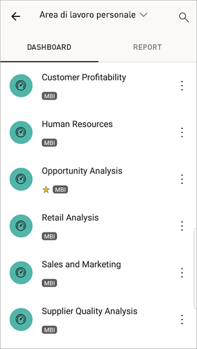
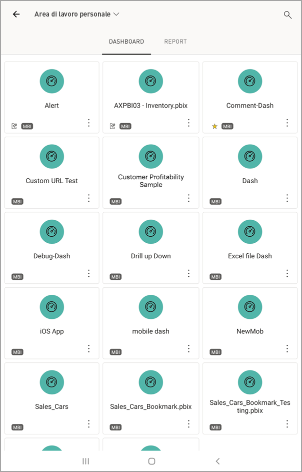
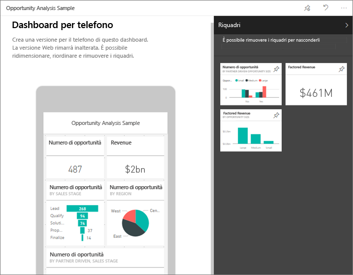

# Visualizzare dashboard e report nelle app Power BI per dispositivi mobili
Si applica a:

|  |  |  |  |  |
|:--- |:--- |:--- |:--- |:--- |
| [iPhone](mobile-apps-view-dashboard.md#view-dashboards-on-your-iphone) |[iPad](mobile-apps-view-dashboard.md#view-dashboards-on-your-ipad) |[Telefoni Android](mobile-apps-view-dashboard.md#view-dashboards-on-your-android-phone) |[Tablet Android](mobile-apps-view-dashboard.md#view-dashboards-on-your-android-tablet) |[Dispositivi Windows 10](mobile-apps-view-dashboard.md#view-dashboards-on-your-windows-10-device) |

I dashboard rappresentano il portale per accedere al ciclo di vita e ai processi aziendali. Un dashboard offre infatti una panoramica, ovvero una posizione unica da cui controllare lo stato corrente delle attività aziendali.

## Creare dashboard nel servizio Power BI (https://powerbi.com)
**Non è possibile creare dashboard con le app per dispositivi mobili.** 

Per visualizzare dashboard e report nel dispositivo mobile, è necessario creare tali elementi o accedervi da un Web browser. 

1. Accedere al servizio Power BI ([https://www.powerbi.com](https://www.powerbi.com)) e [iscriversi per creare un account](../../service-self-service-signup-for-power-bi.md).
2. [Creare dashboard e report di Power BI personalizzati](../../service-get-started.md) o connettersi ad [app Power BI](../../service-connect-to-services.md) esistenti per ottenere una vasta gamma di servizi, ad esempio [Microsoft Dynamics CRM](../../service-connect-to-microsoft-dynamics-crm.md) e [Adobe Analytics](../../service-connect-to-adobe-analytics.md).

Ecco un dashboard di Power BI nel servizio Power BI:

## Visualizzare i dashboard nell'iPhone
1. Aprire l'app Power BI nell'iPhone ed eseguire l'accesso.
   
   È necessario [scaricare l'app iPhone](http://go.microsoft.com/fwlink/?LinkId=522062) dall'App Store di Apple?
2. Toccare un dashboard per aprirlo.  
   
    
   
   * Le stelle gialle  indicano quali dashboard sono i preferiti. 
   * La notazione sotto il nome di ogni dashboard (in questo esempio "MBI")  illustra come vengono classificati i dati in ogni dashboard. Altre informazioni sulla [classificazione dei dati in Power BI](../../service-data-classification.md).
   
   Per impostazione predefinita, i dashboard di Power BI hanno un aspetto leggermente diverso sull'iPhone. Tutti i riquadri hanno la stessa dimensione e sono disposti consecutivamente dall'alto verso il basso.
   
    
   
   > [!TIP]
   > I proprietari dei dashboard possono [creare una visualizzazione del dashboard in modo specifico per i telefoni](../../service-create-dashboard-mobile-phone-view.md) in modalità verticale nel servizio Power BI. 
   > 
   > 
   
    In alternativa, è sufficiente ruotare il telefono lateralmente per visualizzare il dashboard in modalità orizzontale sullo schermo.
   
    
3. Scorrere rapidamente su e giù per visualizzare tutti i riquadri del dashboard. è possibile:
   
   * [Toccare un riquadro](mobile-tiles-in-the-mobile-apps.md) per aprirlo in modalità messa a fuoco e interagire con esso.
   * Toccare la stella  per [aggiungerlo ai preferito](mobile-apps-favorites.md).
   * Toccare **Invita**  per [invitare un collega](mobile-share-dashboard-from-the-mobile-apps.md) a visualizzare il dashboard.
   * [Sincronizzare il dashboard con Apple Watch](mobile-apple-watch.md).
4. Per tornare all'elenco dei dashboard, toccare la freccia accanto al titolo del dashboard, quindi toccare **Area di lavoro**.
   
   

### Visualizzare i dashboard in modalità orizzontale nell'iPhone
È sufficiente ruotare il telefono lateralmente per visualizzare i dashboard in modalità orizzontale. Il layout del dashboard cambia: invece di una serie di riquadri viene visualizzato l'intero dashboard, con tutti i riquadri proprio come nel servizio Power BI.

È possibile avvicinare o allontanare le dita per eseguire lo zoom avanti e indietro nelle varie aree del dashboard e scorrere per esplorarlo. È anche possibile [toccare un riquadro](mobile-tiles-in-the-mobile-apps.md) per aprirlo in modalità messa a fuoco e interagire con i dati.

## Visualizzare i dashboard nell'iPad
1. Aprire l'app Power BI.
   
   Se è necessario [scaricare prima l'app iPad](http://go.microsoft.com/fwlink/?LinkId=522062) dall'App Store di Apple, procedere come segue.
2. Toccare **Dashboard** nella parte superiore dell'app.  
   
   
   
   * Le stelle gialle  indicano quali dashboard sono i preferiti. 
   * La notazione sotto il nome di ogni dashboard (in questo esempio "MBI")  illustra come vengono classificati i dati in ogni dashboard. Altre informazioni sulla [classificazione dei dati in Power BI](../../service-data-classification.md).
3. È possibile condividere un dashboard dall'area di lavoro. Toccare i puntini di sospensione (**...**) nell'angolo in basso a destra del riquadro del dashboard e toccare **Invita altri**.
   
   
4. È anche possibile toccare un dashboard per aprirlo e visualizzare i riquadri nel dashboard. Dal dashboard è possibile interagire con esso:
   
   * [Toccare un riquadro per interagire](mobile-tiles-in-the-mobile-apps.md) con esso.
   * [Aprire i report](mobile-reports-in-the-mobile-apps.md) dietro i riquadri.
   * [Invitare altri utenti a visualizzare il dashboard](mobile-share-dashboard-from-the-mobile-apps.md).
   * [Aggiungere annotazioni e condividere uno snapshot](mobile-annotate-and-share-a-tile-from-the-mobile-apps.md) di un riquadro.
5. Per tornare all'area di lavoro personale, toccare il nome del dashboard nell'angolo in alto a sinistra, quindi toccare **Area di lavoro**.
   
   

## Visualizzare i dashboard sul telefono Android
1. Aprire l'app Power BI sul telefono Android ed eseguire l'accesso.
   
   Se è necessario [scaricare prima l'app Android](http://go.microsoft.com/fwlink/?LinkID=544867), procedere come segue.
2. Toccare un dashboard per aprirlo.   
   
   

    Le stelle gialle  indicano quali dashboard sono i preferiti. 

    La notazione sotto il nome di un dashboard (in questo esempio "MBI")  illustra come vengono classificati i dati in ogni dashboard. Altre informazioni sulla [classificazione dei dati in Power BI](../../service-data-classification.md).

    I dashboard di Power BI hanno un aspetto leggermente diverso sul telefono Android. Tutti i riquadri hanno la stessa larghezza e sono disposti consecutivamente dall'alto verso il basso.

    

    I proprietari dei dashboard possono [creare una visualizzazione del dashboard in modo specifico per i telefoni](../../service-create-dashboard-mobile-phone-view.md) in modalità verticale nel servizio Power BI. 

1. Dal dashboard, è possibile toccare i puntini di sospensione verticali (...) accanto al nome per invitare un collega, aggiornare o ottenere informazioni sul dashboard:
   
   
2. Scorrere rapidamente su e giù per visualizzare tutti i [riquadri del dashboard](mobile-tiles-in-the-mobile-apps.md). 
3. Per tornare alla home page dei dashboard, toccare il nome del dashboard per aprire la traccia degli spostamenti, quindi toccare **Area di lavoro**.   

## Visualizzare i dashboard sul tablet Android
1. Aprire l'app Power BI sul tablet Android ed eseguire l'accesso.
   
   Se è necessario [scaricare prima l'app Android](http://go.microsoft.com/fwlink/?LinkID=544867), procedere come segue.
2. Toccare un dashboard per aprirlo.   
   
   
   
   * Le stelle gialle  indicano quali dashboard sono i preferiti. 
   * La notazione sotto il nome di ogni dashboard (in questo esempio "MBI")  illustra come vengono classificati i dati in ogni dashboard. Altre informazioni sulla [classificazione dei dati in Power BI](../../service-data-classification.md).
3. Dal dashboard, è possibile toccare i puntini di sospensione verticali (...) accanto al nome per invitare un collega, aggiornare o ottenere informazioni sul dashboard:
   
   
4. Scorrere rapidamente su e giù per visualizzare tutti i [riquadri del dashboard](mobile-tiles-in-the-mobile-apps.md). 
   
   È possibile avvicinare o allontanare le dita per eseguire lo zoom avanti e indietro nelle varie aree del dashboard e scorrere per esplorarlo. È anche possibile [toccare un riquadro](mobile-tiles-in-the-mobile-apps.md) per aprirlo in modalità messa a fuoco e interagire con i dati.
5. Per tornare alla home page dei dashboard, toccare il nome del dashboard per aprire la traccia degli spostamenti, quindi toccare **Area di lavoro**:
   
    

    È possibile avvicinare o allontanare le dita per eseguire lo zoom avanti e indietro nelle varie aree del dashboard e scorrere per esplorarlo. È anche possibile [toccare un riquadro](mobile-tiles-in-the-mobile-apps.md) per aprirlo in modalità messa a fuoco e interagire con i dati.

## Visualizzare i dashboard nel dispositivo Windows 10
1. Aprire l'app Power BI nel dispositivo Windows 10 ed eseguire l'accesso.
   
   Se è necessario [scaricare prima l'app](http://go.microsoft.com/fwlink/?LinkID=526478), procedere come segue.
2. Toccare un dashboard per aprirlo.   
   
   
   
   * Le stelle nere indicano quali dashboard sono i preferiti. 
   * La notazione sotto il nome di ogni dashboard (in questo esempio **MBI**) illustra come vengono classificati i dati in ogni dashboard. Altre informazioni sulla [classificazione dei dati in Power BI](../../service-data-classification.md).
   
   I dashboard di Power BI hanno un aspetto leggermente diverso sul telefono Windows 10. Tutti i riquadri hanno la stessa larghezza e sono disposti consecutivamente dall'alto verso il basso.
   
   
   
    È anche possibile ruotare il telefono lateralmente per visualizzare i dashboard in modalità orizzontale sullo schermo.
   
   > [!TIP]
   > I proprietari dei dashboard possono [creare una visualizzazione del dashboard in modo specifico per i telefoni](../../service-create-dashboard-mobile-phone-view.md) in modalità verticale nel servizio Power BI. 
   > 
   > 
3. Nel dashboard è possibile:
   
   * [Toccare un riquadro](mobile-tiles-in-the-mobile-apps.md) per aprirlo e interagire con esso.
   * Toccare l'icona **Schermo intero**  per presentare il dashboard di Power BI senza bordi o menu, come nella visualizzazione **Presentazione** di PowerPoint.
   * Toccare l'icona **Invita**  per [condividere il dashboard](mobile-share-dashboard-from-the-mobile-apps.md) con un collega.
   * Toccare la stella  per [aggiungere il dashboard ai preferiti](mobile-apps-favorites.md).
   * Toccare l'icona **Aggiungi a Start** per [aggiungere il dashboard alla schermata Start di Windows](mobile-pin-dashboard-start-screen-windows-10-phone-app.md). 
4. Per tornare alla home page dei dashboard, toccare il nome del dashboard per aprire la traccia degli spostamenti, quindi toccare **Area di lavoro**:
   
    

### Visualizzare i dashboard in modalità orizzontale nel telefono Windows 10
È anche possibile visualizzare i dashboard in modalità orizzontale semplicemente ruotando il telefono. Il layout del dashboard cambia: invece di una serie di riquadri viene visualizzato l'intero dashboard, con tutti i riquadri disposti come nel servizio Power BI.

È possibile avvicinare o allontanare le dita per eseguire lo zoom avanti e indietro nelle varie aree del dashboard e scorrere per esplorarlo. È anche possibile [toccare un riquadro](mobile-tiles-in-the-mobile-apps.md) per aprirlo in modalità messa a fuoco e interagire con i dati.

## Creare una visualizzazione telefono di un dashboard nel servizio Power BI
I proprietari dei dashboard possono creare una visualizzazione del dashboard in modo specifico per i telefoni in modalità verticale *nel servizio Power BI*. 

Altre informazioni sulla [creazione di una visualizzazione telefono di un dashboard](../../service-create-dashboard-mobile-phone-view.md).

## Passaggi successivi
* [Scaricare l'app Android](http://go.microsoft.com/fwlink/?LinkID=544867) da Google Play  
* [Introduzione all'app Android per Power BI](mobile-android-app-get-started.md)  
* [Che cos'è Power BI?](../../power-bi-overview.md)
* Domande? [Provare a rivolgersi alla community di Power BI](http://community.powerbi.com/)

