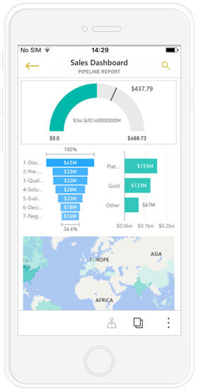
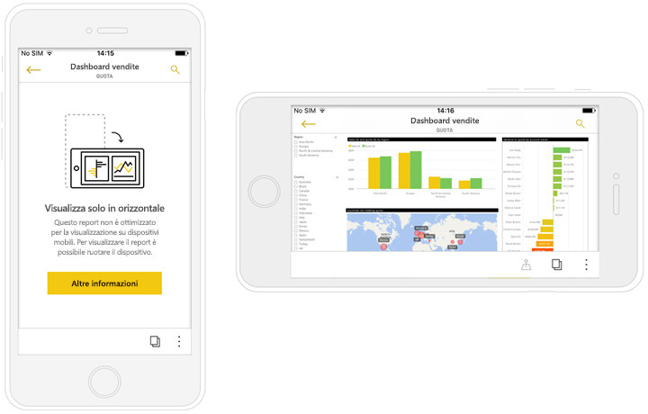
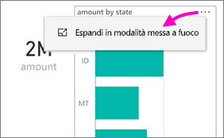
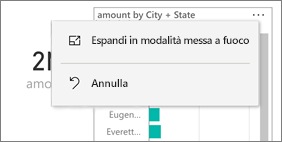
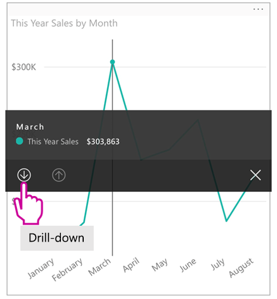
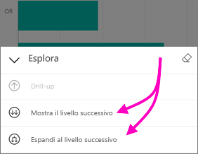
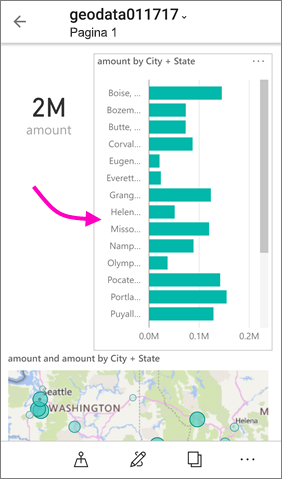
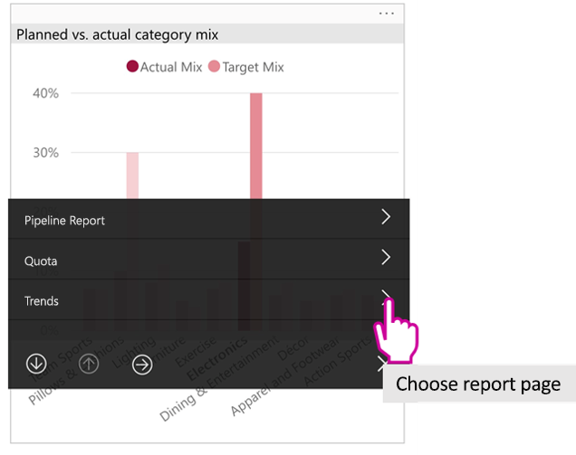

# Visualizzare i report di Power BI ottimizzati per il proprio telefono

Si applica a:

|  |  |
|:--- |:--- |
| iPhone |Telefoni Android |

Quando si visualizza un report di Power BI sul telefono, Power BI verifica se il report è stato ottimizzato per telefoni. In questo caso, Power BI apre automaticamente il report ottimizzato in visualizzazione verticale.

Se non esiste un report ottimizzato per il telefono, il report viene comunque aperto ma in visualizzazione orizzontale non ottimizzata. Persino in un report con ottimizzazione per il telefono, se si gira il telefono sul lato il report si apre nella visualizzazione non ottimizzata con il layout originale del report. Se si ottimizzano solo alcune pagine, si vedrà un messaggio in modalità verticale, che indica che il report è disponibile in modalità orizzontale.

Tutte le altre funzionalità dei report di Power BI continueranno a funzionare nei report ottimizzati per il telefono. Altre informazioni sulle operazioni possibili in:

* [Report negli iPhone](mobile-reports-in-the-mobile-apps.md). 
* [Report nei telefoni Android](mobile-reports-in-the-mobile-apps.md).

## Filtrare la pagina del report in un telefono
Se per un report ottimizzato per il telefono sono stati definiti dei filtri, quando si visualizza il report in un telefono è possibile usare tali filtri. Il report viene aperto sul telefono, filtrati in base a valori usati per filtrare il report sul web. Viene visualizzato un messaggio che indica che sono presenti filtri attivi nella pagina. È possibile modificare i filtri nel telefono.

1. Toccare l'icona del filtro  nella parte inferiore della pagina. 
2. Usare il filtro di base o avanzato per visualizzare i risultati desiderati.
   
    

## Evidenziare oggetti visivi
Evidenziazione degli oggetti visivi in modalità verticale Vista funziona come nel servizio Power BI e nei telefoni in visualizzazione orizzontale: quando si selezionano i dati in un oggetto visivo, vengono evidenziati i dati correlati negli altri oggetti visivi in tale pagina.

Altre informazioni su [filtri ed evidenziazione in Power BI](../../power-bi-reports-filters-and-highlighting.md).

## Selezionare gli oggetti visivi
Nei report per il telefono, quando si seleziona un oggetto visivo il report per il telefono lo evidenzia e si concentra su di esso, neutralizzando i gesti nell'area di disegno.

Con l'oggetto visivo selezionato è possibile eseguire operazioni come lo scorrimento al suo interno. Per deselezionare un oggetto visivo, è sufficiente toccare in un punto qualsiasi all'esterno dell'area dell'oggetto visivo.

## Aprire gli oggetti visivi in modalità messa a fuoco
Report per il telefono offrono anche una modalità messa a fuoco: Ottenere una visualizzazione più grande di un singolo oggetto visivo e di esplorarli più facilmente.

* In un report per il telefono toccare i puntini di sospensione ( **...** ) nell'angolo in alto a destra di un oggetto visivo > **Espandi in modalità messa a fuoco**.
  
    

Operazioni in modalità messa a fuoco riporta all'area di disegno report e viceversa. Ad esempio, se si evidenzia un valore in un oggetto visivo, tornare al report intero, il report viene filtrato per il valore evidenziato nell'oggetto visivo.

Alcune azioni sono possibili solo in modalità messa a fuoco a causa di limitazioni delle dimensioni dello schermo:

* **Eseguire il drill-down** nelle informazioni visualizzate in un oggetto visivo. Altre informazioni sul [drill-down e drill-up](mobile-apps-view-phone-report.md#drill-down-in-a-visual) in Power BI.
* **Ordinare** i valori nell'oggetto visivo.
* **Annullare**: cancellare i passaggi di esplorazione eseguiti in un oggetto visivo e annullare la definizione impostata quando il report è stato creato.
  
    Per cancellare qualsiasi esplorazione da un oggetto visivo, toccare i puntini di sospensione ( **...** ) > **Annulla**.
  
    
  
    Ripristinare è disponibile a livello di report, la cancellazione di esplorazione da tutti gli oggetti visivi, o a livello visivo, la cancellazione di esplorazione dell'oggetto visivo selezionato.   

## Eseguire il drill-down in un oggetto visivo
Se in un oggetto visivo sono definiti i livelli della gerarchia, è possibile eseguire il drill-down nelle informazioni dettagliate visualizzate in un oggetto visivo, quindi eseguire il backup. È possibile [aggiungere il drill-down in un oggetto visivo](../end-user-drill.md) nel servizio Power BI o in Power BI Desktop.

Esistono alcuni tipi di drill-down:

### Il drill-down su un valore
1. Toccare Long (toccare e tenere premuto) su un punto dati in un oggetto visivo.
2. Descrizione comando verrà visualizzata e se viene definita una gerarchia, il piè di pagina della descrizione comando verrà visualizzato il drill down e up freccia.
3. Toccare la freccia verso il basso per eseguire il drill-down

    
    
4. Toccare la freccia verso l'alto per il drill-up.

### Eseguire il drill-al livello successivo
1. In un report nel telefono toccare i puntini di sospensione ( **...** ) nell'angolo in alto a destra > **Espandi in modalità messa a fuoco**.
   
    
   
    In questo esempio le barre mostrano i valori per gli stati.
2. Toccare l'icona Esplora  in basso a sinistra.
   
    
3. Toccare **Mostra il livello successivo** o **Espandi al livello successivo**.
   
    
   
    Ora le barre mostrano i valori per le città.
   
    
4. Se si tocca la freccia nell'angolo in alto a sinistra, si torna al report per il telefono con i valori ancora espansi al livello inferiore.
   
    
5. Per tornare al livello originale, toccare di nuovo i puntini di sospensione ( **...** ) > **Annulla**.
   
    

## Il drill-through da un valore
Drill-through, i valori in una pagina del report, si connette con altre pagine del report. Quando il drill-through da un punto dati a un'altra pagina del report, i valori dei punti dati vengono utilizzati per filtrare il trapanato pagina oppure sia nel contesto dei dati selezionati.
Gli autori di report possono [definiscono il drill-through](https://docs.microsoft.com/power-bi/desktop-drillthrough) quando si crea il report.

1. Toccare Long (toccare e tenere premuto) su un punto dati in un oggetto visivo.
2. Descrizione comando verrà visualizzata e se il drill-through è definito, il piè di pagina della descrizione comando verrà visualizzato il drill-through freccia.
3. Toccare la freccia di drill-through.

    

4. Scegliere quale pagina report drill-through

    

5. Usare il pulsante Indietro, nell'intestazione di app per tornare alla pagina che da cui sei partito.

## Passaggi successivi
* [Creare report ottimizzati per le app per telefoni di Power BI](../../desktop-create-phone-report.md)
* [Creare una visualizzazione telefono di un dashboard in Power BI](../../service-create-dashboard-mobile-phone-view.md)
* [Creare oggetti visivi reattivi ottimizzati per qualsiasi dimensione](../../visuals/desktop-create-responsive-visuals.md)
* Altre domande? [Provare a rivolgersi alla community di Power BI](http://community.powerbi.com/)

