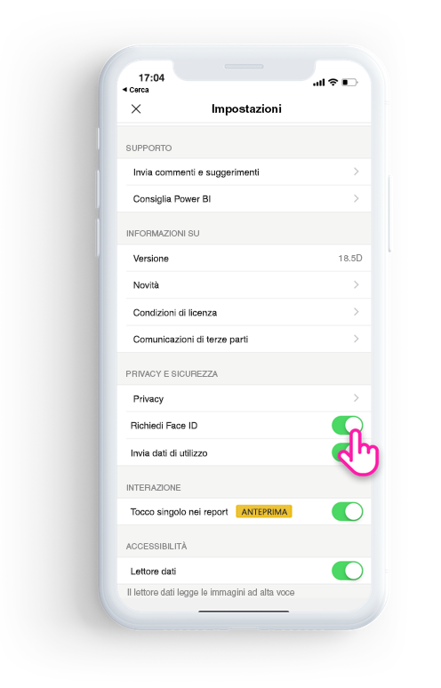

# Proteggere l'app Power BI con Face ID, Touch ID o passcode 

In molti casi, i dati gestiti in Power BI sono riservati e devono essere protetti e accessibili ai soli utenti autorizzati. 

L'app Power BI per iOS consente di proteggere i dati configurando un'identificazione aggiuntiva. Sarà necessario specificare un Face ID, Touch ID o passcode ogni volta che si avvia l'app o che si porta l'app in primo piano dalla modalità in background.

|  |  |
|:--- |:--- |
| iPhone |iPad |

## Attivare un Face ID, Touch ID o passcode nell'impostazione dell'app

Per usare un'identificazione aggiuntiva in Power BI, vedere l'impostazione dell'app in **Privacy and Security** (Privacy e sicurezza). Verrà visualizzata l'opzione che consente di attivare un Face ID, Touch ID o passcode, in base alle funzionalità del dispositivo.

Dopo aver attivato questa impostazione, ogni volta che si avvia Power BI o lo si attiva dalla modalità in background sarà necessario specificare il proprio ID prima di poter accedere all'app. 

La decisione di chiedere un Face ID, Touch ID o Passcode viene eseguita da iOS in base alle funzionalità del dispositivo. Se il dispositivo supporta Face ID, è necessario usare Face ID. Se supporta Touch ID, è necessario usare Touch ID. Se non supporta nessuno dei due, è necessario specificare un passcode.

## Usare MDM per l'applicazione di Face ID, Touch ID o passcode

Alcune organizzazioni hanno requisiti di conformità e criteri di sicurezza che richiedono un'identificazione aggiuntiva prima di consentire l'accesso a dati aziendali sensibili. 

L'app Power BI per dispositivi mobili iOS consente agli amministratori di controllare tale impostazione eseguendo il push delle impostazioni di configurazione dell'app da Microsoft Intune e altre soluzioni di gestione dei dispositivi mobili (MDM). Gli amministratori possono usare i criteri di protezione delle app per attivare questa impostazione per tutti gli utenti o per un gruppo di utenti.

|Key  |Tipo  |Descrizione  |
|---------|---------|---------|
| com.microsoft.powerbi.mobile.ForceDeviceAuthentication | Boolean | Il valore predefinito è False.  Se impostato su True, l'app imporrà agli utenti di identificarsi tramite Face ID, Touch ID o passcode prima di poter visualizzare i dati di Power BI nell'app. Gli utenti che non hanno un Face ID, Touch ID o passcode configurato nel proprio dispositivo dovranno configurarlo prima di poter accedere a Power BI.  |

## Passaggi successivi

[Usare MDM per configurare in modalità remota l'app Power BI per iOS](mobile-app-configuration.md)
