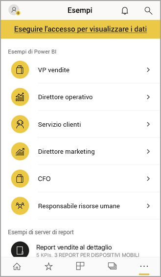

# Iniziare a usare l'app Power BI per dispositivi mobili nei dispositivi iOS
L'app Microsoft Power BI per iOS nell'iPhone e iPad offre l'esperienza di business intelligence per dispositivi mobili per Power BI, Server di report di Power BI e Reporting Services. Visualizzare e interagire con i dashboard aziendali locali e nel cloud ovunque ci si trovi con l'accesso mobile in tempo reale e abilitato per il tocco. Esplorare i dati nei dashboard e condividerli con i colleghi nei messaggi di posta elettronica o di testo. Tenersi al corrente con i dati più aggiornati sul proprio [Apple Watch](mobile-apple-watch.md).  

È possibile creare report di Power BI in Power BI Desktop e pubblicarli:

* [Pubblicarli nel servizio Power BI](../../service-get-started.md) e creare dashboard.
* [Pubblicarli in locale nel Server di report di Power BI](../../report-server/quickstart-create-powerbi-report.md).

Nell'app Power BI per dispositivi mobili per iOS è quindi possibile interagire con i dashboard e i report, in locale o nel cloud.

Informazioni sulle [Novità delle app Power BI per dispositivi mobili](mobile-whats-new-in-the-mobile-apps.md).

## Scarica l'app
[Scaricare l'app per iOS](https://go.microsoft.com/fwlink/?LinkId=522062 "Scaricare l'app iOS") dall'App Store di Apple nel dispositivo iPhone o iPad.

È possibile eseguire l'app per dispositivi mobili Power BI per iOS in qualsiasi dispositivo che esegue iOS 11 o versioni successive. 

## Iscriversi al servizio Power BI
Se non si è ancora eseguito l'accesso, andare a [powerbi.com](https://powerbi.microsoft.com/get-started/) e in **Power BI - Cloud collaboration and sharing** (Collaborazione e condivisione nel cloud), selezionare **Prova gratuitamente**.

## Introduzione all'app Power BI
1. Aprire l'app Power BI nel dispositivo iOS.
2. Per accedere a Power BI, toccare la scheda **Power BI** e immettere i dettagli di accesso.  
   Per accedere ai report per dispositivi mobili e agli indicatori KPI di Reporting Services, toccare la scheda **Server di report** e immettere i dettagli di accesso.
   
   
   
   All'interno dell'app, basta toccare l'immagine del profilo dell'account nell'angolo superiore sinistro della schermata per spostarsi tra Power BI e il server di report. 

## Provare gli esempi di Power BI e Reporting Services
Anche senza iscriversi, è possibile visualizzare e interagire con gli esempi di Power BI e Reporting Services.

Per accedere agli esempi, toccare **Altre opzioni** (...) sulla barra di spostamento e scegliere **Esempi**.

Alcuni esempi di Power BI sono seguiti da diversi esempi di server di report.

   
   
   > [!NOTE]
   > Non tutte le funzionalità sono disponibili negli esempi. Ad esempio, non è possibile visualizzare i report di esempio sottostanti ai dashboard, condividere gli esempi con altri utenti e impostarli come preferiti. 
   > 
   >

## Cercare il contenuto nelle app Power BI per dispositivi mobili

Toccare la lente di ingrandimento nell'intestazione per avviare la ricerca dei contenuti di Power BI.

## Visualizzare i dashboard e i report preferiti
Toccare **Preferiti**  () sulla barra di spostamento per visualizzare la pagina Preferiti. 

Altre informazioni sui [dashboard preferiti nelle app Power BI per dispositivi mobili](mobile-apps-favorites.md).

## Supporto aziendale per le app Power BI per dispositivi mobili
Le organizzazioni possono usare Microsoft Intune per gestire dispositivi e applicazioni, tra cui le app Power BI per dispositivi mobili iOS e Android.

Microsoft Intune permette alle organizzazioni di controllare aspetti come la richiesta di un PIN di accesso, la modalità di gestione dei dati nell'applicazione e anche la crittografia dei dati dell'applicazione quando l'app non è in uso.

> [!NOTE]
> Se si usa l'app Power BI per dispositivi mobili in un dispositivo iOS e l'organizzazione ha configurato il software MAM di Microsoft Intune, l'aggiornamento dati in background è disattivato. La volta successiva che si accede all'app, Power BI aggiorna i dati dal servizio Power BI sul Web.
> 

Altre informazioni sulla [configurazione delle app Power BI per dispositivi mobili con Microsoft Intune](../../service-admin-mobile-intune.md). 

## Passaggi successivi

* [Che cos'è Power BI?](../../fundamentals/power-bi-overview.md)
* Domande? [Contattare la community di Power BI](https://community.powerbi.com/)

