# <a name="using-oauth-to-connect-to-power-bi-report-server-and-ssrs"></a>Uso di OAuth per la connessione al Server di report di Power BI e a SSRS

È possibile usare OAuth per connettersi al Server di report di Power BI e a Reporting Services e visualizzare report per dispositivi mobili o indicatori KPI. Informazioni su come configurare l'ambiente per supportare l'autenticazione OAuth con l'app Power BI per dispositivi mobili e connettersi a Server di report di Microsoft Power BI e a SQL Server Reporting Services 2016 o versioni successive.

Guarda il video di Adam che spiega come connettersi da Power BI per dispositivi mobili a SSRS usando OAuth:


<iframe width="560" height="350" src="https://www.youtube.com/embed/okzPAI2uUek" frameborder="0" allowfullscreen></iframe>


> [!NOTE]
> La visualizzazione dei report di Power BI ospitati nel Server di report di Power BI che usano WAP per l'autenticazione è ora supportata per le app iOS e Android.

## <a name="requirements"></a>Requisiti

Windows Server 2016 è necessario per i server Proxy applicazione Web (WAP) e Active Directory Federation Services (ADFS). Non è necessario avere un dominio di livello funzionale di Windows 2016.

## <a name="domain-name-services-dns-configuration"></a>Configurazione Domain Name Services (DNS)

L'URL pubblico sarà quello a cui si connetterà l'app Power BI per dispositivi mobili. Ad esempio, potrebbe essere simile a quello indicato di seguito.

```https
https://reports.contoso.com
```

Il record DNS per i **report** all'indirizzo IP pubblico del server Proxy applicazione Web (WAP). È anche necessario configurare un record DNS pubblico per il server ADFS. Il server ADFS, ad esempio, potrebbe essere stato configurato con l'URL seguente.

```https
https://fs.contoso.com
```

Il record DNS per i **fs** all'indirizzo IP pubblico del server Proxy applicazione Web (WAP), perché verrà pubblicato come parte dell'applicazione WAP.

## <a name="certificates"></a>Certificati

È necessario configurare i certificati per l'applicazione WAP e il server ADFS. Entrambi questi certificati devono essere parte di un'autorità di certificazione valida e riconosciuta dai dispositivi mobili.

## <a name="reporting-services-configuration"></a>Configurazione di Reporting Services

Per Reporting Services gli elementi da configurare sono limitati. È sufficiente assicurarsi di avere un nome dell'entità servizio (SPN) valido per abilitare l'autenticazione Kerberos corretta e che il server di Reporting Services sia abilitato per la negoziazione dell'autenticazione.

### <a name="service-principal-name-spn"></a>Nome dell'entità servizio (SPN)

Il nome dell'entità servizio (SPN) è un identificatore univoco per un servizio che usa l'autenticazione Kerberos. È necessario verificare di avere un nome SPN HTTP corretto per il server di report.

Per informazioni su come configurare il corretto nome dell'entità servizio (SPN) per il server di report, vedere [Registrare un nome dell'entità servizio (SPN) per un server di report](/sql/reporting-services/report-server/register-a-service-principal-name-spn-for-a-report-server).

### <a name="enabling-negotiate-authentication"></a>Abilitare la negoziazione dell'autenticazione

Per abilitare l'uso dell'autenticazione Kerberos in un server di report è necessario configurare il tipo di autenticazione del server di report come RSWindowsNegotiate. Questa operazione viene eseguita all'interno del file rsreportserver.config.

```xml
<AuthenticationTypes>  
    <RSWindowsNegotiate />  
    <RSWindowsKerberos />  
    <RSWindowsNTLM />  
</AuthenticationTypes>
```

Per altre informazioni, vedere [Modificare un file di configurazione di Reporting Services](/sql/reporting-services/report-server/modify-a-reporting-services-configuration-file-rsreportserver-config) e [Configurare l'autenticazione di Windows nel server di report](/sql/reporting-services/security/configure-windows-authentication-on-the-report-server).

## <a name="active-directory-federation-services-adfs-configuration"></a>Configurazione di Active Directory Federation Services (ADFS)

È necessario configurare ADFS in un server Windows 2016 all'interno dell'ambiente. La configurazione può essere eseguita usando Server Manager e selezionando Aggiungi ruoli e funzionalità in Gestisci. Per altre informazioni, vedere [Active Directory Federation Services](https://technet.microsoft.com/windows-server-docs/identity/active-directory-federation-services).

### <a name="create-an-application-group"></a>Creare un gruppo di applicazioni

All'interno della schermata di gestione di AD FS è necessario creare un gruppo di applicazioni per Reporting Services, che includerà informazioni per le app Power BI per dispositivi mobili.

È possibile creare il gruppo di applicazioni con i passaggi seguenti.

1. All'interno dell'app di gestione di AD FS, fare clic con il pulsante destro del mouse su **Gruppi di applicazioni** e selezionare **Aggiungi gruppo di applicazioni**

   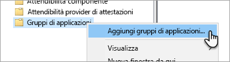

2. Nell'aggiunta guidata del gruppo di applicazioni, fornire un **nome** per il gruppo di applicazioni e selezionare **Applicazione nativa che accede a un'API Web**.

   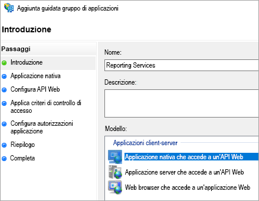

3. Selezionare **Avanti**.

4. Fornire un **nome** per l'applicazione che si sta aggiungendo. 

5. Mentre il **ID client** verrà generato automaticamente, immettere *484d54fc-b481-4eee-9505-0258a1913020* per iOS e Android.

6. È consigliabile aggiungere i seguenti **URL di reindirizzamento**:

   **Voci per Power BI per dispositivi mobili - iOS:**  
   msauth://code/mspbi-adal://com.microsoft.powerbimobile  
   msauth://code/mspbi-adalms://com.microsoft.powerbimobilems  
   mspbi-adal://com.microsoft.powerbimobile  
   mspbi-adalms://com.microsoft.powerbimobilems

   **Le app Android necessitano solo dei passaggi seguenti:**  
   urn:ietf:wg:oauth:2.0:oob

   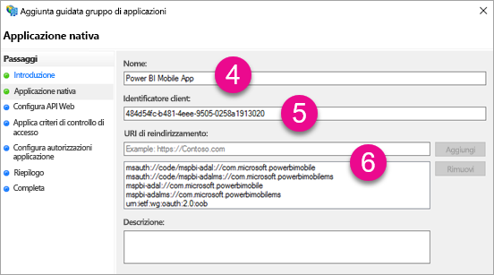
7. Selezionare **Avanti**.

8. Fornire l'URL del server di report. Si tratta dell'URL esterno che raggiungerà il proxy applicazione Web. Deve essere nel formato seguente.

   > [!NOTE]
   > L'URL rispetta la distinzione tra maiuscole e minuscole.

   *https://< url server di report >/*

   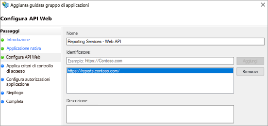
9. Selezionare **Avanti**.

10. Scegliere i **Criteri di controllo di accesso** idonei alle esigenze della propria organizzazione.

    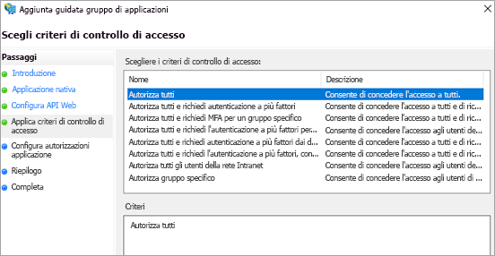

11. Selezionare **Avanti**.

12. Selezionare **Avanti**.

13. Selezionare **Avanti**.

14. Selezionare **Chiudi**.

Al termine, le proprietà del gruppo di applicazioni avranno un aspetto simile al seguente.

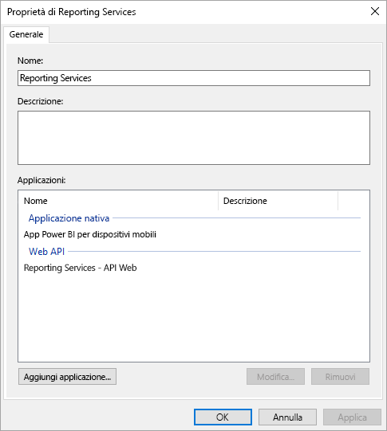

## <a name="web-application-proxy-wap-configuration"></a>Configurazione del Proxy applicazione Web (WAP)

È consigliabile abilitare il ruolo di Proxy applicazione Web Windows in un server nell'ambiente in uso. Deve essere in un server Windows 2016. Per altre informazioni, vedere [Proxy di applicazione Web in Windows Server 2016](https://technet.microsoft.com/windows-server-docs/identity/web-application-proxy/web-application-proxy-windows-server) e [Pubblicazione di applicazioni con la preautenticazione di ADFS](https://technet.microsoft.com/windows-server-docs/identity/web-application-proxy/publishing-applications-using-ad-fs-preauthentication#a-namebkmk14apublish-an-application-that-uses-oauth2-such-as-a-windows-store-app).

### <a name="constrained-delegation-configuration"></a>Configurazione della delega vincolata

Per passare dall'autenticazione OAuth all'autenticazione di Windows, è necessario usare la delega vincolata con transizione del protocollo. Fa parte della configurazione di Kerberos. È già stato definito il nome SPN di Reporting Services all'interno della configurazione di Reporting Services.

È necessario configurare la delega vincolata nell'account del computer Server WAP all'interno di Active Directory. Se non si hanno diritti per Active Directory, può essere necessario collaborare con un amministratore di dominio.

Per configurare la delega vincolata, eseguire le operazioni seguenti.

1. Sul computer in cui sono installati gli strumenti di Active Directory, avviare **Utenti e computer di Active Directory**.

2. Trovare l'account del computer per il server WAP. Per impostazione predefinita, si troverà nel contenitore computer.

3. Fare clic con il pulsante destro sul server WAP e passare a **Proprietà**.

4. Selezionare la scheda **Delega**.

5. Selezionare **Computer attendibile per la delega solo ai servizi specificati** e quindi **Utilizza un qualsiasi protocollo di autenticazione**.

   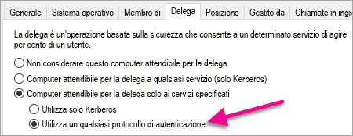

   Consente di impostare una delega vincolata per l'account di computer Server WAP. È quindi necessario specificare i servizi che questo computer è autorizzato a delegare.

6. Selezionare **Aggiungi…** nella casella Servizi.

   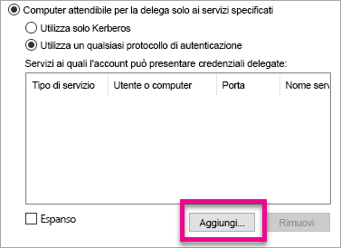

7. Selezionare **Utenti o computer…**

8. Immettere l'account del servizio che si sta usando per Reporting Services. Si tratta dell'account a cui è stato aggiunto il nome SPN all'interno della configurazione di Reporting Services.

9. Selezionare il nome SPN per Reporting Services e quindi **OK**.

   > [!NOTE]
   > Potrebbe essere visualizzato solo il nome SPN di NetBIOS. Se esistono entrambi, verranno effettivamente selezionati i nomi SPN di NetBIOS e FQDN.

   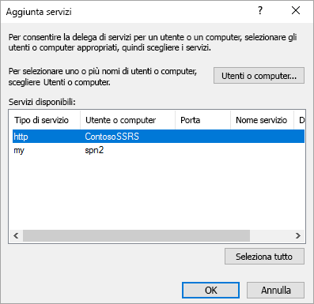

10. Il risultato dovrebbe essere simile al seguente quando la casella di controllo **Espansa** è selezionata.

    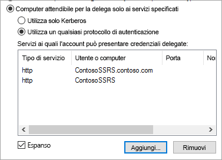

11. Scegliere **OK**.

### <a name="add-wap-application"></a>Aggiungere applicazione WAP

Mentre è possibile pubblicare applicazioni nella console di gestione di accesso ai report, è consigliabile creare l'applicazione con PowerShell. Ecco il comando per aggiungere l'applicazione.

```powershell
Add-WebApplicationProxyApplication -Name "Contoso Reports" -ExternalPreauthentication ADFS -ExternalUrl https://reports.contoso.com/ -ExternalCertificateThumbprint "0ff79c75a725e6f67e3e2db55bdb103efc9acb12" -BackendServerUrl https://ContosoSSRS/ -ADFSRelyingPartyName "Reporting Services - Web API" -BackendServerAuthenticationSPN "http/ContosoSSRS.contoso.com" -UseOAuthAuthentication
```

| parametro | Commenti |
| --- | --- |
| **ADFSRelyingPartyName** |Il nome dell'API Web creato come parte del gruppo di applicazioni all'interno di ADFS. |
| **ExternalCertificateThumbprint** |Il certificato da usare per gli utenti esterni. È importante che il certificato sia valido per i dispositivi mobili e provenga da un'autorità di certificazione attendibile. |
| **BackendServerUrl** |L'URL per il server di report dal server WAP. Se il server WAP è in una rete perimetrale, è necessario usare un nome di dominio completo. Assicurarsi che sia possibile raggiungere l'URL dal browser Web nel server WAP. |
| **BackendServerAuthenticationSPN** |Il nome SPN creato come parte della configurazione di Reporting Services. |

### <a name="setting-integrated-authentication-for-the-wap-application"></a>Impostazione dell'autenticazione integrata per l'applicazione WAP

Dopo aver aggiunto l'applicazione WAP, è necessario impostare BackendServerAuthenticationMode in modo da usare IntegratedWindowsAuthentication. A tale scopo, è necessario l'ID dell'applicazione WAP.

```powershell
Get-WebApplicationProxyApplication "Contoso Reports" | fl
```


Eseguire il comando seguente per impostare il nome BackendServerAuthenticationMode usando l'ID dell'applicazione WAP.

```powershell
Set-WebApplicationProxyApplication -id 30198C7F-DDE4-0D82-E654-D369A47B1EE5 -BackendServerAuthenticationMode IntegratedWindowsAuthentication
```


## <a name="connecting-with-the-power-bi-mobile-app"></a>Connessione con l'app Power BI per dispositivi mobili

All'interno dell'app Power BI per dispositivi mobili è consigliabile connettersi all'istanza di Reporting Services. A tale scopo, specificare l'**URL esterno** per l'applicazione WAP.

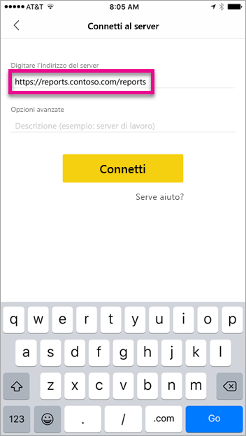

Quando si seleziona **Connetti** si viene indirizzati alla pagina di accesso di AD FS. Immettere le credenziali valide per il dominio.

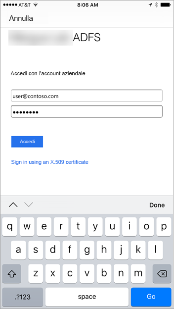

Dopo aver selezionato **Accedi**, vengono visualizzati gli elementi dal server di Reporting Services.

## <a name="multi-factor-authentication"></a>Autenticazione a più fattori

È possibile abilitare Multi-Factor Authentication per applicare una protezione aggiuntiva per l'ambiente. Per altre informazioni, vedere [Configurare AD FS 2016 e Azure MFA](https://technet.microsoft.com/windows-server-docs/identity/ad-fs/operations/configure-ad-fs-2016-and-azure-mfa).

## <a name="troubleshooting"></a>Risoluzione dei problemi

### <a name="you-receive-the-error-failed-to-login-to-ssrs-server"></a>Viene visualizzato l'errore "Non è stato possibile connettersi al server SSRS"

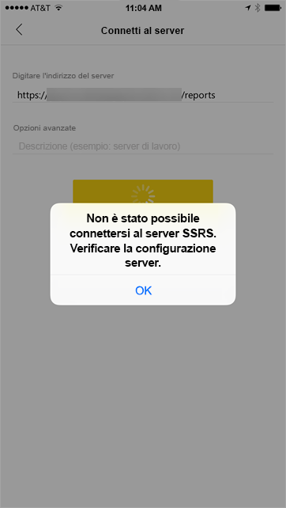

È possibile impostare [Fiddler](https://www.telerik.com/fiddler) in modo che funga da proxy per i dispositivi mobili e visualizzi l'avanzamento della richiesta. Per abilitare un proxy di Fiddler per il dispositivo telefonico, è necessario configurare [CertMaker per iOS e Android](https://www.telerik.com/fiddler/add-ons) nel computer che esegue Fiddler. Il componente aggiuntivo è di Telerik per Fiddler.

Se l'accesso funziona correttamente quando si usa Fiddler, potrebbe essere un problema di certificato con l'applicazione WAP o il server ADFS. 

## <a name="next-steps"></a>Passaggi successivi

[Registrare un nome dell'entità servizio (SPN) per un server di report](/sql/reporting-services/report-server/register-a-service-principal-name-spn-for-a-report-server)  
[Modificare un file di configurazione di Reporting Services](/sql/reporting-services/report-server/modify-a-reporting-services-configuration-file-rsreportserver-config)  
[Configurare l'autenticazione di Windows in un server di report](/sql/reporting-services/security/configure-windows-authentication-on-the-report-server)  
[Active Directory Federation Services](https://technet.microsoft.com/windows-server-docs/identity/active-directory-federation-services)  
[Proxy applicazione Web in Windows Server 2016](https://technet.microsoft.com/windows-server-docs/identity/web-application-proxy/web-application-proxy-windows-server)  
[Pubblicazione di applicazioni usando la preautenticazione di ADFS](https://technet.microsoft.com/windows-server-docs/identity/web-application-proxy/publishing-applications-using-ad-fs-preauthentication#a-namebkmk14apublish-an-application-that-uses-oauth2-such-as-a-windows-store-app)  
[Configurare AD FS 2016 e Azure MFA](https://technet.microsoft.com/windows-server-docs/identity/ad-fs/operations/configure-ad-fs-2016-and-azure-mfa)  
Altre domande? [Provare la community di Power BI](https://community.powerbi.com/)
